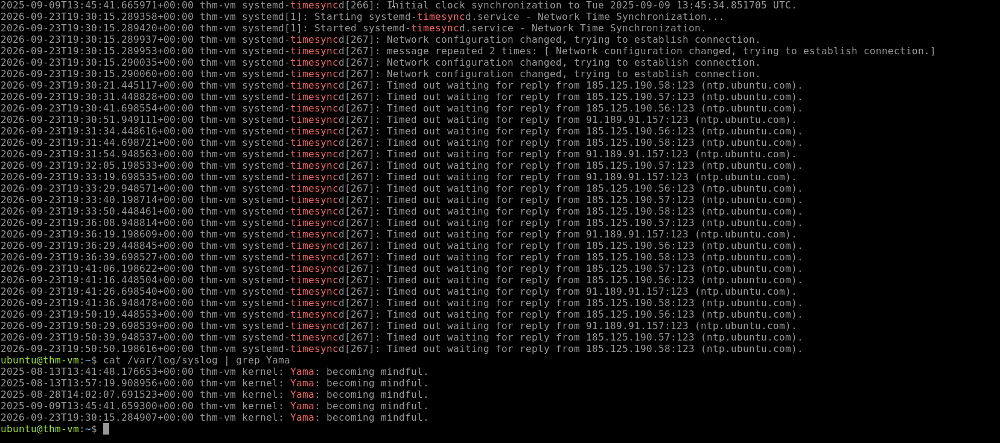
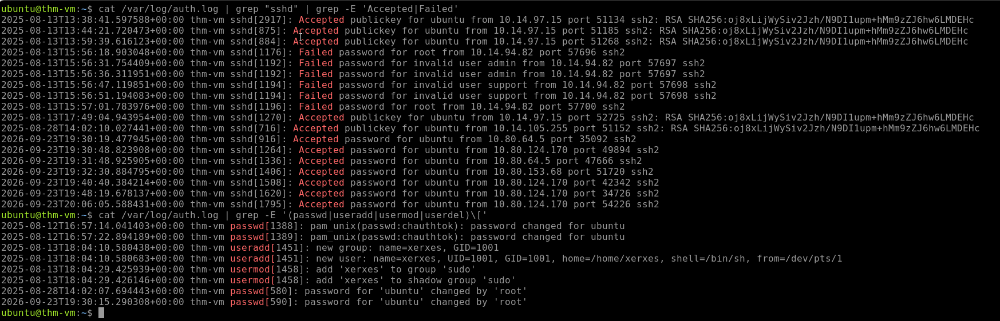
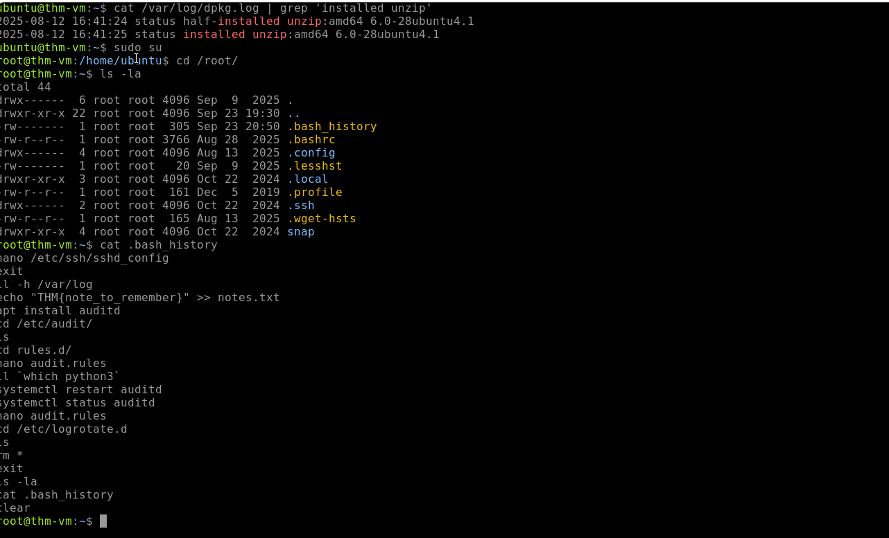
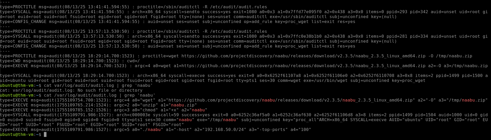

# Linux Logging for SOC

## Overview

This investigation focused on understanding and analysing Linux logs for SOC monitoring and threat detection. The investigation covered Linux system logs, authentication events, user management, Bash history, package manager logs, and `auditd` activity.

The investigation used Linux distributions such as Debian, Ubuntu, CentOS, and RHEL, with a focus on Linux servers without a graphical interface.

The investigation covered the following areas:

* Working with Text Logs
* Authentication Logs
* Common Linux Logs
* Bash History
* Auditd Log Analysis

---

# Working with Text Logs

## Log Format

Linux-based systems are not immune to malware, and Linux-targeted intrusions are a growing problem. As a SOC analyst, it is important to understand how Linux logging works so that security alerts and suspicious activity can be investigated effectively.

The investigation used the following system log:

```text
/var/log/syslog
```

### Investigation

The `/var/log/syslog` file was investigated to identify system activity and messages.

### Finding 1: Time Synchronisation Server

| Artifact    | Value             |
| ----------- | ----------------- |
| Log File    | `/var/log/syslog` |
| Search Term | `timesync`        |
| Time Server | `ntp.ubuntu.com`  |

The VM contacted `ntp.ubuntu.com` to synchronise its system time.

Command used:

```bash
cat /var/log/syslog | grep timesync
```

### Finding 2: Yama Kernel Message

| Artifact    | Value               |
| ----------- | ------------------- |
| Log File    | `/var/log/syslog`   |
| Search Term | `Yama`              |
| Message     | `Becoming mindful.` |

The Yama kernel message identified in the system log was `Becoming mindful.`

Command used:

```bash
cat /var/log/syslog | grep Yama
```



---

# Authentication Logs

## Linux Authentication Logging

The primary authentication log on many Linux systems is:

```text
/var/log/auth.log
```

On RHEL-based systems, authentication events may instead be stored in:

```text
/var/log/secure
```

Although these logs contain authentication events, they can also contain user management events, `sudo` commands, and other security-relevant activity.

## Login and Logout Events

Linux users can authenticate locally, through SSH, or by using commands such as `sudo` and `su`. Successful login and logout events can be identified by searching for `session opened` and `session closed`.

Command used:

```bash
cat /var/log/auth.log | grep -E 'session opened|session closed'
```

## SSH Login Events

The SSH daemon records successful and failed SSH login attempts in the authentication log.

Command used:

```bash
cat /var/log/auth.log | grep "sshd" | grep -E 'Accepted|Failed'
```

### Investigation

The `/var/log/auth.log` file was investigated to identify suspicious authentication activity and user management events.

### Finding 1: Failed SSH Logins

| Artifact   | Value               |
| ---------- | ------------------- |
| Log File   | `/var/log/auth.log` |
| Event Type | Failed SSH Login    |
| Source IP  | `10.14.94.82`       |

The IP address `10.14.94.82` failed to log in to multiple users through SSH.

### Finding 2: Backdoor User

| Artifact         | Value         |
| ---------------- | ------------- |
| Event Type       | User Creation |
| Username         | `xerxes`      |
| Privileged Group | `sudo`        |

The user `xerxes` was created and added to the `sudo` group.



Command used:

```bash
cat /var/log/auth.log | grep -E '(passwd|useradd|usermod|userdel)\['
```

## Detecting User Management Events

User management activity can be identified by searching for keywords associated with account creation, modification, password changes, and deletion.

Command used:

```bash
cat /var/log/auth.log | grep -E '(passwd|useradd|usermod|userdel)\['
```

## Detecting Sudo Commands

Commands executed using `sudo` can also appear in the authentication logs and may help identify potentially malicious activity.

Command used:

```bash
cat /var/log/auth.log | grep -E 'COMMAND='
```

---

# Common Linux Logs

## Generic System Logs

Linux stores different types of system activity across files in `/var/log`. These logs can contain kernel messages, network changes, service activity, cron jobs, package installations, and other events.

Common Linux log files include:

| Log File            | Purpose                                      |
| ------------------- | -------------------------------------------- |
| `/var/log/kern.log` | Kernel messages and errors                   |
| `/var/log/syslog`   | Consolidated stream of various Linux events  |
| `/var/log/dpkg.log` | Package manager logs on Debian-based systems |
| `/var/log/apt`      | Package manager logs on Debian-based systems |
| `/var/log/dnf.log`  | Package manager logs on RHEL-based systems   |
| `/var/log/yum.log`  | Package manager logs on RHEL-based systems   |

## Application-Specific Logs

SOC analysts may also investigate logs generated by specific applications and services.

Examples include:

* Database logs to identify executed queries
* Mail logs to investigate phishing activity
* Container logs to identify anomalies
* Web server logs to determine which pages were accessed, when they were accessed, and by whom

Example command:

```bash
cat /var/log/nginx/access.log
```

### Finding 1: Installed Package Version

| Artifact | Value               |
| -------- | ------------------- |
| Package  | `unzip`             |
| Version  | `6.0-28ubuntu4.1`   |
| Log File | `/var/log/dpkg.log` |

The installed version of `unzip` was `6.0-28ubuntu4.1`.

Command used:

```bash
cat /var/log/dpkg.log | grep 'installed unzip'
```

---

# Bash History

## Command History

Bash history records commands entered by users. By default, commands are stored in memory during the current session and are written to the user's:

```text
~/.bash_history
```

The history can also be viewed using the `history` command.

Example commands:

```bash
cat /home/ubuntu/.bash_history
history
```

## Bash History Limitations

Although Bash history can provide useful information during an investigation, it has several limitations.

Attackers may attempt to avoid having commands recorded in Bash history.

### Leading Spaces

A leading space can prevent a command from being recorded depending on the Bash configuration.

```bash
echo "You will never see me in logs!"
```

### Using Scripts

Attackers can place commands inside scripts and execute the script instead of entering each command directly.

```bash
nano legit.sh && ./legit.sh
```

### Using Another Shell

Attackers can use another shell, such as `/bin/sh`, which may not save commands in Bash history.

```bash
sh
```

Example:

```bash
echo "I am no longer tracked by Bash!"
```

### Finding 2: Bash History Flag

| Artifact | Value                        |
| -------- | ---------------------------- |
| File     | `/home/ubuntu/.bash_history` |
| Flag     | `THM{note_to_remember}`      |

The Bash history was investigated by accessing the user's history and then examining the root user's history.

Commands used:

```bash
cat /home/ubuntu/.bash_history
sudo su
cd /root/
ls -la
cat .bash_history
```

The flag found in the Bash history was:

```text
THM{note_to_remember}
```



---

# Using Auditd

## Audit Daemon

`auditd` (Audit Daemon) is a built-in Linux auditing solution that can be used for runtime monitoring. SOC teams can use audit logs to investigate file access, process execution, and other security-relevant events.

Audit logs can be viewed in:

```text
/var/log/audit/audit.log
```

The `ausearch` command can also be used to search and filter audit events in a more readable format.

## Investigation

The investigation used `ausearch` and direct searches against the audit log to identify file access, process creation, and network scanning activity.

### Finding 1: Secret File Access

| Artifact     | Value               |
| ------------ | ------------------- |
| Audit Key    | `file_thmsecret`    |
| File         | `secret.thm`        |
| First Access | `08/13/25 18:36:54` |

Access to `secret.thm` was logged using the `file_thmsecret` key.

Command used:

```bash
ausearch -i -k file_thmsecret
```

The file was first opened at:

```text
08/13/25 18:36:54
```

### Finding 2: Downloaded Tool

| Artifact        | Value                         |
| --------------- | ----------------------------- |
| Audit Key       | `proc_wget`                   |
| Process         | `wget`                        |
| Downloaded File | `naabu_2.3.5_linux_amd64.zip` |

The original filename downloaded from GitHub using `wget` was:

```text
naabu_2.3.5_linux_amd64.zip
```

Command used:

```bash
ausearch -i -k proc_wget
```

### Finding 3: Network Scan

| Artifact      | Value             |
| ------------- | ----------------- |
| Tool          | `naabu`           |
| Network Range | `192.168.50.0/24` |

The downloaded `naabu` tool was used to scan the following network range:

```text
192.168.50.0/24
```

Command used:

```bash
cat /var/log/audit/audit.log | grep 'naabu'
```



---

# Key Findings

| Investigation Area       | Finding                       |
| ------------------------ | ----------------------------- |
| Time Server              | `ntp.ubuntu.com`              |
| Yama Message             | `Becoming mindful.`           |
| Failed SSH Source IP     | `10.14.94.82`                 |
| Created User             | `xerxes`                      |
| Privileged Group         | `sudo`                        |
| Installed Package        | `unzip 6.0-28ubuntu4.1`       |
| Bash History Flag        | `THM{note_to_remember}`       |
| Audit Key                | `file_thmsecret`              |
| Secret File First Access | `08/13/25 18:36:54`           |
| Downloaded Tool          | `naabu_2.3.5_linux_amd64.zip` |
| Scanned Network          | `192.168.50.0/24`             |

---

# Skills Demonstrated

* Linux Log Analysis
* SOC Log Investigation
* Sudo Activity Detection
* Linux System Log Analysis
* Auditd Log Analysis
* Network Scanning Detection
* Linux Threat Detection
* SOC Investigation and Triage
