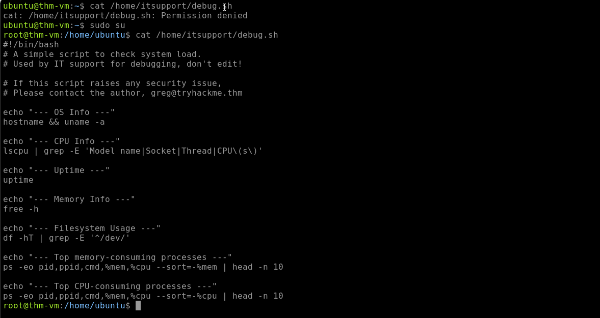
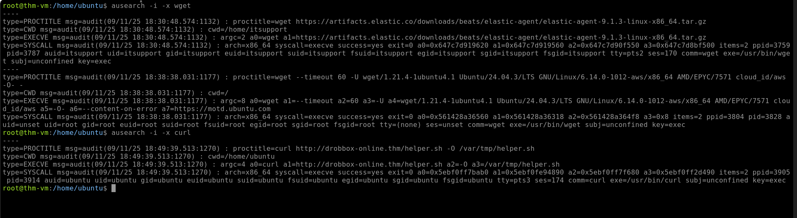
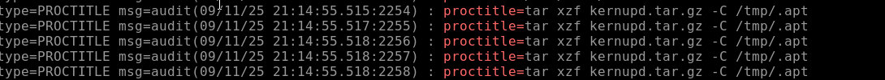
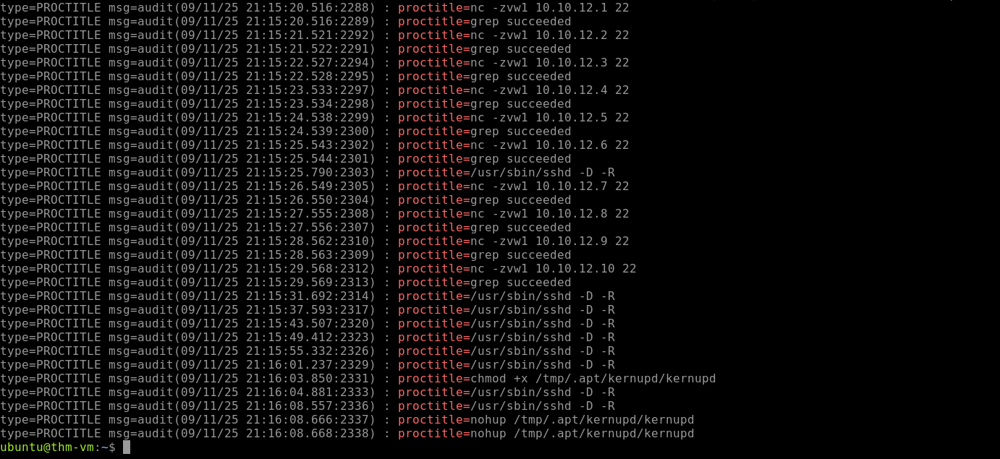

# Linux Threat Detection

## Overview

This investigation focused on detecting Linux post-compromise activity related to Discovery, attacker motivation, Ingress Tool Transfer, cryptominer infections, and malware persistence/setup using auditd and runtime logs.

The investigation covered the following areas:

* Discovery Overview
* Detection of Discovery Activity
* Motivation for Attacks
* DOTA3: First Actions
* DOTA3: Miner Setup

---

# Discovery Overview

## First Actions

The first discovery commands threat actors run on Linux systems are usually similar regardless of the entry point or attack goal. Discovery may be skipped when attackers already know their target or simply want to install a cryptominer and exit.

### Common Discovery Commands

| Discovery Goal | Typical Commands |
| --- | --- |
| OS and Filesystem Discovery | `pwd`, `ls /`, `env`, `uname -a`, `lsb_release -a`, `hostname` |
| User and Groups Discovery | `id`, `whoami`, `w`, `last`, `cat /etc/sudoers`, `cat /etc/passwd` |
| Process and Network Discovery | `ps aux`, `top`, `ip a`, `ip r`, `arp -a`, `ss -tnlp`, `netstat -tnlp` |
| Cloud or Sandbox Discovery | `systemd-detect-virt`, `lsmod`, `uptime`, `pgrep "<edr-or-sandbox>"` |

### Investigation

The VM was used to test common Discovery commands.

### Finding 1: Cloud Environment

| Artifact | Value |
| --- | --- |
| Command | `systemd-detect-virt` |
| Output | `Amazon` |

The command identified the system's cloud environment as Amazon.

### Finding 2: Antimalware Binary

| Artifact | Value |
| --- | --- |
| Command | `ps aux` |
| Antimalware Binary | `/var/lib/ultrasec/malscan` |

The detected antimalware binary was located at `/var/lib/ultrasec/malscan`.

---

# Detection of Discovery Activity

## Discovery Detection

Detecting Discovery commands can be performed with `auditd` or other runtime monitoring tools. Auditd can be configured to log relevant commands, which can then be investigated using a SIEM or `ausearch`.

The main challenge is determining whether the commands were executed by an attacker, a legitimate service, or an IT administrator.

For example, a web server unexpectedly spawning `whoami` can be suspicious, while a network monitoring tool periodically checking the local network may be expected behavior.

### Investigation

A SIEM alert indicated a spike in Discovery commands. The `itsupport` user had launched the `hostname` command, so the process origin was traced using `ausearch`.

### Finding 1: Script Responsible for `hostname`

| Artifact | Value |
| --- | --- |
| Commands | `ausearch -i -x hostname`<br>`ausearch -i --pid 3771` |
| Script | `/home/itsupport/debug.sh` |

The `hostname` command was initiated by `/home/itsupport/debug.sh`.

### Finding 2: Last Discovery Command

| Artifact | Value |
| --- | --- |
| Command | `ausearch -I --ppid 3771` |
| Last Discovery Command | `ps -eo pid,ppid,cmd,%mem,%cpu --sort=-%cpu` |

The last Discovery command launched by the script was used to list processes and sort them by CPU usage.

### Finding 3: Script Author

| Artifact | Value |
| --- | --- |
| Command | `cat /home/itsupport/debug.sh` |
| Email | `greg@tryhackme.thm` |

The email address found in the script identified the script author as `greg@tryhackme.thm`.



---

# Motivation for Attacks

## Hack and Forget Attacks

After the Discovery stage, threat actors may reveal their motivation by installing specialized malware or performing actions associated with a particular attack class.

The room focuses on **"Hack and Forget"** attacks, which operate at scale and focus on quick gains.

Examples include:

* **Install Cryptominer:** Use the victim's CPU/GPU to mine cryptocurrency.
* **Enroll to Botnet:** Add the victim to a botnet such as Mirai and use it for activities such as DDoS.
* **Use as Proxy:** Use the compromised system to send phishing, host malware, or route attacker traffic.

## Ingress Tool Transfer

The investigation looked for commands that could indicate Ingress Tool Transfer.

### Finding 1: Elastic Agent Download

| Artifact | Value |
| --- | --- |
| Command | `ausearch -i -x wget` |
| Domain | `artifacts.elastic.co` |

The Elastic agent was downloaded from `artifacts.elastic.co`.

### Finding 2: Downloaded `helper.sh`

| Artifact | Value |
| --- | --- |
| Command | `ausearch -i -x curl` |
| File | `/var/tmp/helper.sh` |

The downloaded `helper.sh` script was located at `/var/tmp/helper.sh`.

### Finding 3: Potentially Malicious Download

| Artifact | Value |
| --- | --- |
| Download Method | `curl` |
| Assessment | `curl` |

The file downloaded with `curl` was identified as the more likely malicious file in the investigation.



---

# DOTA3: First Actions

## Detecting the Attack

DOTA3 remains active because weak SSH passwords can allow attackers to gain access to Linux systems.

In a real SOC environment using a SIEM, multiple alerts could indicate the attack:

* SSH login from a known malicious IP
* A spike in Discovery commands
* A match for the attack string `mdrfckr`

### Detection Sources

| Log Source | Description |
| --- | --- |
| Auth Logs | `cat /var/log/auth.log \| grep "Accepted"` — Look for successful SSH logins by password from untrusted external IP addresses |
| Auditd Process Logs | `ausearch -i -x [command]` — Look for execution of Discovery commands such as `uname` and `lscpu` and trace their origin |

### Investigation

The `/home/ubuntu/scenario` directory was investigated using the available logs.

### Finding 1: Brute-Force Source IP

| Artifact | Value |
| --- | --- |
| Command | `ausearch -i -if /home/ubuntu/scenario/audit.log \| grep 'sshd'` |
| IP Address | `45.9.148.125` |

The IP address that managed to brute-force the exposed SSH service was `45.9.148.125`.

### Finding 2: Last Logged-In Users

| Artifact | Value |
| --- | --- |
| Command | `last` |

The attacker used `last` to list recently logged-in users.

### Finding 3: EDR Processes Targeted

| Artifact | Value |
| --- | --- |
| Command | `ausearch -i -if /home/ubuntu/scenario/audit.log \| grep 'egrep'` |
| EDR Processes | `ds_agent`, `falcon`, `sentinel` |

The attacker searched for the `ds_agent`, `falcon`, and `sentinel` EDR processes using `egrep`.

---

# DOTA3: Miner Setup

## Cryptominer Setup

After gaining SSH access, threat actors can upload tools using SCP. In the investigated scenario, the attackers transferred an archive and unpacked the tools into a hidden folder under `/tmp`, a common location for staging temporary malware.

Example transfer:

```bash
user@bot-1672$ scp dota3.tar.gz ubuntu@victim:/tmp
[OK] Transfered dota3.tar.gz file to the victim
```

### Detection Indicators

Common indicators that SOC rules or EDR alerts could detect include:

* Auditd logs showing creation of untrusted hidden files and folders in `/tmp`
* Auditd logs showing creation of files with names associated with known malware
* Usage of commands commonly observed during attacks, such as `nohup`
* Network traffic showing SSH port scans across internal network ranges
* EDR detections for cryptominer binaries such as XMrig

### Investigation

The same logs from `/home/ubuntu/scenario` were used to investigate the cryptominer infection chain.

### Finding 1: Malicious Archive

| Artifact | Value |
| --- | --- |
| Command | `ausearch -i -if /home/ubuntu/scenario/audit.log \| grep 'proctitle='` |
| Archive | `kernupd.tar.gz` |

The malicious archive transferred via SCP was `kernupd.tar.gz`.



### Finding 2: Cryptominer Launch Command

| Artifact | Value |
| --- | --- |
| Command | `nohup /tmp/.apt/kernupd/kernupd` |

The cryptominer was launched using the command shown above.

### Finding 3: SSH Scan Range

| Artifact | Value |
| --- | --- |
| IP Range | `10.10.12.1-10.10.12.10` |

The attacker scanned the `10.10.12.1-10.10.12.10` range for exposed SSH services.



---

# Key Findings

| Investigation Area | Finding |
| --- | --- |
| Cloud Environment | `Amazon` |
| Antimalware Binary | `/var/lib/ultrasec/malscan` |
| Discovery Script | `/home/itsupport/debug.sh` |
| Script Author | `greg@tryhackme.thm` |
| Last Discovery Command | `ps -eo pid,ppid,cmd,%mem,%cpu --sort=-%cpu` |
| Elastic Agent Domain | `artifacts.elastic.co` |
| Downloaded Script | `/var/tmp/helper.sh` |
| Brute-Force Source IP | `45.9.148.125` |
| EDR Processes Targeted | `ds_agent`, `falcon`, `sentinel` |
| Malicious Archive | `kernupd.tar.gz` |
| Cryptominer Command | `nohup /tmp/.apt/kernupd/kernupd` |
| SSH Scan Range | `10.10.12.1-10.10.12.10` |

---

# Skills Demonstrated

* Linux Threat Detection
* Auditd Log Analysis
* Network Discovery Detection
* Cloud and Sandbox Discovery
* Ingress Tool Transfer Detection
* SSH Attack Detection
* EDR Process Identification
* Cryptominer Detection
* Malware Staging Detection
* SCP Transfer Analysis
* SOC Investigation and Triage
* Attack Chain Analysis
