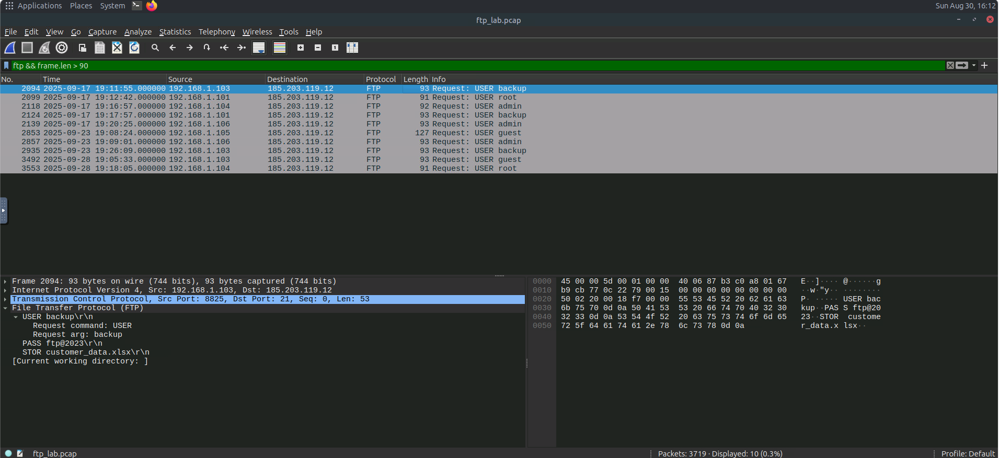
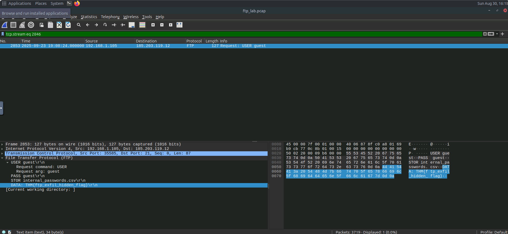
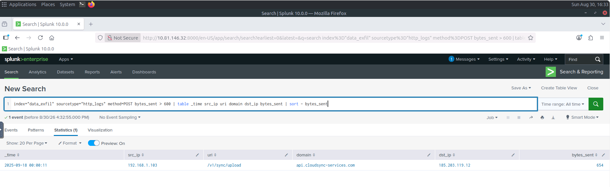
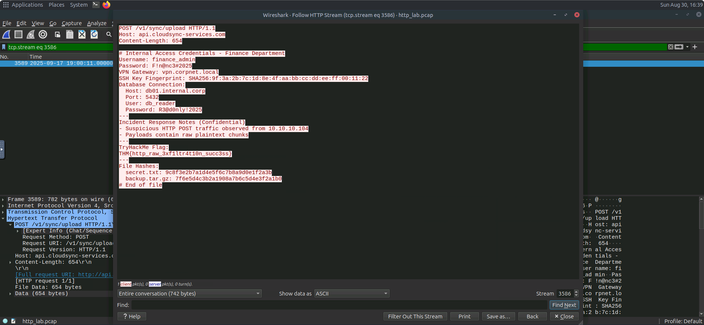
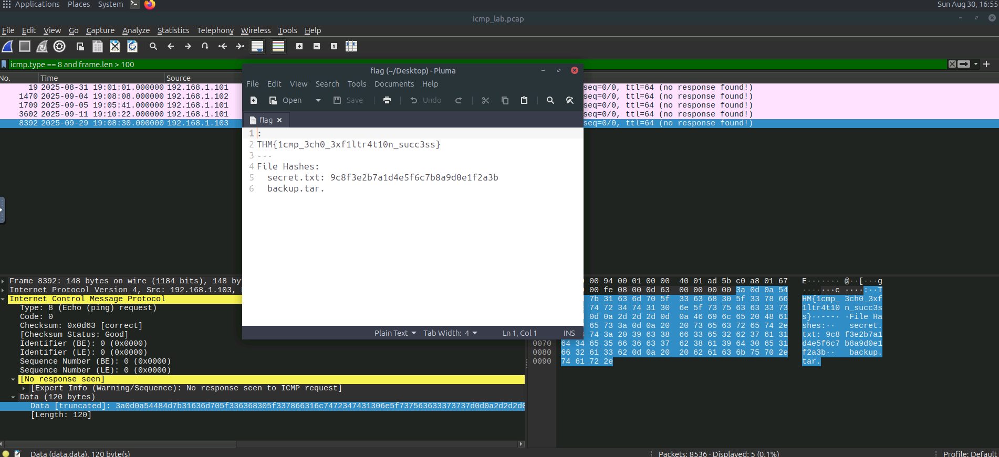

# Data Exfiltration Detection

## Overview

This investigation focused on identifying and distinguishing different methods of data exfiltration using network traffic captured in Wireshark and logs exported from a SIEM solution.

The investigation used packet captures and SIEM logs to identify indicators associated with data exfiltration and determine which internal hosts were involved.

---

## Tools Used

* Wireshark
* Splunk
* Linux Terminal
* PCAP files
* SIEM-exported logs
* Network traffic analysis

---

# Detection: Data Exfiltration Through DNS Tunneling

## Overview

DNS exfiltration abuses the Domain Name System (DNS), a protocol that is normally allowed through networks, to smuggle data by encoding bytes inside DNS queries and responses.

Because DNS traffic is commonly permitted through firewalls and may be forwarded to public DNS resolvers, attackers can abuse it to establish covert communication channels and exfiltrate data.

The investigation used the following files:

* `dns_exfil.pcap` - Wireshark
* `dns_exfil.log` - Splunk

---

## Indicators of Attack

Common indicators of DNS tunneling and DNS-based data exfiltration include:

* Large numbers of DNS queries sent to a single external domain, especially when the query volume is significantly higher than the normal baseline.
* Long subdomain labels or unusually long complete DNS query names, typically greater than 60–100 characters.
* High-entropy or Base32/Base64-like patterns within DNS query names.
* Unusual characters or patterns such as mixed-case letters, digits, `-`, and `=` characters.
* Rare DNS record types such as `TXT` or `NULL`.
* Large or unusually frequent TXT responses.
* Frequent `NXDOMAIN` responses, which may occur when data is being exfiltrated through queries without requiring meaningful responses.
* DNS traffic using TCP or unusually large UDP packets.
* Queries occurring at regular intervals, potentially indicating beaconing behaviour.

---

## 1. Identify the Suspicious Domain Receiving the DNS Traffic

Wireshark and Splunk were used to identify the domain receiving the suspicious DNS traffic.

### Wireshark Queries

```text
dns.flags.response == 0
````

This filter displays DNS queries rather than DNS responses.

```text
dns && frame.len > 70
```

This filter was used to identify DNS packets with larger-than-normal frame sizes.

### Splunk Queries

```text
index="data_exfil" sourcetype="dns_logs" | stats count by query | sort -count
```

This query counts DNS requests by queried domain and sorts the results by frequency.

```text
index="data_exfil" sourcetype="DNS_logs" | where len(query) > 30
```

This query identifies unusually long DNS queries.

### Finding

| Artifact          | Value            |
| ----------------- | ---------------- |
| Suspicious Domain | `tunnelcorp.net` |

The high volume of DNS traffic associated with `tunnelcorp.net` identified it as the suspicious domain receiving the DNS traffic.

---

## 2. Identify the Number of Suspicious DNS Tunneling Logs

The DNS logs were analyzed to determine the number of suspicious traffic events associated with DNS tunneling.

### Finding

| Artifact                      | Value |
| ----------------------------- | ----- |
| Suspicious DNS Tunneling Logs | `315` |

A total of `315` suspicious DNS tunneling-related events were observed.

---

## 3. Identify the Local IP Sending the Maximum Number of Suspicious Requests

The DNS traffic was analyzed to determine which internal host generated the highest number of suspicious requests.

### Finding

| Artifact        | Value           |
| --------------- | --------------- |
| Local Source IP | `192.168.1.103` |

The internal host `192.168.1.103` sent the maximum number of suspicious DNS requests.

---

# Detection: Data Exfiltration Through FTP

## Overview

FTP (File Transfer Protocol) is one of the oldest protocols used to transfer files between clients and servers over a TCP/IP network.

Attackers may abuse FTP to move large amounts of data out of a network using compromised credentials, misconfigured servers, or temporary accounts.

Detection can involve packet inspection, FTP commands, server logs, session metadata, and network traffic analysis.

The investigation used:

* `ftp_lab.pcap` - Wireshark

---

## Indicators of Attack

Common indicators of FTP-based data exfiltration include:

* `USER` and `PASS` commands, which may expose credentials because traditional FTP transmits them in cleartext.
* `STOR` commands used to upload files.
* `RETR` commands used to download files.
* Repeated or unusually large file transfers.
* Large data connections to unusual external IP addresses.
* FTP transfers occurring outside normal business hours.
* Passive-mode (`PASV`) data connections using ephemeral ports combined with large payloads.

---

## 1. Identify the Number of Connections from the Guest Account

The FTP traffic was analyzed to determine how many connections were established using the guest account.

### Finding

| Artifact                  | Value |
| ------------------------- | ----- |
| Guest Account Connections | `5`   |

A total of `5` connections were observed from the guest account.

---

## 2. Identify the Customer-Related File Exfiltrated from the Root Account

The FTP traffic was filtered to identify large FTP packets associated with the file transfer.

### Wireshark Query

```text
ftp && frame.len > 90
```

This filter was used to identify larger FTP frames that could contain file-transfer activity.

### Finding

| Artifact         | Value                |
| ---------------- | -------------------- |
| Exfiltrated File | `customer_data.xlsx` |

The customer-related file exfiltrated from the root account was identified as `customer_data.xlsx`.



---

## 3. Identify the Internal IP Sending the Largest Payload

The FTP traffic was analyzed to determine which internal host transmitted the largest amount of data to an external IP address.

### Finding

| Artifact           | Value           |
| ------------------ | --------------- |
| Internal Source IP | `192.168.1.105` |

The internal IP `192.168.1.105` was identified as the host sending the largest payload to an external IP.

---

## 4. Identify the Flag Hidden Inside the FTP Stream

The FTP stream transferring the CSV file to the suspicious IP was inspected to identify hidden data within the stream.

### Finding

| Artifact    | Value                        |
| ----------- | ---------------------------- |
| Hidden Flag | `THM{ftp_exfil_hidden_flag}` |

The flag was found within the FTP stream associated with the suspicious file transfer.



---

# Detection: Data Exfiltration Through HTTP

## Overview

HTTP-based data exfiltration occurs when an attacker moves sensitive information out of a target network using HTTP as the transport protocol.

HTTP is commonly abused for data exfiltration because it resembles normal web traffic, can pass through firewalls and proxies, and can be obfuscated through encoding, encryption, or tunneling.

The investigation focused on identifying HTTP-based exfiltration activity using Wireshark packet captures and Splunk logs.

The investigation used:

* `http_lab.log` - Splunk
* `http_lab.pcap` - Wireshark

---

## Indicators of Attack

Common indicators of HTTP-based data exfiltration include:

* Unusually large HTTP `POST` requests to external or unexpected hosts.
* HTTP requests to domains with a low reputation or domains rarely observed in the normal network baseline.
* Frequent small requests to the same host, potentially indicating beaconing behaviour.
* Large uploads following a series of smaller requests.
* Chunked or multipart transfers where multiple HTTP requests are used to transfer a larger file.
* Encoded or obfuscated data contained within HTTP requests.

---

## 1. Identify the Internal Compromised Host

The HTTP traffic was filtered for large `POST` requests to identify the internal host being used to exfiltrate sensitive data.

### Wireshark Query

```text
http.request.method == "POST" and frame.len > 750
```

This filter identifies HTTP POST requests with frame sizes greater than 750 bytes.

### Finding

| Artifact                  | Value           |
| ------------------------- | --------------- |
| Compromised Internal Host | `192.168.1.103` |

The internal host `192.168.1.103` was identified as the compromised system used to exfiltrate the sensitive data.



---

## 2. Identify the Flag Hidden Inside the Exfiltrated Data

The HTTP traffic was inspected to identify the hidden flag contained within the exfiltrated data.

### Finding

| Artifact    | Value                                |
| ----------- | ------------------------------------ |
| Hidden Flag | `THM{http_raw_3xf1ltr4t10n_succ3ss}` |

The flag was identified within the data being exfiltrated through HTTP.



---

# Detection: Data Exfiltration Through ICMP

## Overview

ICMP (Internet Control Message Protocol) is a network-layer protocol commonly used for diagnostics and network control operations, such as `ping` and TTL-exceeded messages.

Because ICMP traffic may be allowed through firewalls and can receive less scrutiny than TCP or UDP traffic, attackers can abuse it to create covert communication channels.

An attacker can encode data inside ICMP payloads, such as Echo Request and Echo Reply packets, and transmit the data to a remote system under their control.

The investigation used:

* `icmp_lab.pcap` - Wireshark

---

## Indicators of Attack

Common indicators of ICMP-based data exfiltration include:

* A single internal host sending large numbers of ICMP Echo Requests to an external IP address.
* ICMP packets with unusually large `frame.len` values.
* ICMP payloads significantly larger than normal ping payloads, such as payloads greater than 64 bytes.
* Unusual ICMP type or code values.
* Unexpected use of ICMP Timestamp Request/Reply messages (`13/14`).
* Regularly timed ICMP packets, indicating possible beaconing behaviour.
* Similar-sized payloads being transmitted at regular intervals.
* Multiple ICMP fragments from the same source and destination pair.
* Fragment reassembly indicating that larger amounts of data may be transported through ICMP.

---

## 1. Identify the Flag Found in the ICMP Exfiltrated Data

The ICMP traffic was filtered to identify large Echo Request packets that could contain exfiltrated data.

### Wireshark Query

```text
icmp.type == 8 and frame.len > 100
```

This filter identifies ICMP Echo Request packets with frame sizes greater than 100 bytes.

The packet contents were then exported using **Export Packet Bytes** to inspect the data contained within the ICMP payload.

### Finding

| Artifact    | Value                                 |
| ----------- | ------------------------------------- |
| Hidden Flag | `THM{1cmp_3ch0_3xf1ltr4t10n_succ3ss}` |

The flag was found within the data exfiltrated through ICMP.



---

# Skills Demonstrated

* DNS Tunneling Detection
* DNS-Based Data Exfiltration Detection
* FTP Exfiltration Detection
* HTTP Exfiltration Detection
* ICMP Exfiltration Detection
* Network Traffic Analysis
* Wireshark Packet Analysis
* Splunk Log Analysis
* Extracting Hidden Data from Network Streams

---

# Key Findings

| Investigation Area                    | Finding                               |
| ------------------------------------- | ------------------------------------- |
| Suspicious DNS Domain                 | `tunnelcorp.net`                      |
| Suspicious DNS Tunneling Logs         | `315`                                 |
| Local IP Sending Maximum DNS Requests | `192.168.1.103`                       |
| Guest FTP Connections                 | `5`                                   |
| Exfiltrated Customer File             | `customer_data.xlsx`                  |
| Largest FTP Payload Source IP         | `192.168.1.105`                       |
| FTP Hidden Flag                       | `THM{ftp_exfil_hidden_flag}`          |
| HTTP Compromised Host                 | `192.168.1.103`                       |
| HTTP Hidden Flag                      | `THM{http_raw_3xf1ltr4t10n_succ3ss}`  |
| ICMP Hidden Flag                      | `THM{1cmp_3ch0_3xf1ltr4t10n_succ3ss}` |

---

# Lessons Learned

* DNS can be abused as a covert channel for data exfiltration because DNS traffic is commonly permitted through network boundaries.
* High-volume DNS queries to a single domain can indicate DNS tunneling or data exfiltration.
* Long and high-entropy DNS query names can indicate encoded data being transmitted through DNS.
* FTP can be abused to transfer sensitive files outside an organisation, especially when attackers obtain valid credentials.
* Large FTP payloads sent from internal systems to external IP addresses can indicate potential data exfiltration.
* HTTP POST requests with unusually large payloads can indicate data being uploaded to an external system.
* HTTP-based exfiltration can be difficult to distinguish from legitimate web traffic because HTTP is commonly used throughout enterprise networks.
* ICMP can be abused to create covert channels by embedding data inside packet payloads.
