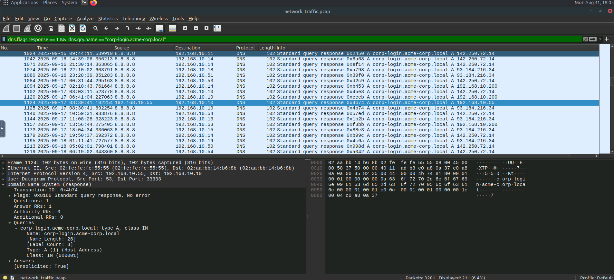
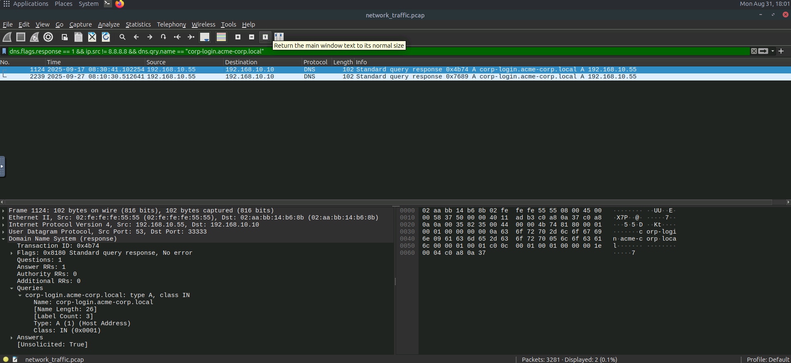
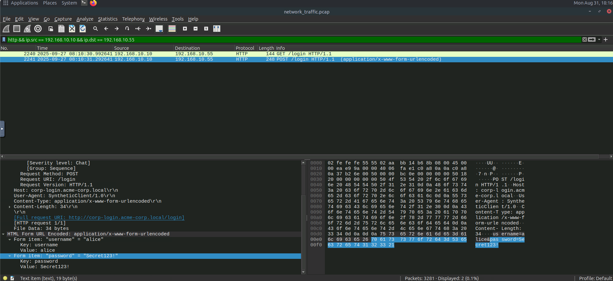

# MITM Attack Detection

## Overview

This investigation focused on identifying a chained Man-in-the-Middle (MITM) attack using network traffic captured in Wireshark.

The investigation identified three techniques:

* ARP Spoofing
* DNS Spoofing
* SSL Stripping

---

## Tools Used

* Wireshark
* PCAP files
* Network traffic analysis

---

# Detection: ARP Spoofing

## Overview

ARP spoofing occurs when an attacker sends forged ARP replies to associate their MAC address with a legitimate IP address, such as the default gateway. This allows the attacker to intercept network traffic.

### Indicators of Attack

* Duplicate MAC addresses claiming the same IP.
* Unsolicited or gratuitous ARP replies.
* Abnormally high ARP traffic.
* Multiple MAC addresses associated with the gateway IP.
* Traffic being redirected through the attacker's MAC address.

### 1. ARP Packets from the Gateway

#### Wireshark Query

```text
arp && arp.src.proto_ipv4 == 192.168.10.1 && eth.src == 02:aa:bb:cc:00:01
```

#### Finding

| Artifact    | Value |
| ----------- | ----- |
| ARP Packets | `10`  |

### 2. Attacker MAC Address

| Artifact     | Value               |
| ------------ | ------------------- |
| Attacker MAC | `02:fe:fe:fe:55:55` |

The attacker used this MAC address to impersonate the gateway.

### 3. Gratuitous ARP Replies

| Artifact               | Value |
| ---------------------- | ----- |
| Gratuitous ARP Replies | `2`   |

### 4. Duplicate MAC Addresses

#### Wireshark Query

```text
arp.duplicate-address-detected || arp.duplicate-address-frame
```

| Artifact                          | Value |
| --------------------------------- | ----- |
| MAC Addresses Claiming Gateway IP | `2`   |

### 5. Total ARP Spoofing Packets

| Artifact                      | Value |
| ----------------------------- | ----- |
| Attacker ARP Spoofing Packets | `14`  |

---

# Detection: DNS Spoofing

## Overview

DNS spoofing occurs when an attacker provides a forged DNS response, causing a victim to connect to an attacker-controlled IP address instead of the legitimate server.

### Indicators of Attack

* Multiple DNS responses for the same query.
* DNS responses from unexpected sources.
* Suspicious TTL values.
* Unsolicited DNS responses.

### 1. DNS Responses for the Domain

#### Wireshark Query

```text
dns.flags.response == 1 && dns.qry.name == "corp-login.acme-corp.local"
```

| Artifact      | Value |
| ------------- | ----- |
| DNS Responses | `211` |



### 2. Responses from Unexpected Sources

#### Wireshark Query

```text
dns.flags.response == 1 && ip.src != 8.8.8.8 && dns.qry.name == "corp-login.acme-corp.local"
```

| Artifact                 | Value |
| ------------------------ | ----- |
| Responses from Other IPs | `2`   |

### 3. Attacker's Forged IP

| Artifact            | Value           |
| ------------------- | --------------- |
| Forged DNS Response | `192.168.10.55` |

The attacker redirected `corp-login.acme-corp.local` to `192.168.10.55`.



---

# Detection: SSL Stripping

## Overview

SSL stripping is a MITM technique where an attacker downgrades a victim's HTTPS connection to HTTP. This allows the attacker to observe traffic that would normally be encrypted.

### Indicators of Attack

* HTTPS traffic followed by HTTP traffic for the same domain.
* HTTP redirects replacing HTTPS connections.
* Certificate or TLS handshake anomalies.

### 1. POST Request Observed

The traffic was analyzed to identify the victim's connection to the attacker-controlled server.

#### Wireshark Queries

```text
tls.handshake.type == 1 && tls.handshake.extensions_server_name == "corp-login.acme-corp.local"
```

```text
dns.flags.response == 1 && ip.src == 192.168.10.55 && dns.qry.name == "corp-login.acme-corp.local"
```

```text
http && ip.src == 192.168.10.10 && ip.dst == 192.168.10.55
```

#### Finding

| Artifact      | Value |
| ------------- | ----- |
| POST Requests | `1`   |



### 2. Captured Password

The HTTP traffic was inspected after the SSL stripping downgrade. The victim's credentials were visible in plaintext.

| Artifact          | Value        |
| ----------------- | ------------ |
| Captured Password | `Secret123!` |

---

# Attack Chain

The investigation identified a three-stage MITM attack:

1. **ARP Spoofing** — The attacker impersonated the gateway using a forged MAC address.
2. **DNS Spoofing** — The attacker forged a DNS response and redirected the login domain to `192.168.10.55`.
3. **SSL Stripping** — The attacker downgraded the victim's connection to HTTP, exposing the submitted credentials.

---

# Key Findings

| Investigation Area       | Finding             |
| ------------------------ | ------------------- |
| Attacker MAC             | `02:fe:fe:fe:55:55` |
| Gateway ARP Packets      | `10`                |
| Gratuitous ARP Replies   | `2`                 |
| Duplicate Gateway MACs   | `2`                 |
| ARP Spoofing Packets     | `14`                |
| DNS Responses            | `211`               |
| Unexpected DNS Responses | `2`                 |
| Forged DNS IP            | `192.168.10.55`     |
| POST Requests            | `1`                 |
| Captured Password        | `Secret123!`        |

---

# Skills Demonstrated

* ARP Spoofing Detection
* DNS Spoofing Detection
* SSL Stripping Detection
* Wireshark Packet Analysis
* MITM Attack Investigation
* Network Traffic Analysis
* Credential Exposure Detection
