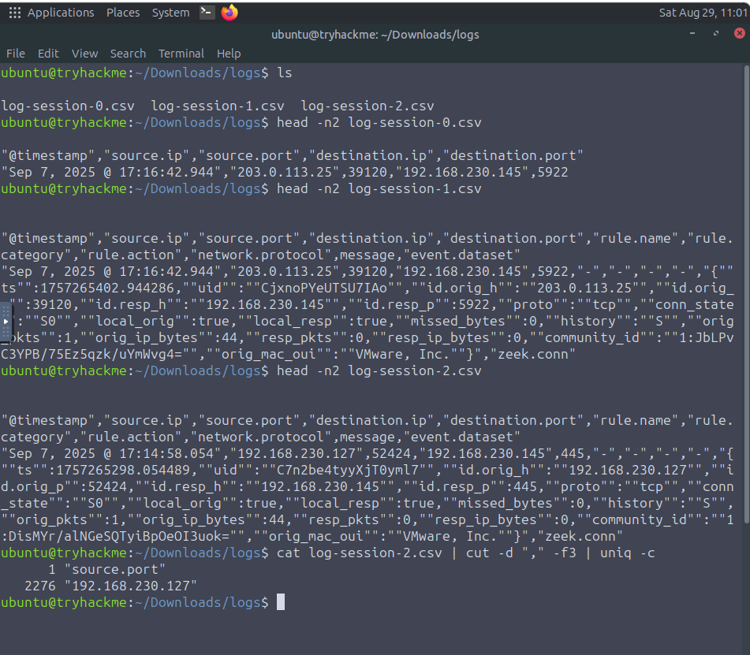
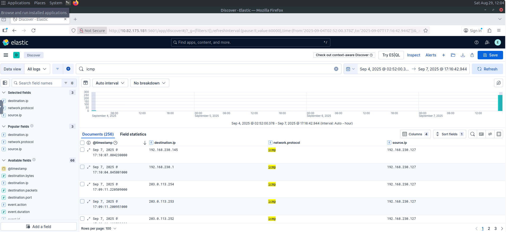

# Network Discovery Detection

## Overview

This investigation focused on identifying and distinguishing different types of network scanning activity using logs exported from a SIEM solution.

The investigation covered:

* External vs internal scanning
* Horizontal vs vertical scanning
* The mechanics of scanning
* Identifying scanning source and destination IP addresses
* Identifying scanned ports
* Identifying TCP SYN scanning activity
* Identifying ping sweep activity

The logs were located in `/home/ubuntu/Downloads/logs` and consisted of CSV files exported from a SIEM solution. The investigation also demonstrated the use of the Linux `head` command to preview log contents.

---

## Tools Used

* Linux Terminal
* SIEM-exported CSV logs
* `head` command
* Network and security log analysis

---

## Investigation Summary

### 1. External vs Internal Scanning

#### External Scanning

External scanning occurs during the initial phases of an attack, before the attacker has achieved a foothold in the network. It is therefore considered a lower-severity type of scanning.

A SOC analyst can respond by blocking the offending IP address on the organisation's perimeter firewall. However, an attacker may return by masking or changing their IP address.

#### Internal Scanning

Internal scanning indicates that an attacker may already be inside the network and is therefore considered a high-severity alert.

After confirming that the activity is not authorised, a SOC analyst should escalate the alert and initiate the Incident Response process. Simply blocking the source IP at the firewall is insufficient because the source is already inside the network. A deeper investigation and root cause analysis are required.

These distinctions are important because internal scanning can indicate that an attacker has already gained a foothold within the network.

---

### 2. Identify the Log File Containing Internal Scanning Activity

The available CSV files were reviewed to identify the file containing evidence of internal scanning.

**Finding**

| Artifact | Value |
| -------- | ----- |
| Internal Scanning Log | `log-session-2.csv` |

---

### 3. Identify the Number of Internal Scanning Log Entries

The logs were analyzed to determine how many entries were associated with the internal IP performing the internal scanning activity.

**Finding**

| Artifact | Value |
| -------- | ----- |
| Internal Scanning Log Entries | `2276` |

---

### 4. Identify the External Scanning IP Address

The logs were examined to identify the external IP address performing external scanning activity.

**Finding**

| Artifact | Value |
| -------- | ----- |
| External Scanning IP | `203.0.113.25` |

---

### 5. Identify Horizontal Scanning

Horizontal scanning can be identified when the same source IP communicates with multiple destination IP addresses while targeting a single destination port across multiple events.

**Finding**

| Artifact | Value |
| -------- | ----- |
| Scanned IP Range | `203.0.113.0/24` |

The identified activity is consistent with a horizontal scan because a single source targets multiple destination IP addresses on a single destination port.

---

### 6. Identify Vertical Scanning

Vertical scanning can be identified when the same source IP targets the same destination IP across multiple events while using multiple destination ports.

**Finding**

| Artifact | Value |
| -------- | ----- |
| Vertically Scanned IP | `192.168.230.145` |

The identified activity is consistent with a vertical scan because multiple destination ports were observed against the same destination IP.

---

### 7. Identify Ports Scanned for Common Services

One host showed scanning activity against a small number of ports associated with common services.

**Finding**

| Artifact | Ports |
| -------- | ----- |
| Scanned Ports | `80`, `445`, `3389` |

These ports correspond to commonly encountered network services and were specifically identified as the ports scanned on the host.

---

### 8. Identify the Source IP Performing a Ping Sweep

The logs were analyzed to identify the source IP performing a ping sweep across an entire subnet.

**Finding**

| Artifact | Value |
| -------- | ----- |
| Ping Sweep Source IP | `192.168.230.127` |

The source IP `192.168.230.127` performed a ping sweep across the subnet.

---

### 9. Identify the Type of Scan Using Connection State

The `zeek.conn.conn_state` value was used to determine the type of scan performed by `203.0.113.25` against `192.168.230.145`.

**Finding**

| Artifact | Value |
| -------- | ----- |
| Source IP | `203.0.113.25` |
| Destination IP | `192.168.230.145` |
| Scan Type | `TCP SYN Scan` |

The connection-state information identified the activity as a TCP SYN scan.

---

## Skills Demonstrated

* Network Scanning Detection
* External vs Internal Scanning Analysis
* Horizontal Scanning Identification
* Vertical Scanning Identification
* Ping Sweep Detection
* TCP SYN Scan Identification
* SIEM Log Analysis
* CSV Log Analysis
* Linux Command-Line Log Analysis
* Security Event Investigation

---

## Key Findings

| Investigation Area | Finding |
| ------------------- | ------- |
| Internal Scanning Log | `log-session-2.csv` |
| Internal Scanning Entries | `2276` |
| External Scanning IP | `203.0.113.25` |
| Horizontally Scanned Range | `203.0.113.0/24` |
| Vertically Scanned IP | `192.168.230.145` |
| Common Service Ports Scanned | `80`, `445`, `3389` |
| Ping Sweep Source IP | `192.168.230.127` |
| TCP SYN Scan Source IP | `203.0.113.25` |
| TCP SYN Scan Destination IP | `192.168.230.145` |

---

## Lessons Learned

* External scanning generally occurs before an attacker gains a foothold and is considered lower severity.
* Internal scanning can indicate that an attacker is already inside the network and should be treated as a high-severity alert.
* Blocking an external scanning IP at the perimeter firewall can be an appropriate initial response, although attackers may return using masked or different IP addresses.
* Internal scanning requires deeper investigation, Incident Response, and root cause analysis rather than simply blocking the source IP.
* Horizontal scanning involves the same source IP targeting multiple destination IP addresses on a single destination port.
* Vertical scanning involves the same source IP targeting the same destination IP across multiple destination ports.
* Ping sweeps can be used to discover hosts across a subnet.
* Zeek connection-state information can help identify the type of scanning activity taking place.
* The investigation identified `203.0.113.25` as an external scanning IP and also identified it performing a TCP SYN scan against `192.168.230.145`.
* Combining different log attributes such as source IP, destination IP, destination port, and connection state can help analysts identify reconnaissance techniques.
