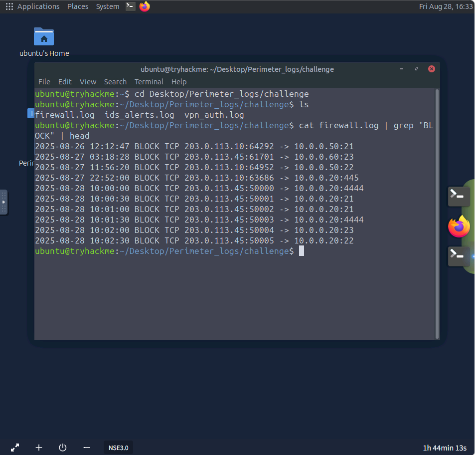
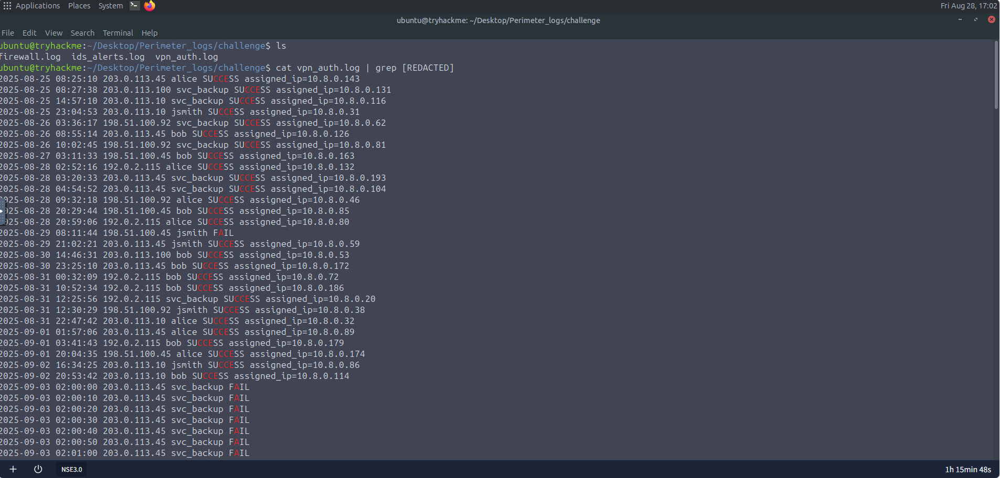
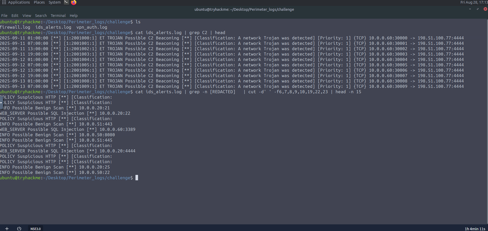

# Perimeter Logs: Investigating the Breach

## Overview

Initech Corp, a mid-sized financial services company, has recently deployed a new firewall and intrusion detection system (IDS) to monitor its network perimeter.

Over the past month, security analysts noticed abnormal traffic patterns, but the SOC team was overwhelmed and missed deeper analysis.

As a new security analyst, the objective was to review one month of perimeter logs to determine what techniques the adversary used and whether they succeeded in breaching the perimeter.

Three sets of logs from the time of the incident were provided in the `Perimeter_logs/challenge` directory:

* `firewall.log`
* `ids_alerts.log`
* `vpn_auth.log`

---

## Tools Used

* Linux Terminal
* Firewall logs
* IDS logs
* VPN authentication logs

---

## Investigation Summary

### 1. Identify the External IP Performing the Most Reconnaissance

The firewall logs were examined to determine which external IP performed the most reconnaissance.

Command:

```bash
cat firewall.log | grep "BLOCK" | head
```

**Finding**

| Artifact                   | Value          |
| -------------------------- | -------------- |
| External Reconnaissance IP | `203.0.113.45` |

The identified IP address performed the most reconnaissance activity against the network perimeter.



---

### 2. Identify the Internal Host Targeted by Scans

The firewall log was analyzed to determine which internal host was targeted by scanning activity.

**Finding**

| Artifact               | Value       |
| ---------------------- | ----------- |
| Targeted Internal Host | `10.0.0.20` |

This exercise demonstrated how firewall logs can be used to identify internal systems targeted during reconnaissance.

---

### 3. Identify the Targeted VPN Username

The VPN authentication logs were examined to determine which username was targeted.

Command:

```bash
cat vpn_auth.log | grep [REDACTED]
```

**Finding**

| Artifact          | Value        |
| ----------------- | ------------ |
| Targeted Username | `svc_backup` |

The `svc_backup` account was targeted during the VPN attack.



---

### 4. Identify the Internal IP Assigned After Successful VPN Login

The investigation identified the internal IP address assigned after a successful VPN login.

**Finding**

| Artifact             | Value       |
| -------------------- | ----------- |
| Assigned Internal IP | `10.8.0.23` |

The successful VPN login resulted in the assignment of internal IP address `10.8.0.23`.

---

### 5. Identify the Port Used for Lateral SMB Attempts

The IDS logs were searched for SMB-related activity to identify the port used during lateral movement attempts.

Command:

```bash
cat ids_alerts.log | grep -n [REDACTED] | grep 'SMB' | cut -d' ' -f6,7,8,9,10,19,21 | head
```

**Finding**

| Artifact | Value |
| -------- | ----- |
| SMB Port | `445` |

Port `445` was used for the lateral SMB attempts.

---

### 6. Identify the Host Beaconing to the C2

The IDS logs were searched for C2-related events.

Command:

```bash
cat ids_alerts.log | grep C2 | head
```

**Finding**

| Artifact          | Value       |
| ----------------- | ----------- |
| C2 Beaconing Host | `10.0.0.60` |

The host `10.0.0.60` was identified as beaconing to the command-and-control infrastructure.



---

### 7. Identify the IP Associated with C2

During the investigation, an IP address was observed to be associated with the command-and-control infrastructure.

**Finding**

| Artifact      | Value           |
| ------------- | --------------- |
| C2 IP Address | `198.51.100.77` |

---

### 8. Identify the Host Showing Exfiltration Attempts

The investigation identified the internal host associated with exfiltration attempts.

**Finding**

| Artifact          | Value       |
| ----------------- | ----------- |
| Exfiltration Host | `10.0.0.51` |

The host `10.0.0.51` showed evidence of exfiltration attempts.

---

## Skills Demonstrated

* Firewall Log Analysis
* IDS Log Analysis
* VPN Authentication Log Analysis
* Network Reconnaissance Detection
* Port Scan Identification
* VPN Attack Investigation
* Successful VPN Login Analysis
* Lateral Movement Analysis
* SMB Traffic Analysis
* C2 Beacon Identification
* Exfiltration Detection
* Linux Command-Line Log Analysis

---

## Key Findings

| Investigation Area         | Finding         |
| -------------------------- | --------------- |
| Most Reconnaissance        | `203.0.113.45`  |
| Scanned Internal Host      | `10.0.0.20`     |
| Targeted VPN Username      | `svc_backup`    |
| Successful VPN Internal IP | `10.8.0.23`     |
| Lateral SMB Port           | `445`           |
| C2 Beaconing Host          | `10.0.0.60`     |
| C2 IP                      | `198.51.100.77` |
| Exfiltration Host          | `10.0.0.51`     |

---

## Lessons Learned

* Firewall logs can reveal external reconnaissance and identify internal systems targeted by scanning activity.
* VPN authentication logs can reveal targeted usernames and successful authentication events.
* A successful VPN login and assigned internal IP can provide important evidence when investigating a potential perimeter breach.
* IDS logs can help identify lateral movement and SMB activity within the network.
* Port `445` was identified as the port used for lateral SMB attempts.
* C2-related IDS alerts can identify internal hosts communicating with command-and-control infrastructure.
* Identifying the external C2 IP can help establish connections between compromised hosts and attacker infrastructure.
* Combining firewall, VPN, and IDS logs provides a broader picture of an adversary's activity across the network perimeter.
