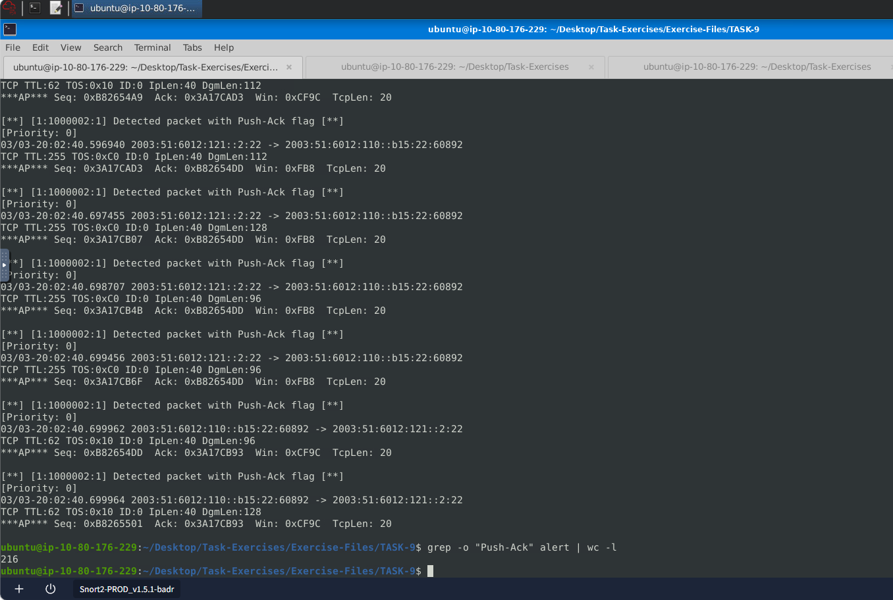

# Snort Network Traffic Analysis

## Overview

This investigation focused on using Snort in multiple operational modes to analyze network traffic, investigate PCAP files, detect network activity, and create custom Snort rules.

The investigation covered:

* Packet Logger Mode
* IDS/IPS Mode
* PCAP Investigation
* Snort Rule Structure

---

## Tools Used

* Snort
* Snort configuration files
* PCAP files
* Linux terminal
* Network traffic analysis

---

# Packet Logger Mode

## Overview

Packet Logger Mode was used to capture and analyze network traffic with Snort. The captured traffic was then inspected using Snort commands to identify packet details such as source ports, IP IDs, HTTP referers, TCP acknowledgement numbers, and TCP port activity.

### Snort Command

```text
sudo snort -dev -K ASCII -l .
```

### 1. Source Port Used to Connect to Port 53

The traffic generator was executed using the `TASK-6 Exercise`, and the resulting logs were analyzed.

#### Finding

| Artifact | Value |
| -------- | ----- |
| Source Port | `3009` |

---

### 2. IP ID of the 10th Packet

#### Snort Query

```text
snort -r snort.log1640048004 -n 10
```

#### Finding

| Artifact | Value |
| -------- | ----- |
| IP ID | `49313` |

---

### 3. Referer of the 4th Packet

#### Snort Query

```text
snort -r snort.log1640048004 -n 10 -X
```

#### Finding

| Artifact | Value |
| -------- | ----- |
| Referer | `http://www.ethereal.com/development.html` |


---

### 4. Ack Number of the 8th Packet

#### Finding

| Artifact | Value |
| -------- | ----- |
| Ack Number | `0x38AFFFF3` |

---

### 5. TCP Port 80 Packets

#### Snort Query

```text
snort -r snort.log.1640048004 'tcp and port 80'
```

#### Finding

| Artifact | Value |
| -------- | ----- |
| TCP Port 80 Packets | `41` |

---

# IDS/IPS Mode

## Overview

IDS/IPS Mode was used to analyze traffic against Snort's detection rules and identify suspicious network activity.

### Snort Command

```text
sudo snort -c /etc/snort/snort.conf -A full -l .
```

The traffic generator was executed using the `TASK-7 Exercise`.

### Detected HTTP GET Methods

#### Finding

| Artifact | Value |
| -------- | ----- |
| Detected HTTP GET Methods | `2` |

---

# PCAP Investigation

## Overview

The `mx-1.pcap`, `mx-2.pcap`, and `mx-3.pcap` files were investigated using Snort's default and custom configuration files.

---

## 1. Investigate `mx-1.pcap` with the Default Configuration

### Snort Query

```text
sudo snort -c /etc/snort/snort.conf -A full -l . -r mx-1.pcap
```

### Finding

| Artifact | Value |
| -------- | ----- |
| Generated Alerts | `170` |

---

## 2. TCP Segments Queued

### Finding

| Artifact | Value |
| -------- | ----- |
| TCP Segments Queued | `18` |

---

## 3. HTTP Response Headers Extracted

### Finding

| Artifact | Value |
| -------- | ----- |
| HTTP Response Headers | `3` |

---

## 4. Investigate `mx-1.pcap` with the Second Configuration

### Snort Query

```text
sudo snort -c /etc/snort/snortv2.conf -A full -l . -r mx-1.pcap
```

### Finding

| Artifact | Value |
| -------- | ----- |
| Generated Alerts | `68` |

---

## 5. Investigate `mx-2.pcap` with the Default Configuration

### Snort Query

```text
sudo snort -c /etc/snort/snort.conf -A full -l . -r mx-2.pcap
```

### Finding

| Artifact | Value |
| -------- | ----- |
| Generated Alerts | `340` |

---

## 6. Detected TCP Packets

### Finding

| Artifact | Value |
| -------- | ----- |
| Detected TCP Packets | `82` |

---

## 7. Investigate `mx-2.pcap` and `mx-3.pcap`

### Snort Query

```text
sudo snort -c /etc/snort/snort.conf -A full -l . --pcap-list="mx-2.pcap mx-3.pcap"
```

### Finding

| Artifact | Value |
| -------- | ----- |
| Generated Alerts | `1020` |

---

# Snort Rule Structure

## Overview

Custom Snort rules were created to detect specific packet characteristics, including IP IDs, TCP flags, and packets where the source and destination IP addresses are identical.

---

## 1. Detect IP ID `35369`

### Snort Rule

```text
alert ip any any <> any any (msg: "Packect with ID 35369 detected"; id:35369; sid:1000001; rev:1)
```

### Command

```text
snort -c local.rules -A full -l . -r task9.pcap
```

### Analyze Alert

```text
cat alert
```

### Finding

| Artifact | Value |
| -------- | ----- |
| Request Name | `TIMESTAMP REQUEST` |

---

## 2. Detect SYN Flag Packets

The previous alert file was cleared before creating the new rule.

### Command

```text
truncate -s 0 alert
```

### Snort Rule

```text
alert tcp any any <> any any (msg: "Packect with Syn flag detected"; flags:S; sid:1000001; rev:1)
```

### Command

```text
snort -c local.rules -A full -l . -r task9.pcap
```

### Analyze Alert

```text
cat alert
```

### Finding

| Artifact | Value |
| -------- | ----- |
| Detected SYN Packets | `1` |

---

## 3. Detect Push-Ack Flag Packets

### Command

```text
truncate -s 0 alert
```

### Snort Rule

```text
alert tcp any any <> any any (msg: "Packect with Push-Ack flag detected"; flags:PA; sid:1000002; rev:1)
```

### Command

```text
snort -c local.rules -A full -l . -r task9.pcap
```

### Analyze Alert

```text
cat alert
```

Because there was too much alert output to count manually, `grep` and `wc` were used.

```text
grep -o "Push-Ack flag" alert | wc -l
```

### Finding

| Artifact | Value |
| -------- | ----- |
| Push-Ack Packets | `216` |



---

## 4. Detect Packets with the Same Source and Destination IP

### Command

```text
truncate -s 0 alert
```

### Snort Rule

```text
alert udp any any <> any any (msg: "Detected packet with same Soource and Destination Ip"; sameip; sid:1000003; rev:1;)
```

### Command

```text
snort -c local.rules -A full -l . -r task9.pcap
```

### Analyze Alert

```text
grep -o "Destination Ip" alert | wc -l
```

### Finding

| Artifact | Value |
| -------- | ----- |
| Packets with Same Source/Destination IP | `7` |

---

## 5. Rule Revision

### Scenario

An analyst successfully modified an existing Snort rule. The question was which rule option must be changed after the implementation.

### Finding

| Artifact | Value |
| -------- | ----- |
| Rule Option | `rev` |

The `rev` option is the rule revision value.

---

# Key Findings

| Investigation Area | Finding |
| ------------------- | ------- |
| Source Port to Port 53 | `3009` |
| 10th Packet IP ID | `49313` |
| 4th Packet Referer | `http://www.ethereal.com/development.html` |
| 8th Packet Ack Number | `0x38AFFFF3` |
| TCP Port 80 Packets | `41` |
| Detected HTTP GET Methods | `2` |
| `mx-1.pcap` Alerts (Default Config) | `170` |
| TCP Segments Queued | `18` |
| HTTP Response Headers Extracted | `3` |
| `mx-1.pcap` Alerts (Second Config) | `68` |
| `mx-2.pcap` Alerts | `340` |
| Detected TCP Packets | `82` |
| `mx-2.pcap` + `mx-3.pcap` Alerts | `1020` |
| IP ID `35369` Request Name | `TIMESTAMP REQUEST` |
| SYN Packets | `1` |
| Push-Ack Packets | `216` |
| Same Source/Destination IP Packets | `7` |
| Rule Revision Option | `rev` |

---

# Skills Demonstrated

* Snort Packet Logger Mode
* Snort IDS/IPS Analysis
* PCAP Investigation
* Snort Rule Creation
* HTTP Traffic Analysis
* Network Traffic Analysis
* Alert Investigation
* Linux Command-Line Analysis
* Custom Detection Rule Development
