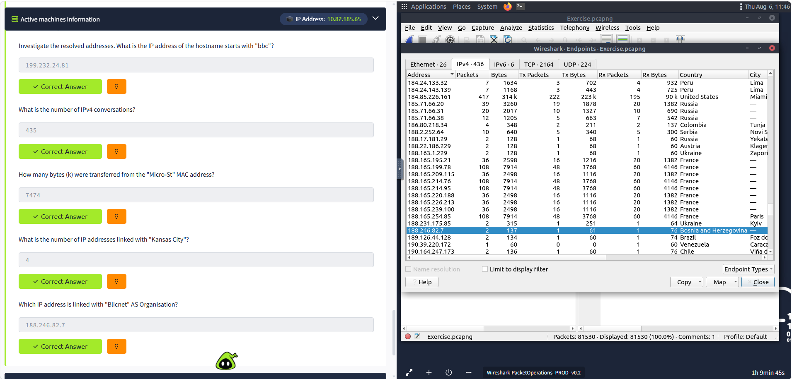
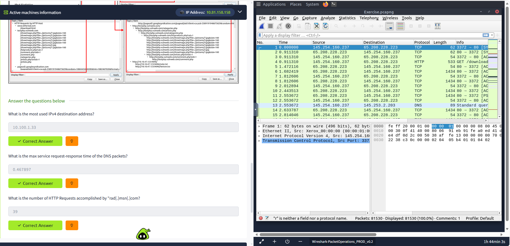

# Wireshark: Packet Operations

## Overview

This room introduces the fundamentals of **packet analysis using Wireshark**. The exercises focus on analyzing a packet capture by exploring network statistics, inspecting protocol-specific traffic, and applying both basic and advanced display filters. The objective is to develop practical skills in investigating network communications, identifying endpoints and conversations, analyzing HTTP and DNS traffic, and efficiently isolating packets using Wireshark's filtering capabilities.

## Tools Used

- Ubuntu Linux
- Wireshark

---

# Investigation Summary

## 1. Analyze Network Statistics

Wireshark's **Statistics** menu was used to investigate network conversations, endpoints, and resolved addresses to identify communicating hosts and traffic characteristics.

### Navigation Used

- **Statistics → Resolved Addresses**
- **Statistics → Conversations**
- **Statistics → Endpoints**

### Key Findings

| Investigation | Result |
|--------------|-------:|
| IP address of hostname beginning with **bbc** | `199.232.24.81` |
| Number of IPv4 Conversations | `435` |
| Bytes transferred from **Micro-St** MAC Address | `7474 kB` |
| Number of IP addresses linked with **Kansas City** | `4` |
| IP address linked with **Blicnet** AS Organization | `188.246.82.7` |

This exercise demonstrated how Wireshark statistics provide a quick overview of active hosts, communication pairs, transferred data, and endpoint information.

---

## 2. Analyze Protocol Statistics

Protocol statistics were used to identify frequently contacted hosts, DNS performance, and HTTP communication.

### Navigation Used

- **Statistics → IPv4 Statistics**
- **Statistics → DNS**
- **Statistics → HTTP**

### Key Findings

| Investigation | Result |
|--------------|-------:|
| Most used IPv4 destination address | `10.100.1.33` |
| Maximum DNS request-response time | `0.467897 seconds` |
| HTTP requests made to `rad.msn.com` | `39` |

This exercise demonstrated how protocol statistics help analysts identify communication patterns and measure protocol performance.

---

## 3. Apply Basic Display Filters

Display filters were used to isolate packets matching specific protocols, packet fields, and transport-layer characteristics.

### Filters Used

| Objective | Display Filter | Result |
|-----------|---------------|-------:|
| Count all IP packets | `ip` | `81420` |
| Packets with TTL less than 10 | `ip.ttl < 10` | `66` |
| Packets using TCP port 4444 | `tcp.port == 4444` | `632` |
| HTTP GET requests sent to port 80 | `http.request.method == "GET" && tcp.dstport == 80` | `527` |
| DNS Type A Queries | `dns.flags.response == 0 && dns.qry.type == 1` | `51` |

These filters demonstrate how protocol fields can be used to quickly isolate relevant traffic from large packet captures.

---

## 4. Perform Advanced Packet Filtering

Advanced display filters were created using comparison operators, logical operators, protocol fields, and custom Wireshark profiles to locate specific traffic.

### Filters Used

| Objective | Display Filter | Result |
|-----------|---------------|-------:|
| Microsoft IIS packets not originating from port 80 | `http.server contains "Microsoft-IIS" && tcp.srcport != 80` | `21` |
| Microsoft IIS Version 7.5 packets | `http.server contains "Microsoft-IIS/7.5"` | `71` |
| Packets using ports 3333, 4444 or 9999 | `tcp.port == 3333 || tcp.port == 4444 || tcp.port == 9999` | `2235` |
| Packets with even TTL values | `ip.ttl % 2 == 0` | `77289` |
| Bad TCP Checksum packets *(Checksum Control Profile)* | `tcp.checksum_bad == 1` | `34185` |
| Existing predefined filter supplied by the room | *(Applied using the built-in filtering button)* | `261` |

This exercise demonstrated how multiple filtering techniques can be combined to perform targeted investigations and identify anomalies within packet captures.

---

# Skills Demonstrated

- Packet Inspection
- Network Traffic Analysis
- Protocol Analysis
- IPv4 Statistics Analysis
- Endpoint Analysis
- Conversation Analysis
- HTTP Traffic Analysis
- DNS Traffic Analysis
- Basic Display Filtering
- Advanced Display Filtering
- Comparison Operators
- Logical Expressions
- TCP/UDP Port Filtering
- Network Troubleshooting

---

# Lessons Learned

- Wireshark's **Statistics** tools provide valuable insight into network conversations, endpoints, and protocol usage.
- Resolved addresses and endpoint statistics help identify communicating devices and transferred data volumes.
- Protocol statistics simplify the identification of frequently contacted hosts and network service performance.
- Display filters allow analysts to efficiently isolate packets based on protocols, ports, packet fields, and header values.
- Logical operators (`&&`, `||`, `!=`) and comparison operators enable the creation of complex filters for targeted investigations.
- Combining statistics with display filters significantly reduces analysis time and improves the efficiency of packet investigations.
- Wireshark's filtering capabilities are essential for network troubleshooting, traffic analysis, and digital forensics.
