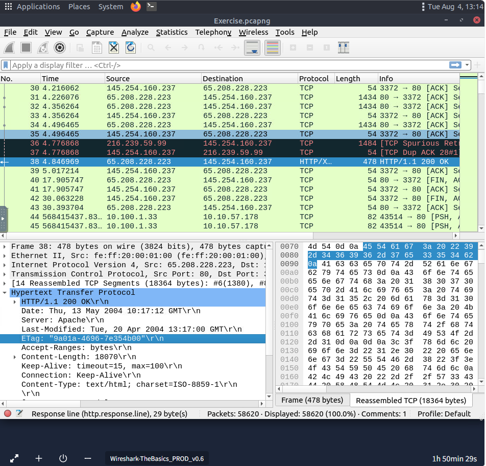
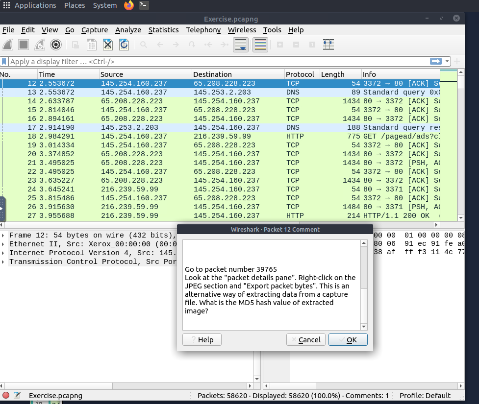
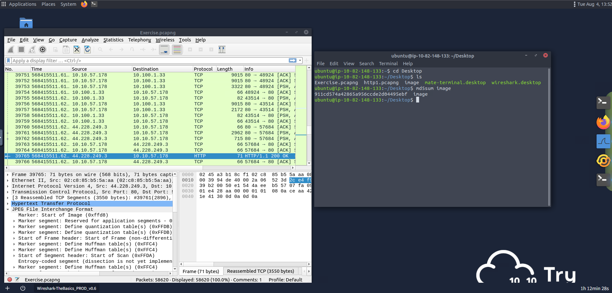
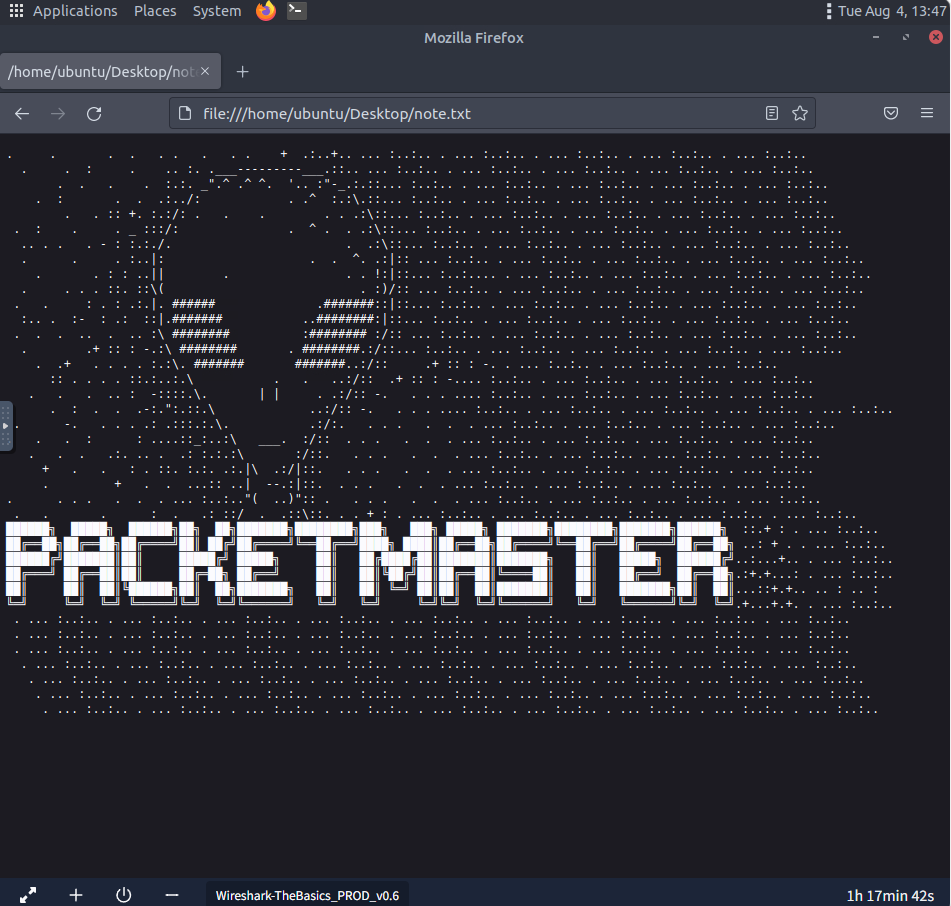

# Wireshark: The Basics

## Overview

This room introduces the fundamentals of **Wireshark**, an open-source network protocol analyzer used to capture and inspect network traffic. The exercises cover packet dissection, protocol analysis, display filtering, packet searching, HTTP stream reconstruction, file extraction, and packet analysis using a provided PCAP file. The objective is to develop practical skills for investigating network traffic and extracting valuable forensic evidence from packet captures.

## Tools Used

- Ubuntu Linux
- Wireshark
- Terminal (`md5sum`)

---

## Investigation Summary

### 1. Inspect Individual Packets

Packet **38** was analyzed to identify information contained within the HTTP response and the underlying network protocols.

**Key Findings**

| Artifact | Value |
|----------|------|
| Markup Language | eXtensible Markup Language (XML) |
| Arrival Date | `05/13/2004` |
| Time To Live (TTL) | `47` |
| TCP Payload Size | `424 bytes` |
| HTTP ETag | `9a01a-4696-7e354b00` |

This exercise demonstrated how to inspect packet metadata, HTTP headers, and transport layer information within Wireshark.



---

### 2. Search Packet Contents

Wireshark's search functionality was used to locate the string **`r4w`** within the packet details.

**Finding**

| Artifact | Value |
|----------|------|
| Artist 1 | `r4w8173` |

This exercise demonstrated how packet searches can quickly locate specific application-layer data inside captured traffic.

---

### 3. Follow Packet Comments and Extract Packet Data

Packet **12** contained a comment directing the investigation to **packet 39765**, where an embedded JPEG image was stored inside the packet data.

The investigation steps were:

1. Open **packet 39765**.
2. Expand the **JPEG** section in the **Packet Details** pane.
3. Right-click the JPEG object and select **Export Packet Bytes**.
4. Save the extracted image to the local machine.
5. Generate its MD5 hash using the Linux terminal.

Command:

```bash
md5sum image
```

**Result**

| Artifact | Value |
|----------|------|
| MD5 Hash | `911cd574a42865a956ccde2d04495ebf` |

This exercise demonstrated an alternative method of extracting files directly from packet data and verifying their integrity using an MD5 hash.





---

### 4. Extract Files from the Capture

A transferred **`.txt`** file was extracted from the packet capture using Wireshark's file extraction capabilities.

**Finding**

| Artifact | Value |
|----------|------|
| Alien Name | `PACKETMASTER` |

This exercise demonstrated how application-layer files transferred over the network can be recovered and inspected.



---

### 5. Review Expert Information

Wireshark's **Expert Information** feature was used to summarize events detected throughout the packet capture.

**Finding**

| Artifact | Value |
|----------|------|
| Warning Count | `1636` |

Expert Information provides a quick overview of warnings, protocol issues, and anomalies that may require further investigation.

---

### 6. Apply Display Filters

Packet **4** was inspected, and the **Hypertext Transfer Protocol (HTTP)** field was applied as a display filter.

**Results**

| Artifact | Value |
|----------|------|
| Display Filter | `http` |
| Displayed Packets | `1089` |

Display filters help analysts isolate specific protocols and reduce unnecessary traffic during packet analysis.

---

### 7. Follow an HTTP Stream

The HTTP stream associated with **packet 33790** was reconstructed to inspect the complete client-server conversation.

**Findings**

| Artifact | Value |
|----------|------|
| Total Artists | `3` |
| Second Artist | `Blad3` |

Following an HTTP stream allows investigators to reconstruct full application-layer communications, making it easier to analyze transmitted data.

---

## Skills Demonstrated

- Packet Dissection
- TCP/IP Layer Analysis
- HTTP Protocol Analysis
- Packet Metadata Inspection
- Display Filtering
- Packet Searching
- HTTP Stream Reconstruction
- File Extraction from PCAP Files
- Exporting Packet Bytes
- MD5 Hash Verification

---

## Lessons Learned

- Individual packets contain valuable metadata such as timestamps, TTL values, payload sizes, and HTTP headers.
- Display filters significantly reduce noise by isolating specific protocols.
- Packet searching enables rapid identification of strings and application-layer data.
- Packet comments may provide investigation instructions that lead to additional evidence.
- Files embedded within packet data can be exported using **Export Packet Bytes** and verified using hashing techniques.
- HTTP stream reconstruction provides complete client-server conversations for application-layer analysis.
- The Expert Information window provides a high-level summary of warnings and anomalies that assist in troubleshooting and forensic investigations.
- Wireshark provides multiple methods for extracting evidence, making it an essential tool for network forensics and incident response.
