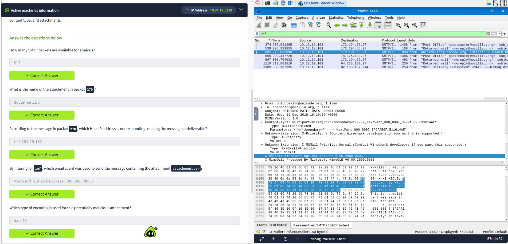
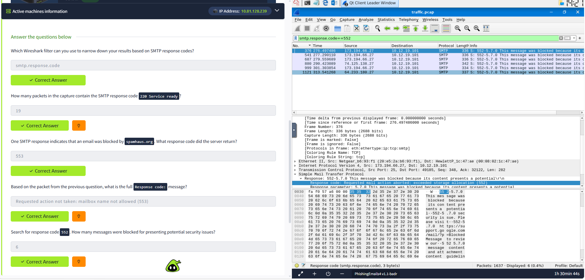

# Phishing Prevention

## Overview
This room explores the techniques and technologies used to defend against phishing attacks. It covers email authentication mechanisms (**SPF, DKIM, and DMARC**), SMTP and email header analysis in **Wireshark**, SMTP response codes, and the investigation of suspicious emails and attachments. The goal is to understand how organizations prevent, detect, and respond to phishing threats.

## Tools Used
- Linux VM
- Wireshark
- SMTP Protocol Analysis
- PCAP File (`traffic.pcap`)

## Investigation Summary

### 1. Analyze SMTP Traffic

Filter SMTP traffic:

```text
smtp
```

This filter isolates all SMTP communications, allowing email conversations to be examined separately from other network traffic.

**Findings**
- Total SMTP packets analyzed: **512**

---

### 2. Examine Email Headers

The Internet Message Format (IMF) filter was used to inspect email headers and identify sender information, attachments, and the email client.

Filter:

```text
imf
```

**Findings**
- Email client:
  ```
  Microsoft Outlook Express 6.00.2600.0000
  ```
- Attachment:
  ```
  document.zip
  ```
- Attachment encoding:
  ```
  base64
  ```



---

### 3. Analyze SMTP Responses

The following filter was used to examine SMTP server response codes:

```text
smtp.response.code
```

| Response Code | Description |
|--------------|-------------|
| 220 | Service Ready (19 packets) |
| 552 | Message blocked due to potential security issues (6 packets) |
| 553 | Requested action not taken: mailbox name not allowed |



---

## Email Authentication

### SPF (Sender Policy Framework)

SPF specifies which mail servers are authorized to send emails on behalf of a domain.

Example:

```text
v=spf1 ip4:127.0.0.1 include:_spf.google.com -all
```

- `v=spf1` – SPF version
- `ip4:127.0.0.1` – Authorized IPv4 address
- `include:_spf.google.com` – Allows Google's mail servers
- `-all` – Reject unauthorized senders

---

### DKIM (DomainKeys Identified Mail)

DKIM digitally signs outgoing emails, allowing recipients to verify that the message has not been altered.

Example:

```text
v=DKIM1; k=rsa; p=<public_key>
```

- `v=DKIM1` – DKIM version
- `k=rsa` – RSA encryption
- `p=` – Public key used for verification

---

### DMARC (Domain-based Message Authentication, Reporting & Conformance)

DMARC works with SPF and DKIM to define how email servers should handle messages that fail authentication.

Example:

```text
v=DMARC1; p=quarantine; rua=mailto:postmaster@website.com
```

- `v=DMARC1` – DMARC version
- `p=quarantine` – Send failed emails to spam/quarantine
- `rua=` – Address for aggregate reports

### Why These Matter

SPF, DKIM, and DMARC work together to verify the authenticity of emails, reduce domain spoofing, and improve an organization's ability to prevent phishing attacks.

---

## Skills Demonstrated

- Wireshark Packet Analysis
- SMTP Traffic Analysis
- Email Header Inspection
- SMTP Response Code Analysis
- Email Attachment Investigation
- Phishing Email Analysis
- SPF Configuration
- DKIM Authentication
- DMARC Policy Analysis

## Lessons Learned

- SMTP traffic can reveal valuable information during phishing investigations.
- IMF headers expose metadata such as the sending client and attachment details.
- SMTP response codes help identify blocked, rejected, or successfully delivered emails.
- Base64 is commonly used to encode email attachments.
- SPF, DKIM, and DMARC work together to reduce email spoofing and improve protection against phishing attacks.
