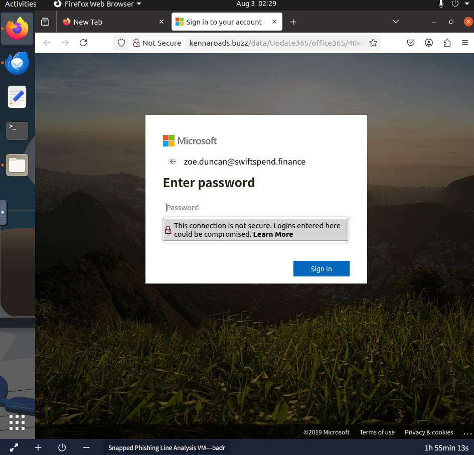
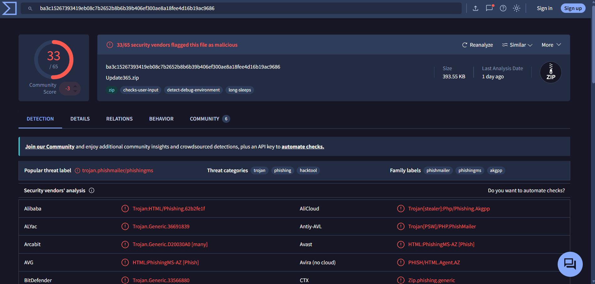
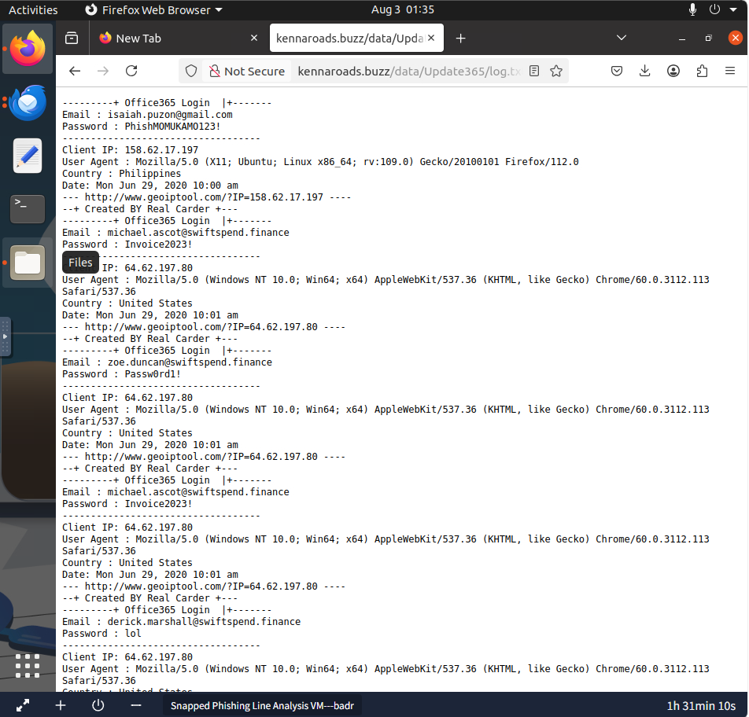

# Phishing Email Investigation

## Overview

This room focuses on investigating a phishing campaign targeting employees at **SwiftSpend Financial**. The investigation involves analyzing multiple phishing emails, inspecting a malicious HTML attachment, tracing phishing infrastructure, examining an exposed phishing kit, identifying compromised user credentials, and collecting Indicators of Compromise (IOCs). Threat intelligence tools are used to validate the phishing kit and understand the attacker's methods.

## Tools Used

- Ubuntu Linux
- Thunderbird
- VirusTotal
- Firefox Web Browser

---

## Investigation Summary

### 1. Analyze the Phishing Emails

The emails stored in the `phish-emails` directory were reviewed using **Thunderbird** to identify recipients, sender information, phishing themes, and malicious attachments.

**Key Findings**

| Artifact | Value |
|----------|------|
| Subject | **Quote for Services Rendered** |
| Recipient | William McClean |
| Sender Address | `Accounts.Payable@groupmarketingonline.icu` |

The phishing campaign targeted multiple employees across the organization. One email requested a quote for services rendered, while another email contained the malicious HTML attachment used later in the investigation.

---

### 2. Investigate the Malicious Attachment

A separate phishing email addressed to **Zoe Duncan** contained a malicious HTML attachment. The attachment was opened inside the isolated virtual machine to safely observe its behavior.

**Findings**

| Artifact | Value |
|----------|------|
| Recipient | Zoe Duncan |
| Redirect Domain | `kennaroads.buzz` |
| Impersonated Company | Microsoft Office 365 |

The HTML attachment redirected victims to a fake Microsoft Office 365 login page designed to harvest user credentials.



---

### 3. Discover the Exposed Phishing Kit

The phishing website was manually explored to determine whether additional resources were publicly accessible.

Directory:

```text
/data
```

**Findings**

| Artifact | Value |
|----------|------|
| Archive Name | `Update365.zip` |

The attacker accidentally exposed the phishing kit archive within the web directory, allowing further forensic analysis.

---

### 4. Analyze the Phishing Kit

The phishing kit archive was downloaded and hashed using Linux.

Command:

```bash
sha256sum Update365.zip
```

**Results**

| Item | Value |
|------|------|
| SHA256 | `ba3c15267393419eb08c7b2652b8b6b39b406ef300ae8a18fee4d16b19ac9686` |

The SHA256 hash was submitted to **VirusTotal** to gather threat intelligence.

**VirusTotal Findings**

| Artifact | Value |
|----------|------|
| Threat Category | Trojan |
| Files Contained in Archive | 49 |

The phishing kit was detected by multiple antivirus vendors and categorized as a credential-stealing phishing toolkit.



---

### 5. Review Harvested Credentials

The exposed credential log was reviewed to determine which users had submitted their login information.

Location:

```text
/data/Update365/log.txt
```

**Findings**

The following user submitted credentials more than once:

```text
michael.ascot@swiftspend.finance
```

The log also contained:

- User email addresses
- Passwords
- Client IP addresses
- Browser User-Agent strings
- Country information
- Submission timestamps

This confirmed that the phishing page was actively collecting victim credentials.



---

### 6. Examine the Phishing Kit Source Code

After extracting the phishing kit archive, the PHP source code responsible for processing submitted credentials was inspected.

File:

```text
submit.php
```

**Finding**

Collected credentials were sent to:

```text
m3npat@yandex.com
```

This email address was hardcoded into the phishing kit and served as the attacker's credential collection point.

---

## Indicators of Compromise (IOCs)

| Indicator | Value |
|----------|------|
| Sender Email | `Accounts.Payable@groupmarketingonline.icu` |
| Phishing Domain | `kennaroads.buzz` |
| Archive Name | `Update365.zip` |
| SHA256 | `ba3c15267393419eb08c7b2652b8b6b39b406ef300ae8a18fee4d16b19ac9686` |
| Impersonated Brand | Microsoft Office 365 |
| Credential Collection Email | `m3npat@yandex.com` |

---

## Indicators of Phishing

During the investigation, several characteristics confirmed the campaign was malicious:

- Business-themed emails were used as social engineering.
- A malicious HTML attachment redirected victims to an external website.
- The phishing page impersonated Microsoft Office 365.
- Victim credentials were harvested through a fake login portal.
- The phishing kit was publicly exposed due to directory listing.
- Captured credentials were stored in plaintext log files.
- Stolen credentials were automatically forwarded to an attacker-controlled email address.

---

## Skills Demonstrated

- Phishing Email Analysis
- Email Attachment Investigation
- URL Analysis
- Web Directory Enumeration
- SHA256 Hash Generation
- VirusTotal Threat Intelligence
- Phishing Kit Analysis
- PHP Source Code Review
- Credential Harvesting Investigation
- Indicator of Compromise (IOC) Collection

---

## Lessons Learned

- A phishing campaign may target multiple users using different email lures within the same infrastructure.
- HTML attachments can redirect victims to convincing credential harvesting pages.
- Publicly exposed web directories may unintentionally reveal attacker infrastructure and phishing kits.
- SHA256 hashes enable quick identification of malicious files using threat intelligence platforms such as VirusTotal.
- Reviewing phishing kit source code can reveal attacker-controlled email addresses and credential collection mechanisms.
- Harvested credential logs provide insight into the scope of user compromise.
- Collecting Indicators of Compromise (IOCs) is essential for incident response, threat hunting, and future detection.
```
