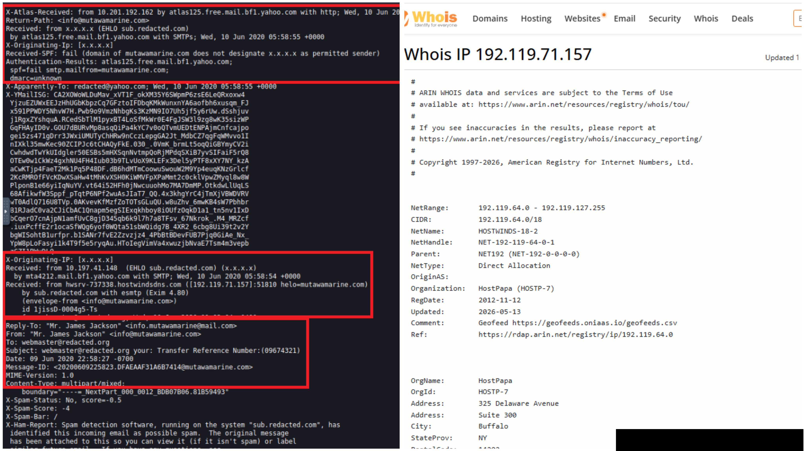
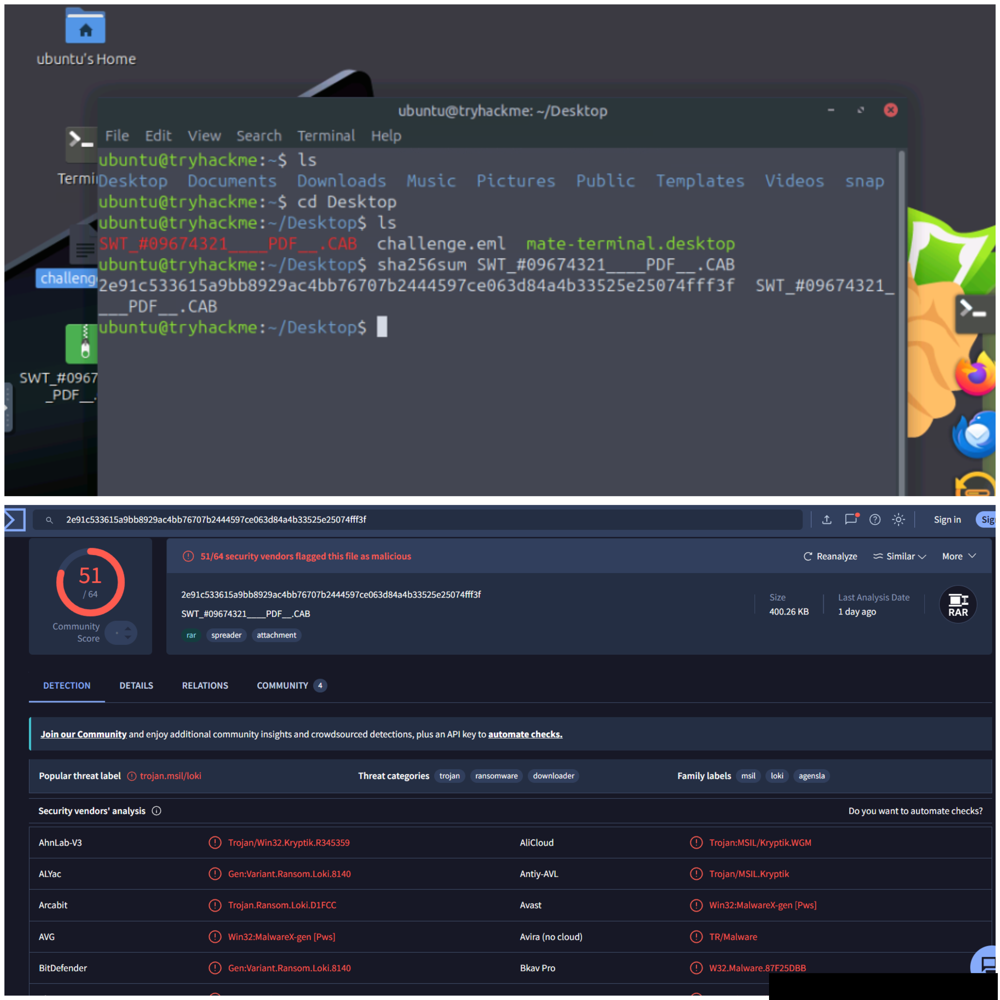

# Phishing Email Investigation

## Overview

This room focuses on investigating a suspected phishing email by analyzing its headers, sender information, authentication records, and malicious attachment. The investigation uses email forensic techniques to determine the origin of the message, validate email authentication mechanisms (**SPF** and **DMARC**), identify the sender's infrastructure, and inspect the attached file using threat intelligence services.

## Tools Used

- Ubuntu Linux
- Thunderbird
- MXToolbox
- VirusTotal
- WHOIS IP Lookup

## Investigation Summary

### 1. Examine the Email Source

The email (`challenge.eml`) was opened in **Mozilla Thunderbird**, and the **Message Source** was inspected to analyze the complete email headers.

**Key Findings**

| Artifact | Value |
|----------|------|
| Subject | Transfer Reference Number: **09674321** |
| Display Name | Mr. James Jackson |
| Sender Address | `info@mutawamarine.com` |
| Reply-To Address | `info.mutawamarine@mail.com` |

The sender's email address differs from the **Reply-To** address, which is a common phishing indicator used to redirect responses to an attacker-controlled mailbox.



---

### 2. Analyze Email Headers

The email headers were examined to identify the originating server and trace the message path.

**Findings**

- Original IP Address:
  ```text
  192.119.71.157
  ```

- IP Owner:
  ```text
  HostPapa
  ```

The originating IP was extracted from the earliest **Received** header and verified using a WHOIS lookup.

---

### 3. Verify Email Authentication

#### SPF Record

The Return-Path domain's SPF record was checked using **MXToolbox**.

```text
v=spf1 include:spf.protection.outlook.com -all
```

This record authorizes Microsoft Outlook's mail servers to send email on behalf of the domain while rejecting unauthorized senders.

---

#### DMARC Record

The DMARC policy for the sender's domain was also verified.

```text
v=DMARC1; p=quarantine; fo=1
```

This policy instructs receiving mail servers to quarantine emails that fail authentication checks.

---

### 4. Investigate the Email Attachment

The suspicious attachment contained in the email was identified and downloaded for analysis.

**Attachment Details**

| Item | Value |
|------|------|
| Filename | `SWT_#09674321____PDF__.CAB` |
| SHA256 | `2e91c533615a9bb8929ac4bb76707b2444597ce063d84a4b33525e25074fff3f` |
| File Size | 400.26 KB |
| Actual File Type | RAR Archive |

Although the attachment appears to be a **CAB/PDF** file, analysis revealed that it is actually a **RAR archive**, indicating an attempt to disguise the true file type.

The SHA256 hash was submitted to **VirusTotal** to gather threat intelligence and verify the attachment's characteristics.



---

## Email Authentication

### SPF (Sender Policy Framework)

SPF specifies which mail servers are permitted to send emails for a domain.

Example:

```text
v=spf1 include:spf.protection.outlook.com -all
```

- `v=spf1` – SPF version
- `include:` – Permitted mail servers
- `-all` – Reject unauthorized senders

---

### DMARC (Domain-based Message Authentication, Reporting & Conformance)

DMARC defines how email servers should handle messages that fail SPF or DKIM validation.

Example:

```text
v=DMARC1; p=quarantine; fo=1
```

- `v=DMARC1` – DMARC version
- `p=quarantine` – Place failed messages in quarantine
- `fo=1` – Generate failure reports

### Why These Matter

SPF and DMARC help reduce email spoofing by verifying that emails originate from authorized servers and defining actions for failed authentication attempts.

---

## Indicators of Phishing

During the investigation, several suspicious characteristics were identified:

- Generic greeting used in the email.
- Unexpected request for a financial transfer.
- Different **Reply-To** address from the sender address.
- Attachment disguised using a misleading file extension.
- Email required verification of sender authenticity through SPF and DMARC.

---

## Skills Demonstrated

- Email Header Analysis
- Email Source Investigation
- SMTP Header Analysis
- Email Authentication Validation (SPF & DMARC)
- WHOIS IP Investigation
- VirusTotal File Analysis
- SHA256 Hash Verification
- Email Attachment Analysis
- Phishing Email Investigation

## Lessons Learned

- Email headers reveal valuable information about a message's true origin.
- Comparing the **From** and **Reply-To** fields can quickly expose phishing attempts.
- WHOIS lookups help identify the infrastructure hosting suspicious emails.
- SPF and DMARC records assist in validating email legitimacy.
- File extensions should never be trusted without verification.
- Hashing suspicious files before analysis preserves integrity and enables threat intelligence lookups.
- Multiple indicators combined provide stronger evidence of phishing than relying on a single artifact.
