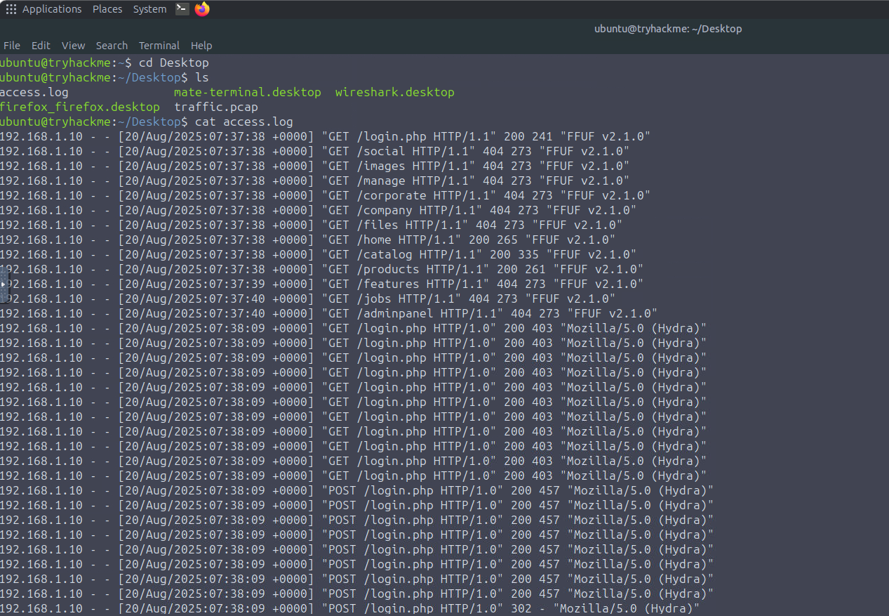
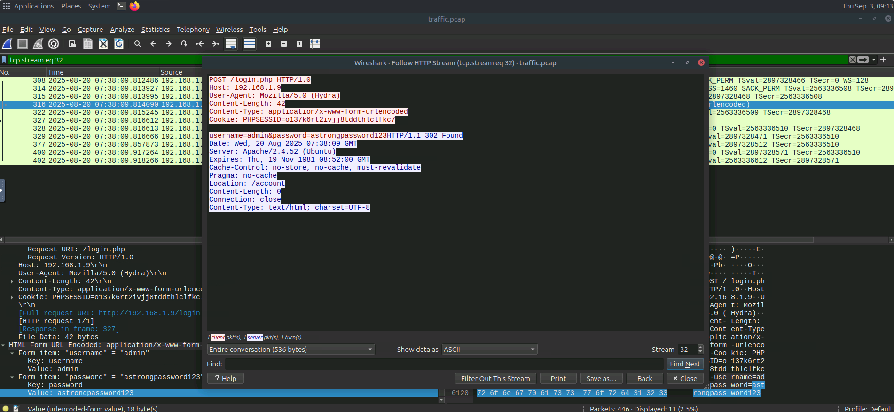
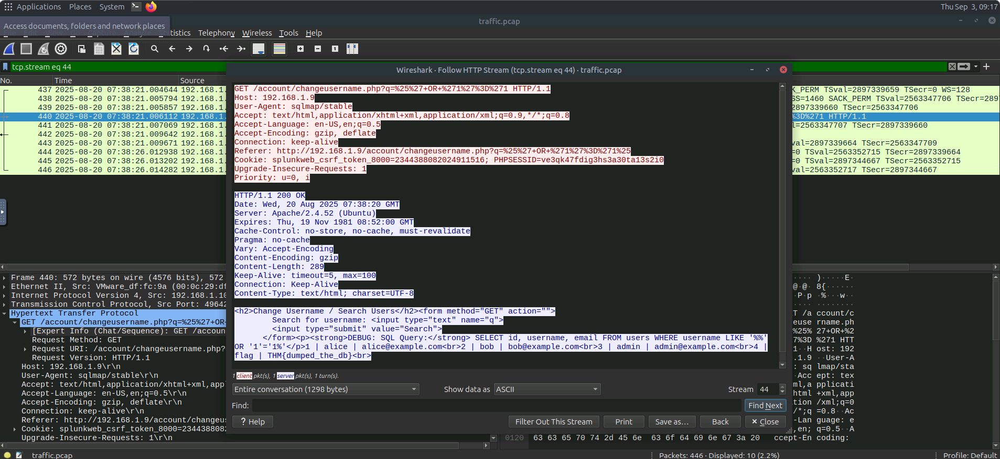

# Web Attack Detection

## Overview

This investigation focused on identifying and retracing a web application attack against **TryBankMe**, a small online banking platform.

The investigation used both **log-based detection** and **network-based detection** to uncover the attacker's techniques, identify the compromised credentials, and determine what data was extracted.

The investigation covered three main areas:

* Log-Based Detection
* Network-Based Detection
* Web Application Firewall (WAF)

---

## Tools Used

* Access logs
* Wireshark
* PCAP files

---

# Detection: Log-Based Detection

## Overview

TryBankMe suffered a breach in which attackers gained access to the company's web application and leaked sensitive customer data.

The investigation began by analyzing the `access.log` file to retrace the attacker's steps.

### Indicators of Attack

* Directory fuzzing activity.
* Brute-force authentication attempts.
* SQL Injection activity.
* Automated security tools identified through User-Agent strings.
* Suspicious requests targeting account functionality.

### 1. Directory Fuzzing User-Agent

The attacker performed directory fuzzing against the web application.

| Artifact   | Value         |
| ---------- | ------------- |
| User-Agent | `FFUF v2.1.0` |

The User-Agent indicates that the attacker used **FFUF** to discover directories and pages on the web application.

### 2. Brute-Force Attack

The attacker performed a brute-force attack against the application's login page.

| Artifact    | Value        |
| ----------- | ------------ |
| Target Page | `/login.php` |

The `/login.php` page was targeted during the authentication attack.



### 3. SQL Injection Payload

The attacker used SQL Injection against the `/changeusername.php` form.

#### Request

```text
GET /account/changeusername.php?q=%25%27+OR+%271%27%3D%271 HTTP/1.1
```

#### Encoded Payload

```text
%25%27+OR+%271%27%3D%271
```

#### Decoded Payload

```text
%' OR '1'='1
```

The request was associated with the `sqlmap/stable` User-Agent, indicating automated SQL Injection activity.

---

# Detection: Network-Based Detection

## Overview

The log analysis revealed evidence of the attack, but it did not identify which credentials were successfully compromised or what information was extracted.

Network traffic captured during the attack was therefore analyzed using the `traffic.pcap` file.

### 1. Brute-Forced Password

The network traffic was filtered to identify HTTP requests originating from the attacker.

#### Wireshark Query

```text
ip.src == 192.168.1.10 && http.user_agent
```

The HTTP stream was then followed to inspect the authentication attempts.

#### Finding

| Artifact             | Value                |
| -------------------- | -------------------- |
| Compromised Password | `astrongpassword123` |

The attacker successfully identified the password:

```text
astrongpassword123
```



### 2. Data Obtained Through SQL Injection

The attacker used SQL Injection to extract information from the application's database.

#### Finding

| Artifact      | Value                |
| ------------- | -------------------- |
| Database Flag | `THM{dumped_the_db}` |

The flag confirms that the attacker successfully dumped data from the database using SQL Injection.



---

# Detection: Web Application Firewall

## Overview

A Web Application Firewall (WAF) can help protect web applications by inspecting and filtering incoming web requests.

### 1. WAF Inspection

| Artifact     | Value         |
| ------------ | ------------- |
| WAF Inspects | `Web Request` |

WAFs inspect and filter web requests to identify and block malicious traffic.

### 2. Custom User-Agent Rule

A custom firewall rule was created to block requests containing the suspicious `BotTHM` User-Agent.

#### Firewall Rule

```text
IF User-Agent CONTAINS "BotTHM" THEN block
```

This rule prevents requests containing `BotTHM` in the User-Agent field from reaching the web application.

---

# Attack Chain

The investigation revealed a multi-stage web application attack:

1. **Directory Fuzzing** — The attacker used `FFUF v2.1.0` to discover directories and pages on the web application.
2. **Brute-Force Attack** — The attacker targeted `/login.php` and successfully identified the password `astrongpassword123`.
3. **SQL Injection** — The attacker used SQL Injection against `/account/changeusername.php`.
4. **Database Dumping** — The SQL Injection attack allowed the attacker to extract database information, including the flag `THM{dumped_the_db}`.
5. **WAF Mitigation** — A custom rule was created to block User-Agents containing `BotTHM`.

---

# Key Findings

| Investigation Area           | Finding                                      |
| ---------------------------- | -------------------------------------------- |
| Directory Fuzzing User-Agent | `FFUF v2.1.0`                                |
| Brute-Force Target           | `/login.php`                                 |
| SQL Injection Target         | `/account/changeusername.php`                |
| SQLi Payload                 | `%' OR '1'='1`                               |
| Attacker IP                  | `192.168.1.10`                               |
| Compromised Password         | `astrongpassword123`                         |
| Database Flag                | `THM{dumped_the_db}`                         |
| WAF Inspection               | `Web Request`                                |
| WAF Rule                     | `IF User-Agent CONTAINS "BotTHM" THEN block` |

---

# Skills Demonstrated

* Log-Based Attack Detection
* Network-Based Attack Detection
* Directory Fuzzing Detection
* Brute-Force Attack Detection
* SQL Injection Detection
* HTTP Traffic Analysis
* Wireshark Packet Analysis
* PCAP Analysis
* Web Application Firewall Configuration
