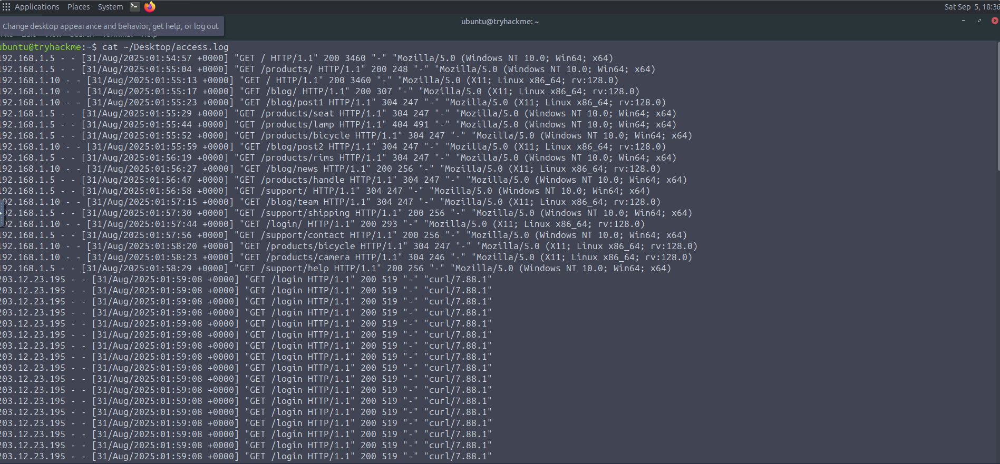
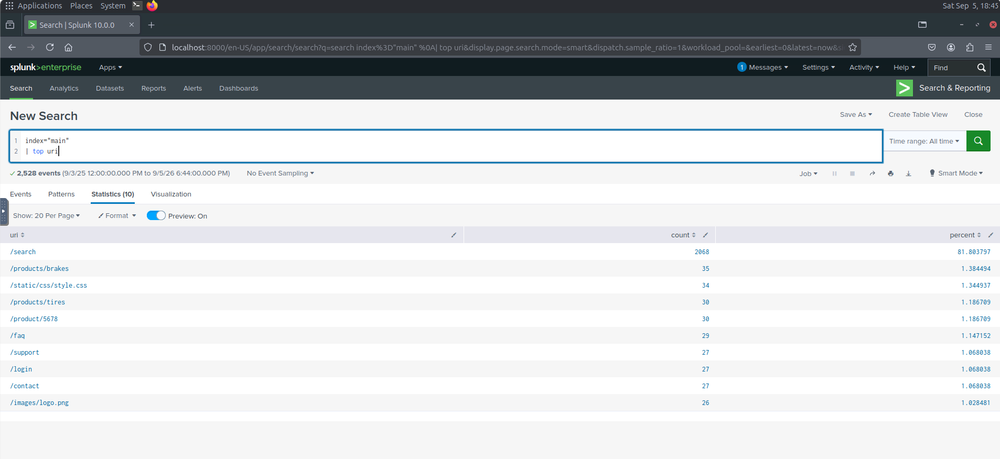
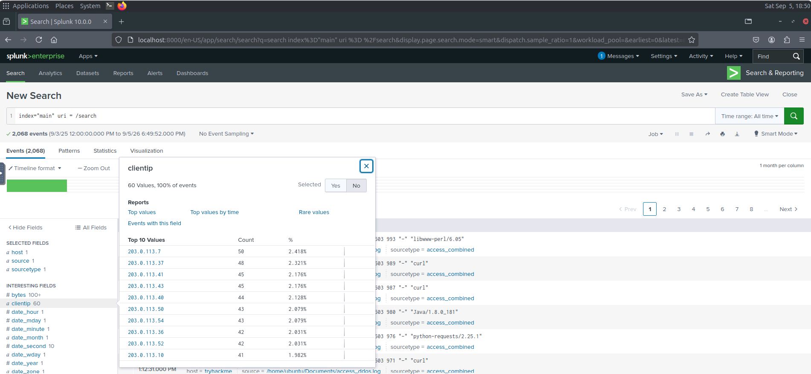
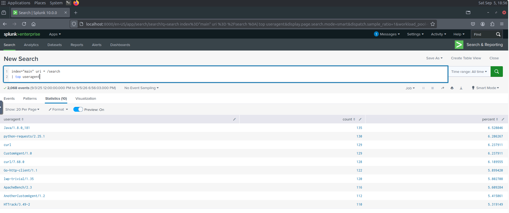

# DDoS Attack Detection

## Overview

This investigation focused on identifying a Denial-of-Service (DoS) and Distributed Denial-of-Service (DDoS) attack against a bicycle parts website.

The investigation was divided into two parts:

* Log Analysis
* SIEM Analysis using Splunk

The analysis identified repeated requests to targeted pages, attacking IP addresses, a common attacking user agent, the size of the botnet, request-rate peaks, and the HTTP error returned to legitimate users after the attack.

---

## Tools Used

* Linux terminal
* Apache access logs
* Splunk
* Splunk Search & Reporting

---

# Detection: Log Analysis

## Overview

The bicycle parts website experienced a denial-of-service attack. The `access.log` file contained a mixture of legitimate user traffic and attacker traffic.

### Log File

```text
~/Desktop/access.log
```

### 1. Attacker IP Address

#### Command

```text
cat ~/Desktop/access.log
```

#### Finding

| Artifact | Value |
| -------- | ----- |
| Attacker IP | `203.12.23.195` |

### 2. Targeted Page

| Artifact | Value |
| -------- | ----- |
| Targeted Page | `/login` |

### 3. Error Code Received by Legitimate Users

| Artifact | Value |
| -------- | ----- |
| HTTP Error Code | `503` |



---

# Detection: Leveraging SIEMs

## Overview

The website experienced a suspected Distributed Denial-of-Service (DDoS) attack.

Splunk was used to investigate web access logs collected during the suspected attack period.

### Splunk Index

```text
index="main"
```

### 1. Most Frequently Requested URI

#### Splunk Query

```text
index="main" | top uri
```

#### Finding

| Artifact | Value |
| -------- | ----- |
| Most Frequently Requested URI | `/search` |



### 2. Client IP Making the Most Requests to the Target URI

#### Splunk Query

```text
index="main" /search
```

#### Finding

| Artifact | Value |
| -------- | ----- |
| Attacking Client IP | `203.0.113.7` |



### 3. Number of IP Addresses in the Botnet

| Artifact | Value |
| -------- | ----- |
| Botnet IP Addresses | `60` |

### 4. Most Common Attacking User Agent

#### Splunk Query

```text
index="main" /search | top useragent
```

#### Finding

| Artifact | Value |
| -------- | ----- |
| Most Common Attacking User Agent | `Java/1.8.0_181` |



### 5. Peak Requests per Second

#### Splunk Query

```text
index="main" | timechart span=1s count
```

#### Finding

| Artifact | Value |
| -------- | ----- |
| Peak Requests per Second | `207` |

### 6. First Legitimate Client to Receive a 503 Response

| Artifact | Value |
| -------- | ----- |
| Legitimate Client IP | `10.10.0.27` |
| HTTP Status | `503` |

---

# Attack Chain

The investigation identified the following attack activity:

1. **DoS Attack** — The attacker repeatedly requested the `/login` page from `203.12.23.195`.
2. **Service Disruption** — Legitimate users received HTTP `503` responses.
3. **DDoS Activity** — Splunk analysis identified traffic originating from multiple attacking IP addresses.
4. **Target Identification** — The `/search` URI was the most frequently requested resource.
5. **Botnet Activity** — `60` IP addresses were identified as part of the attacking botnet.
6. **Common User Agent** — `Java/1.8.0_181` was the most commonly observed attacking user agent.
7. **Traffic Spike** — The attack reached a peak of `207` requests per second.
8. **Legitimate User Impact** — Client `10.10.0.27` was the first identified legitimate client to receive a `503` response after the attack.

---

# Key Findings

| Investigation Area | Finding |
| ------------------- | ------- |
| DoS Attacker IP | `203.12.23.195` |
| DoS Targeted Page | `/login` |
| Legitimate User Error Code | `503` |
| Most Frequently Requested URI | `/search` |
| Highest-Request Client IP | `203.0.113.7` |
| Botnet IP Addresses | `60` |
| Most Common Attacking User Agent | `Java/1.8.0_181` |
| Peak Requests per Second | `207` |
| First Legitimate Client Receiving 503 | `10.10.0.27` |

---

# Skills Demonstrated

* DoS Attack Detection
* DDoS Attack Detection
* Apache Access Log Analysis
* Splunk SIEM Analysis
* Splunk Search Queries
* Botnet Identification
* Identifying Impact on Legitimate Users
