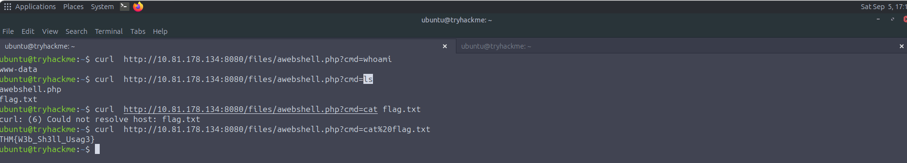
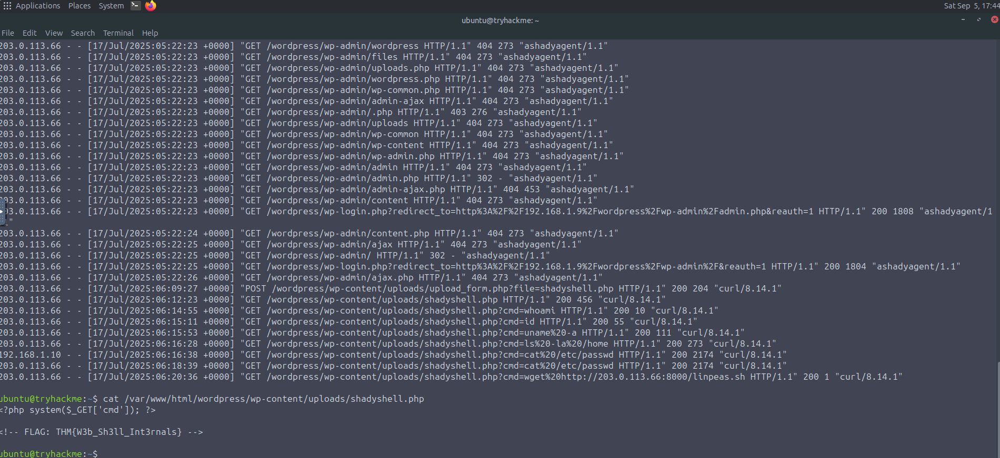

# Web Shell Detection

## Overview

This investigation focused on identifying signs of a web shell compromise on a WordPress site by analyzing Apache access logs and investigating attacker activity.

The investigation identified the following stages:

* Directory enumeration
* Web shell upload
* Command execution through the web shell
* Download of a secondary reconnaissance tool
* Investigation of the web shell code

---

## Tools Used

* Apache access logs
* Linux command line
* WordPress

---

# Web Shell Anatomy

## Overview

A web shell is a script deployed on a web server that allows an attacker to execute commands on the underlying system.

In the lab, a web shell was deployed at:

```text
http://10.81.178.134:8080/files/awebshell.php
```

The shell could be accessed directly through a browser or from the command line using `curl`.

When accessing the shell through the command line, commands must be URL-encoded.

### 1. Determine the Current Account

The `whoami` command was used to determine which account the web shell was running as.

#### Command

```text
whoami
```

#### Finding

| Artifact | Value |
| -------- | ----- |
| User Account | `www-data` |

### 2. Identify the Flag

The directory contents were listed and the flag was read using `ls` and `cat`.

#### Commands

```text
ls
cat <file>
```

#### Finding

| Artifact | Value |
| -------- | ----- |
| Flag | `THM{W3b_Sh3ll_Usag3}` |



---

# Investigation

## Overview

The investigation involved analyzing a WordPress site after suspicious activity was reported.

Apache access logs were provided to identify indicators of web shell usage and determine the sequence of actions performed by the attacker.

### Log File

```text
/var/log/apache2/access.log
```

---

# Detection: Attacker Identification

## 1. Attacker IP Address

The Apache access log was inspected to identify the IP address likely belonging to the attacker.

#### Command

```text
cat /var/log/apache2/access.log
```

#### Finding

| Artifact | Value |
| -------- | ----- |
| Attacker IP | `203.0.113.66` |

---

# Detection: Directory Enumeration

## 2. First Directory Identified

The attacker performed directory enumeration against the WordPress site.

#### Finding

| Artifact | Value |
| -------- | ----- |
| First Directory Identified | `/wordpress` |

The attacker successfully identified the `/wordpress` directory.

---

# Detection: Web Shell Upload

## 3. PHP Upload File

The attacker used a PHP file to upload the web shell onto the server.

#### Finding

| Artifact | Value |
| -------- | ----- |
| Upload PHP File | `upload_form.php` |

---

# Detection: Web Shell Command Execution

## 4. First Command Executed

After uploading the web shell, the attacker used it to execute commands on the server.

#### Finding

| Artifact | Value |
| -------- | ----- |
| First Command | `whoami` |

The `whoami` command was used to determine the account under which the web shell was executing.

---

# Detection: Secondary File Download

## 5. Downloaded File

After gaining access through the web shell, the attacker downloaded a second file onto the server.

#### Finding

| Artifact | Value |
| -------- | ----- |
| Downloaded File | `linpeas.sh` |

`linpeas.sh` is the secondary file identified in the investigation.

---

# Detection: Hidden Web Shell Secret

## 6. Web Shell Code Investigation

The attacker had hidden a secret within the web shell code.

The web shell was investigated using `cat`.

#### Command

```text
cat /var/www/html/wordpress/wp-content/uploads/shadyshell.php
```

#### Finding

| Artifact | Value |
| -------- | ----- |
| Web Shell | `shadyshell.php` |
| Flag | `THM{W3b_Sh3ll_Int3rnals}` |



---

# Attack Chain

The investigation identified the following sequence of attacker activity:

1. **Directory Enumeration** — The attacker identified the `/wordpress` directory.
2. **Web Shell Upload** — The attacker used `upload_form.php` to upload the web shell.
3. **Command Execution** — The attacker executed `whoami` through the newly uploaded web shell.
4. **Secondary File Download** — The attacker downloaded `linpeas.sh` onto the server.
5. **Web Shell Investigation** — The web shell `shadyshell.php` contained a hidden flag.

---

# Key Findings

| Investigation Area | Finding |
| ------------------- | ------- |
| Attacker IP | `203.0.113.66` |
| First Directory Identified | `/wordpress` |
| Web Shell Upload File | `upload_form.php` |
| First Web Shell Command | `whoami` |
| Web Shell User | `www-data` |
| Downloaded File | `linpeas.sh` |
| Web Shell | `shadyshell.php` |
| Web Shell Usage Flag | `THM{W3b_Sh3ll_Usag3}` |
| Web Shell Internals Flag | `THM{W3b_Sh3ll_Int3rnals}` |

---

# Skills Demonstrated

* Web Shell Detection
* Linux Command Line Investigation
* Attacker IP Identification
* Directory Enumeration Detection
* Web Shell Upload Detection
* Command Execution Analysis
* Secondary File Identification
* Web Shell Code Investigation
* Credential / Account Context Identification
* Web Server Security Analysis
