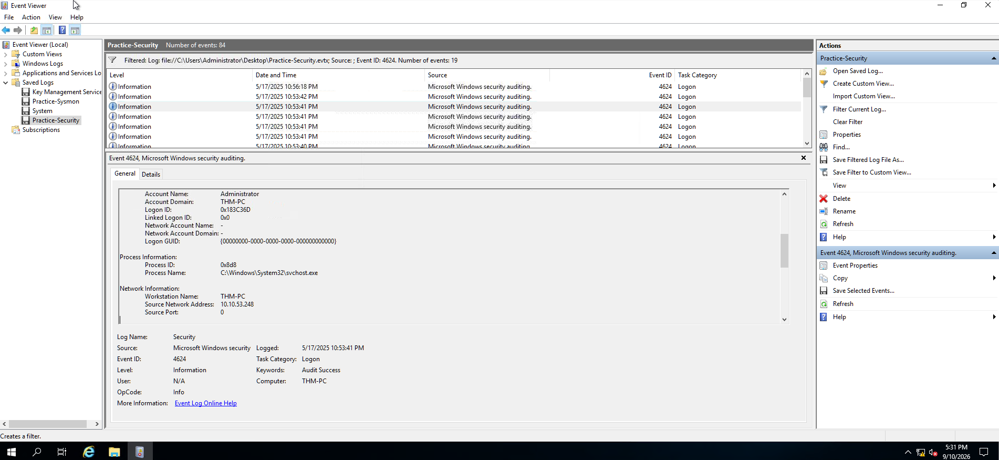
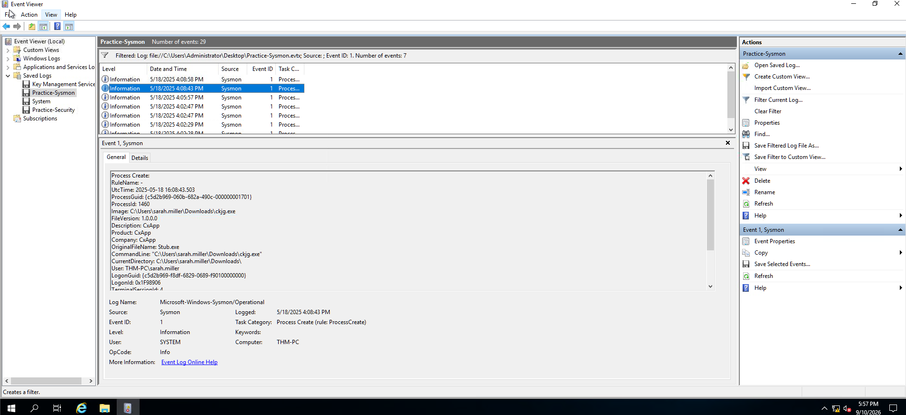
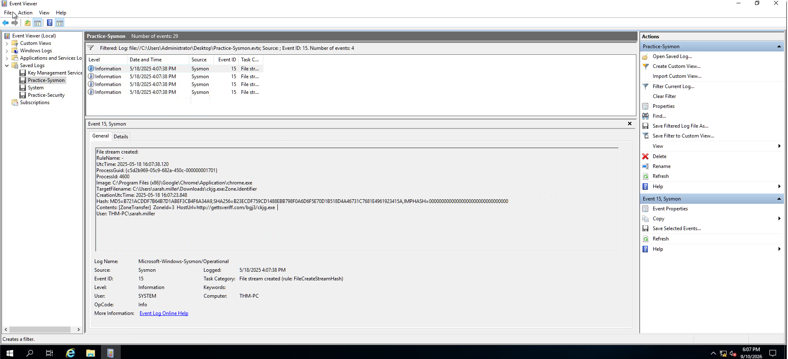
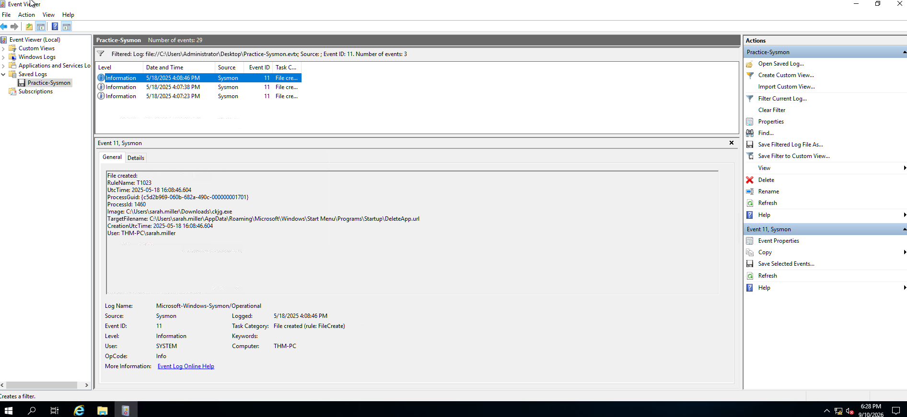
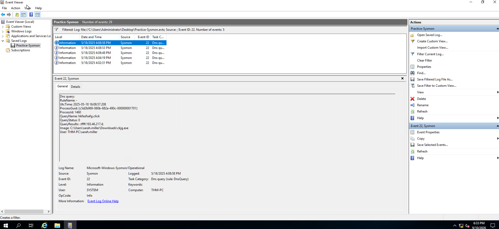
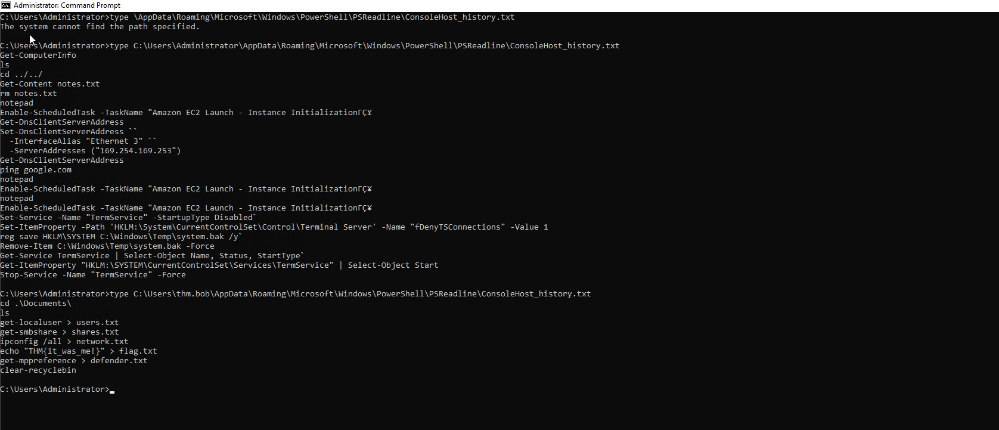

# Windows Logging for SOC

## Overview

As a SOC analyst, you can't know in advance which attack you will be handling tomorrow and which logs you will need to triage. Out of all Windows logs enabled by default, the Security event log provides significant value.

This investigation covered the following Windows logging areas:

* Security Log: Authentication
* Security Log: User Management
* Sysmon: Process Monitoring
* Sysmon: Files and Network
* PowerShell: Logging Commands

---

# Security Log: Authentication

## Overview

The two important Security events covered in this investigation were:

| Event ID | Purpose | Logging | Limitations |
| -------- | ------- | ------- | ----------- |
| `4624` (Successful Logon) | Detect suspicious RDP/network logins and identify the attack starting point | Logged on the lab machine, the one you are trying to access | Noisy. You will see hundreds of logon events per minute on loaded servers |
| `4625` (Failed Logon) | Detect brute force, password spraying, or vulnerability scanning | Logged on the lab machine, the one you are trying to access | Inconsistent. The logs have lots of caveats that may trick you into the wrong understanding of the event |

### Investigation

The `Practice-Security.evtx` file on the VM's Desktop was reviewed to identify authentication activity.

#### Finding 1: Brute Force Source

| Artifact | Value |
| -------- | ----- |
| Event ID | `4625` |
| Attacker IP | `10.10.53.248` |

The IP address `10.10.53.248` performed a brute-force attack against THM-PC.

#### Finding 2: Compromised User

| Artifact | Value |
| -------- | ----- |
| Breached User | `Administrator` |

The `Administrator` account was breached as a result of the attack.

#### Finding 3: Malicious RDP Login

| Artifact | Value |
| -------- | ----- |
| Logon ID | `0x183C36D` |

The malicious RDP login was associated with Logon ID `0x183C36D`.



---

# Security Log: User Management

## Overview

Windows user-management events can provide evidence of persistence and privilege escalation.

| Event ID | Description | Malicious Usage |
| -------- | ----------- | --------------- |
| `4720 / 4722 / 4738` | A user account was created / enabled / changed | Attackers might create a backdoor account or enable an old one to avoid detection |
| `4725 / 4726` | A user account was disabled / deleted | In some advanced cases, threat actors may disable privileged SOC accounts to slow down their actions |
| `4723 / 4724` | A user changed their password / user's password was reset | Given enough permissions, threat actors might reset the password and then access the required user |
| `4732 / 4733` | A user was added to / removed from a security group | Attackers often add their backdoor accounts to privileged groups like `Administrators` |

### Finding 1: Attacker-Created Account

| Artifact | Value |
| -------- | ----- |
| Event ID | `4720` |
| Created User | `svc_sysrestore` |

The attacker created the `svc_sysrestore` user soon after the RDP login.

### Finding 2: Privileged Group Membership

| Artifact | Value |
| -------- | ----- |
| Event ID | `4732` |
| Backdoor User | `svc_sysrestore` |
| Privileged Groups | `Backup Operators`, `Remote Desktop Users` |

The backdoor user was added to the `Backup Operators` and `Remote Desktop Users` groups.

### Finding 3: Logon ID Correlation

| Artifact | Value |
| -------- | ----- |
| Previous Logon ID | `0x183C36D` |
| Match | Yes |

The Logon ID matched the one identified during the malicious RDP login, linking the activity together.

---

# Sysmon: Process Monitoring

## Overview

Authentication logs can show that an account was compromised, but they do not always show how the compromise occurred. Process monitoring provides additional visibility into files and processes executed on a Windows host.

Two process-creation logging methods were covered:

| Event Code | Purpose | Limitations |
| ---------- | ------- | ----------- |
| `4688` (Security Log: Process Creation) | Logs an event every time a new process is launched, including command line and parent process details | Disabled by default; it must be enabled |
| `1` (Sysmon: Process Creation) | Provides advanced process-creation information such as process hash and signature | Sysmon is an external tool and is not installed by default |

### Investigation

The `Practice-Sysmon.evtx` file on the VM's Desktop was reviewed.

#### Finding 1: Web Browser

| Artifact | Value |
| -------- | ----- |
| Event Code | `1` |
| Browser | `Google Chrome` |

Sarah used Google Chrome to browse the web.

#### Finding 2: Downloaded File

| Artifact | Value |
| -------- | ----- |
| Downloaded File | `C:\Users\sarah.miller\Downloads\ckjg.exe` |

The file `ckjg.exe` was downloaded through the browser.



#### Finding 3: Download Source

| Artifact | Value |
| -------- | ----- |
| Event Code | `15` |
| Download URL | `http://gettsveriff.com/bgj3/ckjg.exe` |

The downloaded file originated from the identified URL.



---

# Sysmon: Files and Network

## Overview

Sysmon can provide visibility beyond process creation. It can log file and registry changes, network connections, DNS queries, and other useful events.

The investigation covered the following event IDs:

| Event ID | Security Log Alternative | Event Purpose |
| -------- | ------------------------ | ------------- |
| `11 / 13` (File Create / Registry Value Set) | `4656` for file changes and `4657` for registry changes, both disabled by default | Detect files dropped by malware or changes to the registry, such as persistence |
| `3 / 22` (Network Connection / DNS Query) | No direct alternative; requires additional firewall and DNS configuration | Detect traffic from untrusted processes or connections to known malicious destinations |

### Finding 1: Persistence File

| Artifact | Value |
| -------- | ----- |
| Event ID | `11` |
| Created File | `C:\Users\sarah.miller\AppData\Roaming\Microsoft\Windows\Start Menu\Programs\Startup\DeleteApp.url` |

The downloaded malware created `DeleteApp.url` in the Startup directory to establish persistence on the host.



### Finding 2: Command and Control Server

| Artifact | Value |
| -------- | ----- |
| Event ID | `3` |
| C2 Server | `193.46.217.4:7777` |

The malware connected to the identified Command and Control server.

### Finding 3: Malicious Domain

| Artifact | Value |
| -------- | ----- |
| Event ID | `22` |
| Domain | `hkfasfsafg.click` |

The malicious IP address corresponded to the identified domain.



---

# PowerShell: Logging Commands

## Overview

There are multiple methods for monitoring PowerShell activity. This investigation focused on the PowerShell history file as a simple way to track previously executed PowerShell commands.

### PowerShell History Location

```text
C:\Users\<USER>\AppData\Roaming\Microsoft\Windows\PowerShell\PSReadline\ConsoleHost_history.txt
```

### Finding 1: First PowerShell Command

The Administrator's PowerShell history was reviewed.

#### Command Used to Read the History

```text
type C:\Users\Administrator\AppData\Roaming\Microsoft\Windows\PowerShell\PSReadline\ConsoleHost_history.txt
```

#### Finding

| Artifact | Value |
| -------- | ----- |
| First PowerShell Command | `Get-ComputerInfo` |

The first PowerShell command executed was `Get-ComputerInfo`.

### Finding 2: First Command Timestamp

| Artifact | Value |
| -------- | ----- |
| Date | May 18, 2025 |

The Administrator ran the first PowerShell command on May 18, 2025.

### Finding 3: Flag in PowerShell History

The following command was used to inspect another user's PowerShell history:

```text
type C:\Users\thm.bob\AppData\Roaming\Microsoft\Windows\PowerShell\PSReadline\ConsoleHost_history.txt
```

#### Finding

| Artifact | Value |
| -------- | ----- |
| Flag | `THM{it_was_me!}` |



---

# Attack Chain

The investigation demonstrated how multiple Windows logging sources can be correlated to reconstruct attacker activity:

1. **Brute Force** — The attacker used `10.10.53.248` to brute-force THM-PC.
2. **Account Compromise** — The `Administrator` account was breached.
3. **Malicious RDP Login** — The attacker established an RDP session associated with Logon ID `0x183C36D`.
4. **Backdoor Account Creation** — The attacker created the `svc_sysrestore` account.
5. **Privilege Assignment** — The backdoor account was added to `Backup Operators` and `Remote Desktop Users`.
6. **Process Monitoring** — Sysmon was used to identify browser activity and a downloaded executable.
7. **Malware Download** — `ckjg.exe` was downloaded from the identified URL.
8. **Persistence** — The malware created `DeleteApp.url` in the Windows Startup directory.
9. **Command and Control** — The malware connected to `193.46.217.4:7777`.
10. **DNS Resolution** — The malicious IP corresponded to `hkfasfsafg.click`.
11. **PowerShell Investigation** — PowerShell history was reviewed to identify executed commands and a stored flag.

---

# Key Findings

| Investigation Area | Finding |
| ------------------ | ------- |
| Brute Force IP | `10.10.53.248` |
| Breached User | `Administrator` |
| Malicious RDP Logon ID | `0x183C36D` |
| Backdoor User | `svc_sysrestore` |
| Privileged Groups | `Backup Operators`, `Remote Desktop Users` |
| Browser | `Google Chrome` |
| Downloaded File | `C:\Users\sarah.miller\Downloads\ckjg.exe` |
| Download URL | `http://gettsveriff.com/bgj3/ckjg.exe` |
| Persistence File | `DeleteApp.url` |
| C2 Server | `193.46.217.4:7777` |
| Malicious Domain | `hkfasfsafg.click` |
| First PowerShell Command | `Get-ComputerInfo` |
| First PowerShell Command Date | May 18, 2025 |
| PowerShell History Flag | `THM{it_was_me!}` |

---

# Skills Demonstrated

* Windows Security Log Analysis
* Authentication Log Analysis
* Brute Force Detection
* RDP Login Investigation
* User Account Investigation
* Backdoor Account Detection
* Network Connection Analysis
* PowerShell History Investigation
* Event ID Correlation
* SOC Investigation and Triage
