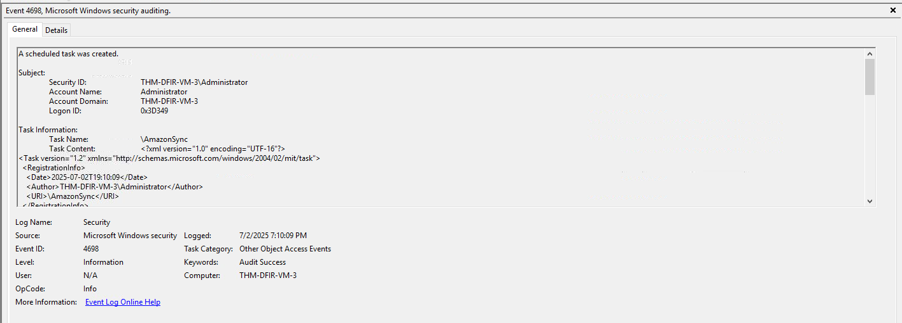
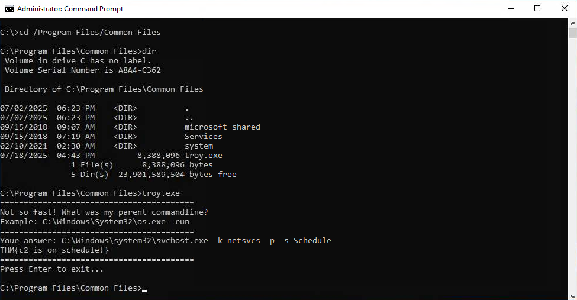
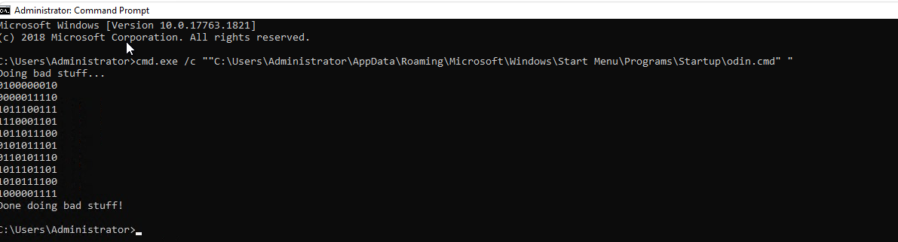

# Windows Threat Detection

## Overview

This investigation focused on detecting Windows post-compromise activity related to Command and Control (C2) and Persistence using Sysmon and Windows Security event logs.

The investigation covered the following areas:

* Command and Control
* Persistence Overview
* Persistence via Tasks and Services
* Persistence via Run Keys and Startup

---

# Command and Control

## Simplest C2

For other Initial Access methods, threat actors can't simply use RDP every time they need to run a command, so they need some process that connects back to the attackers and waits for their commands 24/7. In the simplest case, the phishing attachment will be that process and establish the Command and Control channel, like on the CobaltStrike C2 screenshot.

In more advanced cases, the attachment won't immediately connect back, but rather download an additional C2 malware, hide it in a folder like `C:\Temp`, and run it as a new stealthy process. This method is beneficial to keep the attack going if the victim decides to delete the original attachment.

### Investigation

The C2 setup was investigated using Sysmon logs:

```text
C:\Users\Administrator\Desktop\Practice\Task 2\Sysmon.evtx
```

### Finding 1: Suspicious Archive

| Artifact | Value |
| -------- | ----- |
| Event ID | `11` |
| Archive | `URGENT!.zip` |

The user downloaded the suspicious `URGENT!.zip` archive.

### Finding 2: Hidden C2 Malware

| Artifact | Value |
| -------- | ----- |
| Location | `C:\Users\Administrator\AppData\Roaming\update.exe` |

The attackers hid the C2 malware at the specified location.

### Finding 3: Command and Control Server

| Artifact | Value |
| -------- | ----- |
| Event ID | `22` |
| C2 Domain | `route.m365officesync.workers.dev` |

The C2 server domain was identified through Sysmon Event ID `22`.

---

# Persistence Overview

Data stealer infections usually have a very short lifespan: they breach the victim, collect the data, exfiltrate it, and exit - all within minutes. However, for most other attacks, maintaining access to the victim for days or even months after the Initial Access is vital.

The tactic of maintaining reliable, long-term access to the target that can survive reboots and password changes is called **Persistence**.

## Detecting Backdoored Users

Every user creation event is logged as Security Event ID `4720`. Since threat actors can be creative when naming backdoored accounts, defenders should not rely only on detecting suspicious names.

The investigation should consider:

* Who created the account? Can the person confirm the account creation?
* What is the source IP and time of the creator's login? Is it expected?
* Which other suspicious events can be seen in the creator's session?

## Making Users Privileged

A new user by itself may not give an attacker enough access because the default user permissions do not allow remote RDP logins or grant administrative privileges on the machine.

To overcome this, threat actors may add their backdoored account to a privileged group. This is tracked by Security Event ID `4732`.

Commonly exploited groups include:

* Administrators
* Remote Desktop Users

## Resetting Passwords

In more advanced cases, threat actors may reset the password of an old or unused account and use it instead of creating a new account.

This activity can be detected with Security Event ID `4724`.

### Investigation

The persistence investigation used:

```text
C:\Users\Administrator\Desktop\Practice\Task 3\Security.evtx
```

### Finding 1: Failed Administrator Logins

| Artifact | Value |
| -------- | ----- |
| Event ID | `4625` |
| Failed Logins | `6` |

The threat actor failed to log in to the Administrator account 6 times.

### Finding 2: Backdoor User

| Artifact | Value |
| -------- | ----- |
| Event ID | `4732` |
| Backdoor User | `support` |

After the successful login, the attacker created the backdoor user `support`.

### Finding 3: Privileged Group

| Artifact | Value |
| -------- | ----- |
| Privileged Group | `Administrators` |

The backdoor user was added to the `Administrators` group.

---

# Persistence: Tasks and Services

## Malware Persistence

Persistence via a backdoored user works well if the attacker can remotely log in using RDP. However, if the attack started through a phishing attack or USB infection, this may not be an option.

In these scenarios, threat actors need actively running malware that maintains a connection with their C2 server even after a system reboot.

## Services and Tasks

There are many methods for persistence on a Windows machine. For a SOC L1 or L2 analyst, it is useful to start with common persistence mechanisms such as Windows services and scheduled tasks.

| Persistence Method | Attack Example | Event ID Logging |
| --- | --- | --- |
| Create a Windows Service<br>(Runs after OS startup) | `sc create "BadService" binpath= "C:\malware.exe" start= auto` | Launch of `sc.exe`: Sysmon / `1`<br>Service creation: Security / `4697` |
| Create a Scheduled Task<br>(Runs after OS startup) | `schtasks /create /tn "BadTask" /tr "C:\malware.exe" /sc onstart /ru System` | Launch of `schtasks.exe`: Sysmon / `1`<br>Scheduled task creation: Security / `4698` |

The attackers left two backdoors and restarted the system. The following directory was investigated using Security and Sysmon logs:

```text
C:\Users\Administrator\Desktop\Practice\Task 4\
```

### Finding 1: Windows Service

| Artifact | Value |
| -------- | ----- |
| Event ID | `4697` |
| Service | `Data Protection Service` |

The `Data Protection Service` was created to persist the Nessie malware.

### Finding 2: Scheduled Task

| Artifact | Value |
| -------- | ----- |
| Event ID | `4698` |
| Scheduled Task | `AmazonSync` |

The `AmazonSync` scheduled task was created to persist the Troy malware.



### Finding 3: Troy Malware Flag

| Artifact | Value |
| -------- | ----- |
| Flag | `THM{c2_is_on_schedule!}` |

The flag obtained after finding and running the Troy malware was `THM{c2_is_on_schedule!}`.



---

# Persistence: Run Keys and Startup

## Run Keys and Startup

Services and scheduled tasks are typically run on system boot and require administrative privileges to configure.

However, if a program needs to run only when a specific user logs in, Windows provides per-user persistence methods that can be used by both legitimate tools and malware.

| Persistence Method | Attack Example | Event ID Logging |
| --- | --- | --- |
| Add malware to Startup Folder<br>(Runs upon user login) | `copy C:\malware.exe "%AppData%\Microsoft\Windows\Start Menu\Programs\Startup\malware.exe"` | New startup item: Sysmon Event ID `11` |
| Add malware to "Run" keys<br>(Runs upon user login) | `reg add "HKCU\Software\Microsoft\Windows\CurrentVersion\Run" /v BadKey /t REG_SZ /d "C:\malware.exe"` | New registry value: Sysmon Event ID `13` |

### Investigation

The following directory was investigated to uncover the newly learned backdoors:

```text
C:\Users\Administrator\Desktop\Practice\Task 5\
```

### Finding 1: Odin Parent Process

| Artifact | Value |
| -------- | ----- |
| Event ID | `1` |
| Parent Process Image | `C:\Windows\explorer.exe` |

The parent process image of the `Odin` malware was `C:\Windows\explorer.exe`.

### Finding 2: Odin Output

| Artifact | Value |
| -------- | ----- |
| Last Output | `Done doing bad stuff!` |

The last line output by the `Odin` malware was `Done doing bad stuff!`.



### Finding 3: Kitten Malware Flag

| Artifact | Value |
| -------- | ----- |
| Event ID | `13` |
| Flag | `THM{persisting_in_basket!}` |

The flag obtained after finding and running the `Kitten` malware was `THM{persisting_in_basket!}`.

---

# Key Findings

| Investigation Area | Finding |
| ------------------ | ------- |
| Suspicious Archive | `URGENT!.zip` |
| C2 Malware Location | `C:\Users\Administrator\AppData\Roaming\update.exe` |
| C2 Server Domain | `route.m365officesync.workers.dev` |
| C2 Event ID | `22` |
| Failed Administrator Logins | `6` |
| Backdoor User | `support` |
| Privileged Group | `Administrators` |
| Windows Service | `Data Protection Service` |
| Scheduled Task | `AmazonSync` |
| Troy Malware Flag | `THM{c2_is_on_schedule!}` |
| Odin Parent Process | `C:\Windows\explorer.exe` |
| Odin Last Output | `Done doing bad stuff!` |
| Kitten Malware Flag | `THM{persisting_in_basket!}` |

---

# Skills Demonstrated

* Windows Threat Detection
* Command and Control Detection
* Sysmon Log Analysis
* Persistence Detection
* Backdoor User Detection
* Privilege Escalation Identification
* Windows Service Persistence Detection
* Malware Process Analysis
* C2 Infrastructure Identification
* SOC Investigation and Triage
